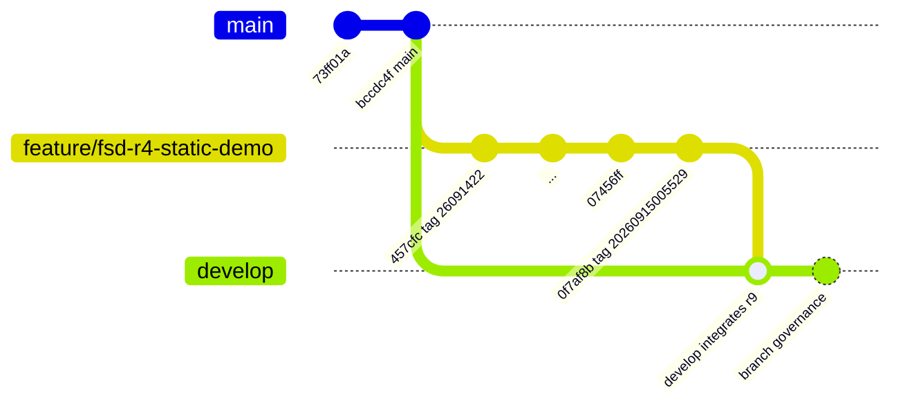

# Branching Policy

Effective date: 2026-09-15, Asia/Singapore.

This repository uses Git Flow from this date onward. Branch creation, branch
starting points, merge timing, branch deletion, and worktree branch creation are
assigned by the Team Leader only. Team members must not create branches
unilaterally, commit directly to `main` or `develop`, force push, or rewrite
shared history.

## Long-Lived Branches

| Branch | Purpose | Rule |
| --- | --- | --- |
| `main` | Production branch | Keep the existing `main`; do not create `master`. Release and verified hotfix changes merge here only after approval. |
| `develop` | Development integration branch | Integrates reviewed work from approved feature branches. Do not commit directly except for Team Leader authorized repository governance initialization. |

## Working Branches

| Pattern | Starting point | Merge target | Rule |
| --- | --- | --- | --- |
| `feature/<name>` | `develop` | `develop` | Use for feature work after Team Leader assignment and review. |
| `release/<version>` | `develop` | `main`, then back to `develop` | Use only for bug fixes and release preparation after test acceptance. The release merge into `main` receives the release tag. |
| `hotfix/<name>` | `main` | `main`, then `develop` | Use for urgent production fixes. If a release branch exists, synchronize the necessary fix there too. |
| `test/qa` | Optional | Optional | Not established at this time. |

## Merge And Review Rules

- Each requirement, design, code, and test commit must reference the relevant RTM
  requirement and acceptance IDs when applicable.
- Existing approved FSD, documentation, and static DEMO review does not equal FIN
  production acceptance.
- A reviewed documentation or DEMO snapshot may be integrated to `develop`
  without becoming a production release.
- `main` receives only release or hotfix merges approved by the Team Leader.
- No force push, destructive reset, or shared-history rewrite is allowed without
  explicit Team Leader approval.
- Shared checkouts must not be switched or repointed except inside the branch
  action assigned by the Team Leader.

## Current Branch Ledger

| Branch | Purpose | Starting point | Owner | Status | Merge target | Authorization source | Related requirement / acceptance |
| --- | --- | --- | --- | --- | --- | --- | --- |
| `main` | Long-lived production branch | Initial repository history | Team Leader | Active, unchanged in this initialization | N/A | Existing repository default branch | Production acceptance only; current FSD/DEMO review is not production certification |
| `develop` | Long-lived development integration branch | `origin/main` at `bccdc4f9f97c7591ac7aa8db0729ff7be629c213` | Team Leader | Created during 2026-09-15 initialization; integrates reviewed revision 9 baseline plus this governance document | Future `release/<version>` branches | Team Leader delegation, 2026-09-15 | RTM baseline in `doc/planning/UPS-Fleet-Requirements-Traceability-Matrix-v0.1.md`; governance initialization only |
| `feature/fsd-r4-static-demo` | Reviewed FSD/documentation/static DEMO work through revision 9 | Historical feature branch from `main` lineage | Team Leader / assigned implementation work | Preserved for traceability; not deleted | Already integrated into `develop` by normal merge | User review approval and Team Leader delegation | PRD/FSD v0.1 revision 9, RTM and validation records under `doc/validation/` |

## Tag Ledger

| Tag | Commit | Meaning | Production release? |
| --- | --- | --- | --- |
| `20260915005529` | `0f7af8b3eba31da027799d5cb98bf9883801cd9f` | Reviewed FSD, documentation, and static DEMO snapshot as of 2026-09-15 00:55:29 Asia/Singapore | No |
| `26091422` | `457cfc8419cdad65b07b35c011fb1d43d486ecde` | Historical baseline before FSD revision 4 static demo work | No |

## Current Branch Graph

