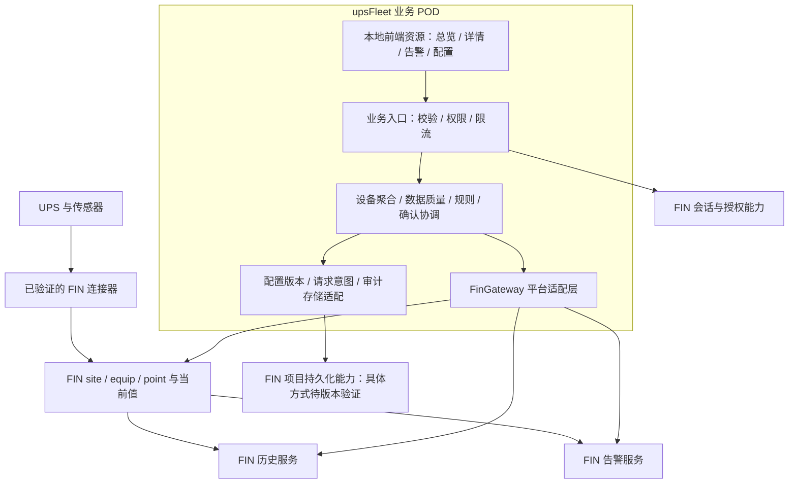
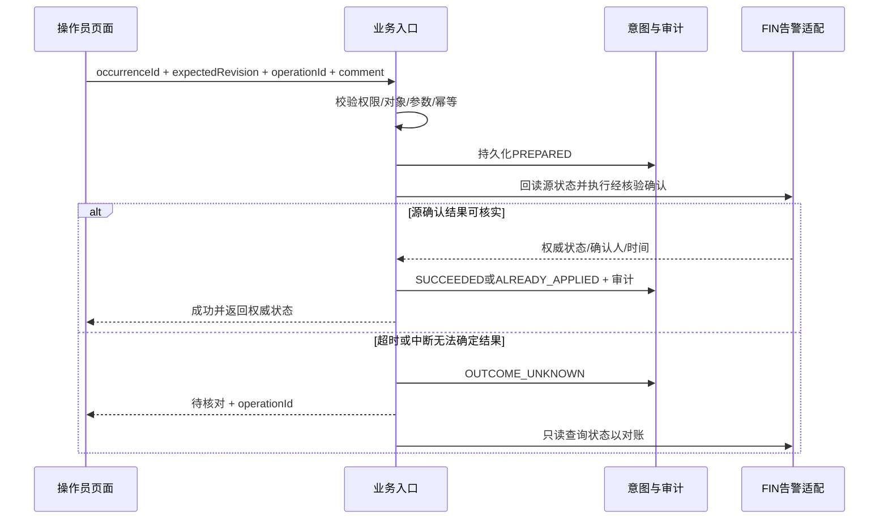

# UPS Fleet Monitor 功能规格说明书（FSD）

版本：v0.1 修订2｜日期：2026-09-14｜作者角色：产品规划与设计｜状态：评审通过，已冻结为研发与验收规格基线

保留原文件名以维持引用；本修订替代同路径旧正文。评审来源：任务“评审代码和文档”，评审轮次 `01a09f26-431d-7e30-b4d1-568dbd251032`。逐项处理索引及PRD差异见第16节；评审通过依据用户于2026-09-14明确确认“评审通过 这版 ，FSD”，不是作者自检或工具校验推导。

需求基线：[UPS-Fleet-FIN-POD-PRD-v0.1.md](UPS-Fleet-FIN-POD-PRD-v0.1.md)。本规格将其 FR-01～17 细化为可分工实现、可用固定输入测试的功能与系统契约。PRD 定义“为什么、做什么”，本文定义“如何表现、如何协作、如何判定完成”。

## 1. 使用约定与实施边界

**已确认**：用户要求基于 FIN Framework，以可安装 POD 插件交付；现有页面是 Ractive 单文件演示，原型不能直接代表真实采集、历史、告警确认或健康预测能力。

**设计决定 D**：本文所有新增模块名、对象名、操作名、参数上限、周期、目录及算法细节均为拟定的项目设计，不是 FIN 官方 API。可据此开发领域逻辑、契约测试和前端；与 FIN 的具体绑定必须通过第 14 节版本门槛。

**待核验 T**：FIN 精确版本/构建号及 SDK、许可证、部署 OS、设备型号固件、协议、点表和容量未知；目标兼容性保持 `unverified`。不得把工作区样例依赖直接作为本产品支持矩阵。

MVP 在单个 FIN 项目内运行。交付一个业务 POD，复用平台已有连接器、对象、历史、告警和会话。本文只交付功能规格及其离线核验附件，不开发、连接现场或部署。无设备控制命令，无远程旁路/停机/放电测试，无批量确认，无未经验证寿命预测。

对 PRD 的细化约定：

|决定|本规格采用方式|原因|
|---|---|---|
|D-01 POD 组织|单业务 POD 暂名 `upsFleet`；前后端同包|减少部署组件，保持业务边界清晰|
|D-02 前端|沿用原型布局和 Ractive 组件方向，拆分模块、固定依赖并本地打包|保留已有设计资产；Ractive 在目标浏览器/CSP 下仍需验证|
|D-03 平台适配|所有 FIN SDK 调用收敛至 FinGateway 逻辑边界|版本变化不扩散到页面和规则|
|D-04 实时传递|MVP 浏览器定时获取业务快照；后端共享采集缓存|无需预先承诺目标 FIN 的推送机制；不因用户数增加设备采集|
|D-05 告警权威|FIN 告警存储为权威；插件只保存关联、请求意图和审计|避免两套独立活动/确认状态|
|D-06 配置发布|影子准备、暂停副作用、持久化提交决定、统一epoch激活；第8节定义重启决策|提交前失败保持旧版，提交后按唯一决定恢复，禁止模块混版|
|D-07 健康呈现|风险等级 + 数据覆盖情况 + 原因列表|不使用静态综合分，不将数据不足等同健康|
|D-08 无权对象|对象级读取统一“对象不存在或不可访问”；会话角色不足返回无权|细化 PRD 的错误页面要求，避免泄露对象存在性|

如实际 FIN 不具备某项接口能力，技术设计必须记录缺口与替代方案，并重新评审对应功能；不得静默降级告警确认、权限或审计。

## 2. POD 总体架构



数据流：设备 → FIN 连接器 → 当前点值/原生质量 → 业务映射与归一 → 快照 → 页面。历史直接经适配层查询平台历史，页面缓存不作为历史库。规则告警经验证的平台告警入口产生与恢复；不直接修改告警记录字段。

浏览器只接触本项目受控业务入口，不接触设备协议、FIN 管理凭据或任意 Axon 执行入口。FIN 内部服务访问方式优先使用目标版本支持的项目上下文能力；本文不预设 HTTP 回环或具体类/函数。

### 2.1 模块职责和边界

以下模块可以组织为 Fantom 类/包，不要求独立 POD。名称为项目逻辑名称。

|模块|输入→输出|负责|不得承担|
|---|---|---|---|
|M-01 UiShell/Views|业务响应→页面|路由、表格、卡片、趋势、表单状态|阈值权威、直接确认、凭据存储|
|M-02 RequestFacade|会话+结构化请求→响应|身份、范围、参数、关联ID、超时、速率限制|接受任意查询表达式|
|M-03 InventoryService|授权范围+配置→设备目录|资产、能力、子对象和稳定ID关联|复制所有 FIN 设备资产成为第二主数据|
|M-04 TelemetryService|FIN点快照+映射→MetricValue/EquipmentSnapshot|转换、质量、新鲜度、缓存|修改设备值、生成随机替代值|
|M-05 HistoryService|点引用+时窗→曲线|权限、时区、分桶与缺口|把前端采样当作平台历史|
|M-06 RuleEngine|新鲜输入+规则版本→评估与告警意图|去抖、回差、规则状态、解释|自行向 UPS 下发控制|
|M-07 AlarmService|FIN事件→统一事件；确认请求→状态|去重关联、生命周期、确认协调与对账|独立重写 FIN 告警权威状态|
|M-08 ConfigurationService|草稿+版本→校验报告/发布版本|草稿、映射、版本冲突、激活/回退|无审计覆盖旧版本|
|M-09 AuditRepository|意图/结果→持久化记录|审计、请求幂等、待核对队列|普通用户可编辑的备注式日志|
|M-10 FinGateway|领域请求→目标FIN接口|点、历史、告警、授权、存储、生命周期适配|向领域泄露版本特定记录结构|
|M-11 Lifecycle/Diagnostics|启停/健康事件→运行状态|启动校验、任务释放、健康检查、版本和指标|在启动时创建示例生产设备|

### 2.2 建议源码与包资源组织

```text
upsFleet/
  build.fan                  # 冻结 SDK 后编写；明确依赖、源码和资源清单
  fan/
    domain/                  # 值对象、规则、状态机
    services/                # 设备、历史、告警、配置协调
    fin/                     # 目标版本的平台适配
    web/                     # 受控业务入口
    persistence/             # 配置、意图、审计存储适配
    lifecycle/               # 初始化、停止、诊断
  ui/                        # 前端源代码、锁文件、构建配置
  res/web/upsFleet/           # 构建后的静态资源
  locale/                    # 中文文案及后续语言资源
  lib/                       # 目标版本要求的注册/模型定义
  test/                      # 领域、契约、目标平台集成测试源
  docs/                      # 兼容矩阵、安装升级回滚与测试报告
```

这是源目录建议；测试如何编入/执行、注册文件、资源路由、构建基类和依赖版本待 SDK 核验。E-01 中的混合 POD 只证明工作区存在这种组织实例，不证明本目录可直接编译。测试夹具与演示数据不得进入生产运行入口。

## 3. 数据对象和持久化规格

### 3.1 对象所有权

|对象|主键/引用|所有者与存储|更改方式|
|---|---|---|---|
|FIN Site/Equip/Point|平台稳定 Ref|FIN；插件引用|标准工程流程；不由前端直接写|
|UpsEnrollment|projectId+equipRef|插件配置；注册监控范围|草稿发布；停用保留关联|
|PointMapping|configRevision+mappingId|插件不可变配置版本|发布生成新版本|
|CapabilityProfile|equipRef+configRevision|插件；每项 supported/unsupported/unverified|工程校验后发布|
|RuleDefinition|ruleId+ruleVersion|插件配置|结构化参数版本化|
|RuleState|equipRef+ruleId+ruleVersion|插件运行持久态|与输入水位、告警outbox意图同事务提交|
|RuleAlarmOutbox|projectId+occurrenceId+commandSeq|插件可靠发送队列|CREATE/SEVERITY/CLEAR按发生顺序发送，未知结果阻断后续|
|MaintenancePlan|planId+planRevision|插件不可变配置及计划事件|配置发布更新，事件区分完成、取消、替代|
|EquipmentSnapshot|projectId+equipRef+snapshotRevision|短期内存缓存|自动生成；不可用作恢复权威|
|AlarmAssociation|sourceSystem+sourceAlarmId+occurrenceId|插件关联记录|源事件幂等写入|
|OperationJournal|projectId+operationId|插件持久化意图/结果|追加状态转换；不删除未知结果|
|AuditEvent|auditId|插件/验证的平台审计设施|追加写，不原地编辑|
|ActiveConfigPointer|projectId→configRevision+activationEpoch|持久化提交决定|与发布COMMITTED及审计同事务写入；不是运行成功标志|
|LastSuccessfulActivation|projectId→configRevision+activationEpoch|插件持久化|全部模块统一激活后写入；用于诊断，不能覆盖已提交决定|

具体用目标 FIN 哪种记录或存储 API，由 FinGateway 映射；不引入独立外部数据库作为 MVP 默认依赖。若平台无法提供原子写入、必要索引或所需审计容量，G1 必须提出经评审的存储实现，未解决前不可上线变更功能。

### 3.2 设备注册与映射

UpsEnrollment 必填：equipRef、siteRef、displayName（默认平台名称）、commissioningStatus、capabilityProfile、sourceDocumentVersion、configRevision、acceptanceRevision（可空）。`enabled`改为服务端只读派生值，不允许客户端独立设置。位置使用明确资产字段；电池串/模块记录 parentEquipRef 和自身稳定引用，不用数组位置作身份。接入状态及必要数据集合见3.5节。

PointMapping 必填：mappingId、equipRef、targetObjectRef、logicalField、pointRef、rawKind、normalizedKind、origin、transform、qualityPolicy、historyPolicy、evidenceRef。数值另需 rawUnit、unit、precision；枚举另需 enumMap；相量另需 phase、measurementLocation；电流另需 signConvention。

转换只支持已注册的 scale/offset、单位换算、枚举映射及布尔正反逻辑。`normalized = raw × scale + offset` 使用有限数；不能同时重复应用源端和业务端的比例。缺失代码映射产生 `unknown + UNMAPPED_ENUM`，保留 rawValue；不能取首个枚举作默认。

逻辑字段、单位及来源沿用 PRD 第7节；本规格补充：环境传感器可属于其他设备，但必须有显式关联、同一授权范围和位置依据，不能强行修改其 equipRef 为 UPS；静态资产值以配置版本和变更时间表时效，不套用10秒遥测过期规则。

### 3.3 MetricValue 契约

|字段|类型/是否必填|规则|
|---|---|---|
|field/objectRef|字符串/Ref，必填|逻辑字段与具体整机/电池串/模块|
|value|数值/布尔/字符串/null，必填|当前有效归一值；非良好质量默认 null|
|lastGoodValue/lastGoodAt|同型/null、时间/null|仅供“最后有效值”展示；不得参与当前规则|
|observedValue/observedAt|同型/null、时间/null|可解码但量程异常的当前观测；普通查看者可见并标异常，不作为有效输入|
|unit/precision|字符串/null、整数/null|显示单位与源精度；布尔/枚举可空|
|quality/reason|枚举、代码/null|见第4节；reason给机器码，UI翻译|
|sourceRef/origin|Ref或配置ID、枚举|measured/configured/derived|
|sourceTs/receivedAt|时间/null、时间/null|真实采样与网关收到源结果；不能用浏览器读取时间代替|
|freshnessTs/freshnessBasis|时间/null、枚举|sample/connectorRead/heartbeat/config；来源可信策略明确|
|rawValue/rawStatus|原始值/状态，可空|仅有诊断权限者可查询；不能含设备凭据|
|mappingRevision|版本，必填|保证可追溯|
|derivation|对象/null|ruleVersion、inputRefs、inputTimes、calculatedAt|

rawValue仅作权限诊断；observedValue为已做单位归一的可展示异常值。类型无法解析时observedValue=null，不能显示误导数字。

传输层 D：应用 JSON 中 Ref 编码为不透明字符串、时间为带偏移的 ISO 8601、Number 为有限数并分离 unit；不是 Haystack JSON 编码。源 Haystack 类型仅在 FinGateway 转换。禁止 NaN/Infinity、空字符串冒充 null、false 被当作缺失。客户端无法推算或拼接 FIN Ref。

契约夹具（非真实设备数据）：

```json
{
  "field": "runtimeEstimateMinutes",
  "objectRef": "fixture-ups-a",
  "value": null,
  "lastGoodValue": 14,
  "lastGoodAt": "2026-09-14T09:00:00+08:00",
  "observedValue": null,
  "observedAt": null,
  "unit": "min",
  "precision": 0,
  "quality": "stale",
  "reason": "SOURCE_EXPIRED",
  "sourceRef": "fixture-point-runtime",
  "origin": "measured",
  "sourceTs": "2026-09-14T09:00:00+08:00",
  "receivedAt": "2026-09-14T09:00:01+08:00",
  "freshnessTs": "2026-09-14T09:00:00+08:00",
  "freshnessBasis": "sample",
  "mappingRevision": "cfg-7",
  "derivation": null
}
```

### 3.4 EquipmentSnapshot 与一致性

返回 identity、communication、powerMode（MetricValue）、metrics数组（以objectRef+field唯一）、assessment、alarmSummary、capabilities、configRevision、activationEpoch、snapshotRevision、generatedAt、partialErrors。assessment采用6.5及9.2的结构，包括risk、coverage、有效/不可用通道、风险原因和最后成功时间；已知critical与partial可共存。

一次快照只使用同一配置版本。各指标保持自身时间，generatedAt 只表示聚合时间，不表示所有设备值刚更新。旧请求响应只有在 equipRef、配置和页面请求序号仍一致时可呈现。列表成员/行序由listRevision冻结，行数值由snapshotRevision更新，实时统计由statsRevision标记；按5.7区分含义，不能用最新统计冒充冻结成员总数。

### 3.5 设备接入状态机与必要能力（评审7）

必要集合分三层，不能互相替代：

|集合|定义|用途|
|---|---|---|
|B 基础运行集合|主连接成功采集诊断、powerMode、至少一个已声明基准的负载指标（loadPct或outputPowerKw/outputApparentPowerKva）；资产ID/site/equip引用另作静态前提|通讯、接入验收及R-05监视集合；环境点默认不属于B|
|A 告警观测通道|真实FIN告警来源、发生身份、同步成功时间、确认/恢复能力|接入验收和健康覆盖；告警平台服务故障不算UPS物理断线|
|I(rule) 规则输入|每条启用规则声明的主输入、辅助遥测和配置；R-01为续航、模式及Q，R-02为负载及阈值|对应规则是否可评估，不影响其他规则输入定义|
|O 可选展示集合|SOC/SOH、阻抗、风扇、环境等能力支持但未选入B的点|字段展示；单点缺失不使B自动扩大|

R-05观测B中的必要遥测及主连接证据，A单独形成“告警同步异常”平台诊断。首批验收至少一种型号有真实续航；该型号启用R-01时续航加入其B集合，不能把不支持续航的型号当成R-01验收。所有集合写入版本化能力档案，不由前端缺省猜测。

|状态|enabled（只读）|进入/离开条件|生产行为|
|---|---|---|---|
|draft|false|工程注册草稿；校验与发布成功→ready|仅预览，不创建规则告警|
|ready|false|已发布未验收；commissioning.accept权限完成证据验收→accepted|只读工程数据，明确未验收；原生告警可读，不作已验收生产统计|
|accepted|true|完整验收报告关联acceptanceRevision；关键变更前须经过8.4限制|B质量监视与已发布规则运行|
|disabled|false|无阻断活动/未决操作后经config.publish停用；重新启用→ready|不创建新的规则告警；历史与源原生告警保留|
|retired|false|工程退役且全部活动规则发生按8.4处理完成；不可直接重新accepted|保留身份/证据/历史，无新监控；替换设备新建资产身份|

验收报告至少有：equipRef、映射/能力/规则revision、型号固件与点表版本、B逐点单位/枚举/时间和源对照、A生命周期/确认测试、断线恢复记录、历史策略结果、可选缺失豁免、验收人/时间及证据引用。后端校验报告指纹与当前配置一致；发布不能伪造accepted。权限 `commissioning.accept` 需明确授予工程角色，范围覆盖设备；验收作为审计变更使用operationId。

关键变更包括源pointRef、比例/单位/枚举、B集合、型号/固件身份、连接/告警来源。无活动/未决规则发生时发布关键变更→ready并撤销旧acceptanceRevision；仅显示名称或非关键计划日期变更保留accepted。已验收设备有活动/未决规则发生时关键变更阻断，先按8.4解决。不能为撤销验收而丢弃旧活动风险。

## 4. 当前值、通讯与质量判定

### 4.1 SF-01 遥测采集与新鲜度

输入：已发布映射、平台当前值/质量、可验证的源时间或连接器成功采集证据。输出：MetricValue 和快照；无任何值写回设备。

为满足PRD从FIN更新到页面p95≤3秒，D调整为：后端共享快照检查周期≤500ms，浏览器可见详情及总览快照刷新周期≤1秒。批量读取能力与开销须G1压测；这不等于500ms设备轮询。数值更新不重建列表成员。隐藏标签页暂停，恢复立即取快照。上次请求未结束不叠加，查询失败按2/5/10/30秒退避，上限30秒，成功恢复正常周期。若目标容量无法承受此策略，必须评审推送或指标变更，不能仍宣称达到3秒。

过期阈值 D：max(3×expectedInterval,30秒)。有效源时间优先；变化上报点可按经过验证的成功采集/心跳确认“值未变化但仍有效”。**单纯再次读取 FIN 缓存不能重置 freshnessTs**；没有采样或成功采集证明则保持 unknown/stale。浏览器可依据服务器时间差更新过期标签，但服务端判定为权威。

### 4.2 SF-02 质量决策顺序

1. 注册停用或点停用 → disabled；能力确认无此点 → unsupported；尚未映射 → unmapped。
2. 类型/单位/枚举转换失败 → fault 或 unknown（未知枚举），给明确 reason；有效范围违规 → fault/OUT_OF_RANGE，value=null，observedValue/At保留可解码的异常观测并对普通查看者显示“超量程，未参与评估”；不能用lastGoodValue替代该异常。
3. 原生 fault/down → 对应状态；无可靠当前采集依据 → unknown。
4. 时钟超未来容差60秒 → unknown/TIME_ANOMALY；采集时间超过阈值 → stale；其余 → good。
5. 非good时 value=null，保留独立 lastGoodValue/At；依赖该值的数值规则暂停并清候选，不自动恢复既有告警；R-05质量规则继续按服务端时间和bad状态评估，R-04日历规则不受遥测影响。

量程配置必须与设备精度/合法范围一致；负载>100%可能合法，不以100作为默认硬上限。good的0、false合法。源诊断和业务质量同时保留，不直接把平台状态枚举全部重命名而丢信息。

### 4.3 SF-03 通讯和供电模式

通讯判定仅来自已映射连接诊断：disabled优先；全部必要连接明确down为offline；部分连接或必要点失败为degraded；全部必要连接健康且必要点满足采集依据为online；证据不足为unknown。多源UPS列出各连接状态，环境传感器断线不能自动声明UPS主连接离线。

供电模式独立采用 utility/battery/staticBypass/maintenanceBypass/off/other/unknown；非good模式值当前为unknown并可附上次模式。不以通信online推断utility，不以模式battery推断连接正常。活动告警等级第三轴独立展示。

## 5. 页面功能规格

### 5.1 SF-04 设备总览（PRD FR-01/02/03）

入口：FIN中经验证的插件菜单或应用入口；进入先获取会话能力，再取授权设备。无查看权限不加载设备数据。

顶部：站点过滤（默认全部授权站点）、关键词（名称/位置，最长100字符）、通讯/供电/严重度筛选、已配置/已验收设备数、通讯异常数、活动严重告警数、续航不足设备数及续航不可评估设备数。活动严重告警数以发生记录计，其他以去重设备计，文案不能混用。

列表：设备名、位置、通讯、供电模式、负载、续航/需求、活动告警数量、最新有效采集时间。50条分页，上限100；默认按活动最高严重度（critical>warning>info>无）、通讯异常、名称、稳定ID排序。列表成员与行序使用listRevision，遥测使用snapshotRevision。初次查询冻结授权范围内成员和顺序5分钟；翻页沿用同一listRevision，不主动重建。值每秒刷新，原成员不再匹配过滤时标“状态已变化，刷新列表后移除”，保持当前位置。新增匹配设备及风险升高均显示常驻“有更新”提示；新增critical需立即显示不受冻结排序影响的顶部风险提示及直接入口。重新过滤、手动刷新才重建成员。权限撤销立即从响应移除对象并使列表失效，不受冻结期限约束。

零设备：显示“尚未接入UPS”，仅工程角色显示配置入口；零过滤结果：显示“没有符合条件的设备”和清除筛选。局部失败展示成功行与统计不完整提示，不能把失败设备从总数悄悄删除。总览选择设备后进入详情，返回恢复筛选和页码。

验收：两个互斥站点角色获取的行、计数和搜索建议均无越权；设备值刷新不跳行；配置设备与已验收计数分别正确。

### 5.2 SF-05 UPS详情（FR-04～08/12）

头部：面包屑、名称、型号/位置、三个状态轴、当前刷新状态。主区：续航估算、业务要求、风险与解释；综合分环改为风险状态区域，不预留假分值。

|区域|主要字段|交互与能力缺失|
|---|---|---|
|电池|串电压、SOC、SOH、温度、电流、阻抗/基准|有多串显示选择器；无SOH显示“不支持SOH”；串值不当整机值|
|负载|实测kW/kVA、负载%、对应额定容量和基准|点击任一支持历史值查看曲线；超载值完整显示|
|电力电子|输出电压/频率/THD、整流器、风扇、电容评估|标相别和THD类型；未提供电容健康则不画百分比|
|环境|温度、湿度、空气质量、漏水|显示传感器所属位置；null漏水为“未知”|
|旁路与切换|静态/维修旁路可用及激活、切换状态/时间|没有设备切换时长证据显示“不支持”；没有控制按钮|
|维护建议|计划维护、已批准的规则提示|展开查看规则、输入时间和缺失项；不显示预测剩余月数|
|本机告警|最多10条活动告警+全部事件入口|确认依第7节；严重已确认仍保留严重样式|

全区域保持标题和缺失说明，避免工程人员找不到缺失点。详情加载骨架；首次数据失败显示错误与重试；旧设备响应不得覆盖新设备。温度选择保存在非敏感用户偏好，默认°C；规则和配置不随显示单位变化。最后有效值用弱化数值加“已过期”，不能只靠颜色表达。

### 5.3 SF-06 历史趋势（FR-09）

入口：详情指标点击；默认1小时，可选24小时/7天；自定义不超过7天 D，后续导出独立评审。最多同时4条兼容量纲曲线；不同单位分图，避免双轴误读。切换设备清空当前查询上下文。

前端传逻辑字段/对象与绝对起止时间；后端按查询时间窗内映射有效区间解析pointRef及转换，并做当前权限校验，不接受任意点号。映射历史语义见5.6节。每曲线最多1000展示点；未降采样返回真实样本，降采样返回桶起止、min/max/avg、validCount、expectedCount（仅固定周期可算）、gap标记。页面默认线图加范围带，标聚合粒度；不以平均抹去尖峰。

缺失区间画断线或空区，不能插值补点。重复/乱序以平台历史读取策略为主，由适配器明确时间和序号处理；冲突不覆盖审计证据。显示站点时区、源单位、数据覆盖和历史服务错误。无历史、单样本、局部读取失败、历史权限不足分别有状态。

### 5.4 SF-07 告警事件页（FR-10/11）

默认活动告警；另有全部事件。过滤：站点、设备、严重度、活动状态、确认状态、发生时间。默认50条分页；活动页按严重度、发生时间降序、occurrenceId稳定排序；全部事件按发生时间降序。显示 occurredAt 与 receivedAt 差异时标“迟到事件”。

详情时间线包括发生、确认、恢复、来源未知、再同步；告警与纯事件区分 kind。纯事件的 ackRequired=false，按钮不出现。关闭详情后返回原过滤。源不支持确认时显示原因，不能把前端已读包装成确认。

### 5.5 SF-08 工程配置页（FR-13/16）

按“注册设备 → 声明能力 → 点位映射 → 历史/规则 → 校验 → 发布”六步组织，可保存草稿后继续。设备选择只列可访问且未重复注册的FIN设备。工程资产修改范围限插件登记，不同时修改设备协议地址和密码。

每个字段显示 logicalField、原始point名称/Ref、单位、枚举、当前值及质量、证据文件版本、支持状态。点预览明确“只读预览”，不得通过假数据使校验通过。设置“不支持”必须填能力依据；“未验证”不能当作已验收。

校验报告按阻断/警告/信息列出位置、原因、整改动作。硬错误：引用无效或越权、量纲冲突、重复目标字段、非法类型/枚举、正负约定缺失、必要点无映射、规则需求≤0、阈值或回差非法。可选字段缺失警告可保留，发布记录原因。

同一源点不得被意外映射为两个含义冲突的字段；合理复用需显式声明。映射UPS环境时可引用同站点其他传感器，必须记录关联，不使用“父设备不一致”一刀切误拒合法环境点。

发布细节见第8节。诊断视图显示配置版本、连接状态、点质量统计、历史错误、规则错误、确认待核对数量和请求ID，不显示凭据或完整内部堆栈。

### 5.6 历史映射版本语义（评审8）

采用“按当时有效映射解释”，不统一用当前源回查过去。PointMapping版本记录validFrom（提交激活决定时间）、validTo（下一生效边界，开区间）、sourceRef、transform、normalizedUnit、assetGeneration、changeReason。查询[from,to)切为互不重叠半开区间；每段使用该段源点和原转换。切换点的样本只属于新段；跨版本桶不得合并，图上显示垂直边界和映射版本。

换设备创建新的assetGeneration，即使名称相同也断开曲线；换点/单位/比例只在变更后生效。修正错误比例默认不追溯改写历史解释；旧段标“历史配置已知错误”并显示原因，数值不参与趋势规则。MVP无追溯修正入口，需另行受审计的重算方案。缺失旧版本/旧源/权限时返回该段gap及原因，不用新点补齐。查询所有段按用户当前对象权限过滤，历史权限不沿用当年的授权。有效区间与旧配置保留时间至少覆盖历史留存，不能提前清理。

### 5.7 列表返回与游标（评审12）

listRevision固定成员/排序和过滤，snapshotRevision只更新值。游标含listRevision与下一位置，不绑定每秒遥测版本；有效期5分钟。设备表和告警表都遵循此原则；topStats为最新权限范围及过滤条件下统计，单独标statsRevision/asOf，不声称与冻结成员数量相同；frozenTotal表示成员数。

从详情返回时游标有效恢复原位置；过期时用原过滤及anchorEquipRef重新查询并定位包含该设备的一页，提示“列表已刷新”；设备不再匹配则回第一页并解释。翻页遇CURSOR_EXPIRED按同一规则重建，不拼接旧页。后台新critical提示始终按当前数据与权限计算，与列表刷新独立。

## 6. 规则规格与状态机

### 6.1 SF-09 三类执行模型与输入推进（评审1、9）

每条规则都有ruleId/version、enabled、driver、inputs、parameters；driver决定执行时机，不能把“必须good”强加给质量或日历规则。

|类型|规则|驱动与前提|候选状态计数|
|---|---|---|---|
|数值规则|R-01/02/03|主输入新采集证据；主/辅助遥测均good，配置合法且同一运行epoch|仅主输入水位推进计数；重复读取/辅助输入更新不增计数|
|质量规则|R-05|服务器每1秒定时检查及质量变更事件；允许bad或完全无新样本|按持续时间判断，不等待good采样|
|日历规则|R-04|站点午夜及每60秒补偿检查、计划发布触发；不依赖遥测|按planRevision+阶段去重，不使用triggerCount|

数值主输入：R-01=runtimeEstimateMinutes，R-02=loadPct（或明确派生负载主采集批次），R-03=batteryImpedance。模式、其他辅助输入更新只影响下一主样本是否有效；模式更新可调整现有R-01告警严重度，但不得累计新的触发/恢复次数。静态配置不参与遥测时间差。遥测maxInputSkew为显式参数，D=2×最慢必要遥测周期。

主样本身份为sourceRef+sourceTs+sourceSeq（源有可靠序号时）；同时间不同递增seq算新样本；没有seq时同时间同值为重复，不同值为冲突诊断，不能多计。时间早于水位或seq倒退不推进，迟到值只可入历史。已验证的成功采集批次/心跳能证明主输入再次被读取时可作为新证据；只证明连接存活而未读该主点的心跳不可推进数值规则。

候选必须同时满足count≥N与elapsed≥durationMs（AND）；N≥1，durationMs≥0。新样本间隔>maxSampleGap重置候选，D=maxSampleGap等于主输入stale阈值；主或辅助数据bad立即重置候选，但保留已有活动风险。N=1且duration=0在第一个满足样本直接转换，不额外等待一次。水位、候选、风险状态及外发意图的原子持久化见7.4。

|状态|新有效主样本|结果|
|---|---|---|
|NORMAL|触发条件满足|达到N/时间则直接ACTIVE，否则PENDING_TRIGGER|
|PENDING_TRIGGER|继续满足|达标ACTIVE；不满足/无效/超间隔→NORMAL并清候选|
|ACTIVE|恢复条件满足|达标NORMAL并产生恢复意图，否则PENDING_CLEAR|
|PENDING_CLEAR|继续恢复|达标NORMAL；不满足/无效/超间隔→ACTIVE并清恢复候选|

ACTIVE/NORMAL是业务检测状态，不宣称平台已完成创建/恢复。平台同步状态另记，创建未确认时页面显示“已检测风险，待同步”，详见7.4。

### 6.2 SF-10 规则参数和转换（评审10）

|规则|条件/参数|级别与边界|
|---|---|---|
|R-01续航|Q>0、R≥0；R<Q触发；R≥Q+H恢复，D H=2min、N=2、duration=0|battery critical；其他已知模式warning；unknown暂停数值评估；参数需工程发布|
|R-02负载|W<C，0< Hw < W，0< Hc < C-W；触发/降级/恢复各自N和duration必填|转换表如下；维持同一活动发生身份|
|R-03阻抗|B>0、同对象/测法/条件，d=(I-B)/B×100；工程配置W、H>0，d≥W触发、d<W-H恢复|warning；无批准阈值只展示变化，不进入已启用评估集合|
|R-04计划|站点Date≥dueDate-remindDays，D提前30天；Date≥dueDate为到期|纯计划事件，ackRequired=false，不当物理故障|
|R-05质量|accepted设备B任一必要项不可用，按6.3|warning及覆盖不足；不要求故障输入good|

R-02每个转换都有独立候选，满足次数和持续时间两项才发生；候选目标变更清旧候选并从当前样本计1。优先先判总体恢复，再判升级/降级。等于恢复阈值仍保持，不算恢复；严重边界等于C属于严重。

|当前风险|负载L|候选/目标|
|---|---|---|
|normal|L≥C|critical触发候选（可直接跨warning）|
|normal|W≤L<C|warning触发候选|
|normal|L<W|保持normal|
|warning|L≥C|critical升级候选|
|warning|L<W-Hw|normal恢复候选|
|warning|其余|保持warning，清不满足候选|
|critical|L<W-Hw|normal恢复候选；无需先降warning|
|critical|W-Hw≤L<C-Hc|warning降级候选|
|critical|L≥C-Hc|保持critical，清不满足候选|

数值规则生产默认disabled，验收所需规则须工程发布。R-05在设备accepted后按审核的B策略自动成为必需质量监视；不能通过禁用R-05让accepted设备无人监视。R-04随有效维护计划存在而评估。

### 6.3 R-05无新数据触发与恢复

每1秒用服务器单调计时检查B。值在now>freshnessTs+staleAfterMs时stale；原生down/fault即时成为异常。badSince起点为可证明的失效时间（stale截止时间、原生错误接收时间），不是下一次good时间。D持续bad达到5秒即生成一次设备级数据不可用风险，服务端检测最迟为截止+6秒；同一活动发生增加子点原因，不重复创建。

恢复必须B全部good且每个必要点取得badSince之后的新成功采集证据，然后持续good5秒；其中一个再次bad重置恢复计时。不要求每秒新样本，但持续good期间必须未过期。平台A告警通道不可用另报同步异常，不将R-05恢复条件循环绑定到自身告警服务。ready/draft/disabled/retired不新建R-05；允许进入停用的条件见8.4。

重启恢复badSince/活动发生；若截止时间已过立即按持久化时间判断，最迟启动质量监视后1秒重现检测。系统时钟回拨用单调时钟保持进程内持续时间；重启发现墙钟不可信标时间诊断并保留活动，不能伪造恢复。B无任何初始样本的ready设备不得accepted。

### 6.4 计划维护最小闭环（评审14）

MaintenancePlan字段：planId、planRevision、equipRef、targetObjectRef、source（manufacturer/manual）、title、dueDate（站点时区Date，YYYY-MM-DD）、remindDays整数0～365、status（scheduled/completed/cancelled）、completedDate可空、updatedAt、updatedBy、evidenceRefs、supersedesPlanRevision可空。计划在SF-08工程配置中通过草稿局部变更发布；不新增设备维护控制。

生成计划事件identity=planId+planRevision+stage，stage=upcoming/due/completed/cancelled/superseded；upcoming在到期日结束并接续due。日历检查重复不增事件，午夜错过由60秒补偿检查处理。完成必须填completedDate和证据；计划改期/修改生成新revision，旧提醒以superseded结束并保留旧日期，取消以cancelled结束，不伪称故障恢复。所有计划事件ackRequired=false；告警确认不会完成维护。MVP只支持计划及完成证据的配置更新，不扩充完整维护工单管理。

### 6.5 风险/覆盖决策表（评审11）

覆盖按“必需观测通道+应评估规则”计，不按屏幕字段数量。集合K包含B健康通道、A告警同步通道、R-05、每条已启用且适用的数值规则，以及存在scheduled计划时的R-04；静态不支持的O不入K。应启用而未启用的验收必需规则作为unavailable项，不能从分母删掉；其他disabled规则另列disabledRules。ready/disabled/retired无当前生产评估，risk=null、coverage=insufficient，保留历史及仍活动的源风险说明。

对accepted设备：validCount为有当前有效结果的K项数；validCount=|K|且|K|>0为complete，0<validCount<|K|为partial，validCount=0或K空为insufficient。质量规则有效地判断“异常”仍算有效评估；B失败本身使B通道unavailable，所以不会显示覆盖complete。源A过期为unavailable；其最后已知活动风险仍保留并标时间。

|输入|risk|
|---|---|
|任一已知活动critical原生告警/规则检测（包括待同步）|critical，优先级最高；质量差不掩盖它|
|无critical，有warning原生/规则风险、R-05异常或维护upcoming/due|attention；warning→attention显式映射|
|无已知风险，coverage=complete|normal|
|无已知风险，coverage非complete|null，显示“无法确认正常”|

info纯事件不参与风险；告警同步异常使覆盖不足，另有系统提示，不创造物理设备critical。输出expectedItems、validItems、unavailableItems（含原因）、disabledRules、lastSuccessfulEvaluationAt（可空）、riskReasons、riskLastVerifiedAt及sourceQuality。不得用刚聚合的generatedAt冒充最后成功评估时间。

## 7. 告警生命周期与可靠确认

### 7.1 SF-11 告警归一与发生身份

AlarmOccurrence采用9.2契约：activity允许active/cleared/administrativelyClosed/unknown；physicalClearedAt仅自然恢复，administrativeClosedAt及resolutionKind单独记录管理结束；acknowledgement和sourceQuality独立。没有平台证据时不能自行新增管理结束状态。

同一源身份重复采集幂等更新；恢复后再触发必须有新的 occurrenceId。FIN源提供批次ID时优先使用；没有时由适配器根据已核验的发生/恢复标识生成持久化批次，不能只用描述+分钟去重。恢复信息不全时activity=unknown并保留lastKnownActivity，不臆造恢复。

原生告警与本地规则同义时配置sourcePreference：native优先或rule优先；没有依据时仅相关联，不删除源记录。实际状态权威仍在FIN。断线只更新sourceQuality，不把活动告警恢复。

### 7.2 SF-12 单条确认流程

前提：已登录、具备 alarm.ack 及对象范围、ackRequired=true，源确认能力通过G1。按钮打开摘要：设备、描述、发生时间、当前状态、备注。备注 D：1～500字符，确认人从服务端身份取，不接受前端指定。



OperationJournal状态：PREPARED → EXECUTING → SUCCEEDED / ALREADY_APPLIED / REJECTED / FAILED_NOT_APPLIED / OUTCOME_UNKNOWN；未知可经源证据转最终状态，证据不足保持未知并呈运维待办。请求意图落库失败不执行确认；源成功但结果落库失败仍为待核对，不能向页面宣称审计完成。

确认请求有效revision与幂等键均通过后再执行；SUCCEEDED意味着源结果已经核实且完成审计，不要求页面投影立刻可读。源成功但审计未完成仍保持OUTCOME_UNKNOWN/待核对，不返回SUCCEEDED+pending。

同operationId同请求体重复提交返回已有操作；同ID不同请求体返回 IDEMPOTENCY_CONFLICT。作用域为项目+操作ID并绑定操作者，不能借ID读取他人越权对象。记录保留与审计同期限（建议365天）；未决操作不因期限自动删除。

两个操作员竞争：先回读；已确认则返回ALREADY_APPLIED及原确认者，不覆盖备注。revision不同且仍可操作则返回REVISION_CONFLICT要求刷新。业务端同一发生串行处理，但不能只依赖进程锁；需持久化去重/原子条件更新保障重启一致性。

浏览器等待超3秒可显示“处理中”，收到待核对后每2秒查询操作状态，30秒后停止自动查询并保留“状态待核对”入口；后端继续受限对账。页面离开不取消已经提交的操作。断网禁用新确认，不保存离线待发队列。

确认不会修改activity或clear时间，不会发送UPS控制命令。目标平台若不支持恢复后确认，显示“平台不支持此确认”，该能力偏差需G1评审；不能临时创建伪装为FIN确认的前端已读状态。

### 7.3 SF-13 审计规格

AuditEvent含 auditId、projectId、serverTs、actorId、action、targetRefs、operationId、outcome、beforeRevision/afterRevision、redactedDiff、reasonCode、sourceResultRef。记录确认、配置发布/回退、规则变更、拒绝与失败。普通角色不可编辑或删除；查询强制授权范围。备注文本进行长度和输出转义，不接受HTML执行。

源确认由其他FIN界面执行时，在本插件回读更新权威状态；显示“源系统确认”，保留可获取的身份与时间；不可把当前读取者记为确认人。本插件审计不声称覆盖所有平台外部操作，外部变更需要通过平台审计关联。

### 7.4 规则告警可靠发送协议（评审4）

业务检测状态与FIN确认状态分离。对每个新主样本/质量或日历时钟事件，在同一事务提交：RuleState（候选、检测级别、输入水位）、新发生identity或既有发生更新、RuleAlarmOutbox命令。事务失败三者均不前移，重新处理同一事件；不得先保存ACTIVE后再单独保存发送意图。

occurrenceId由持久化发生计数分配；correlationKey=projectId+equipRef+ruleId+occurrenceId。每发生commandSeq单调递增，幂等键=correlationKey+commandSeq，命令kind为CREATE/SEVERITY/CLEAR，保存原发生/恢复时间和前置seq。CREATE总为seq1；升级及恢复顺序跟随；不能以当前时间重写过去发生时间。

发送状态为PENDING→DISPATCHING→APPLIED / DEFINITELY_NOT_APPLIED / OUTCOME_UNKNOWN。对同一发生最多一个在途命令；FIN已执行后，把sourceAlarmId/回读结果、outbox APPLIED及关联写入同一事务。发送前退出仍PENDING可发送；DISPATCHING后崩溃一律先只读按correlationKey核对。只有目标FIN支持可验证的幂等键或唯一关联查询，才允许自动创建规则告警；能力不足阻止该功能上线，不能靠“看起来同一描述”查重。

CREATE结果未知时，后续SEVERITY/CLEAR可落队列但禁止外发。业务风险已恢复而CREATE仍未核实时，页面同时保留“已检测历史风险/源同步待核对”和原发生时间；不宣称平台已恢复。待CREATE确认后按seq补发，保持先产生后恢复的历史。源长期不可用时展示本地已检测风险、syncState和首次失败时间，FIN活动数量另列为过期，不能伪造源活动计数。

恢复已确认后若新风险再发生，创建新occurrenceId；同发生CLEAR前不能复用身份。当命令明确未执行可按2/5/10/30秒退避；未知只读对账，D每30秒、连续20次无结论转RECONCILIATION_REQUIRED并停止自动写，保留运维待办。只读对账恢复可继续；无法核实需源系统证据，普通用户无“强制成功”按钮。队列限额D=10,000待发命令，满时停止接受新副作用，显著显示监控降级并保留错误日志；RuleState不能在outbox落库失败时前移。

## 8. 工程发布、并发和恢复

### 8.1 SF-14 范围安全草稿与校验（评审6）

客户端只提交局部patch列表：add/update/remove + entityType + entityId + expectedEntityRevision + payload；省略对象表示不变，不表示删除。不接受项目全量替换。服务端取得完整活动版本，在内存合并patch；A站点用户只能读/改A投影，B对象由服务端原样保留。

新增校验所属site/equip及所有引用；修改校验对象旧归属和新归属双边权限；删除检查被引用对象和其范围权限；跨站搬移无双边授权拒绝。影响无权对象的共享规则模板变更拒绝SCOPE_CONFLICT，不提供对方对象名称或数量。MVP采用设备专属规则配置；全项目公共配置仅project.config权限可改。

草稿含draftId、baseConfigRevision（不透明令牌）、draftRevision、scopeDigest、patches、contentHash、author、updatedAt。每次保存/验证/发布重新取当前权限。差异、校验影响清单、版本历史、回退内容只展示授权范围。回退也是把该用户可见范围生成patch；绝不恢复整个项目旧版本覆盖其他站点。

validate返回validationId、draftRevision/hash、platformBindingFingerprint、blockingIssues、warnings、affectedEquip/ActiveAlarms（范围内）、expiresAt。D有效期10分钟；引用、权限或元数据变化使报告失效。所有发布基于项目baseConfigRevision做CAS；别的站点先发布也返回不含细节的REVISION_CONFLICT。服务端以原patch在最新版本上重新合并供用户复核；不自动发布。未变更的无权对象逐字段保持不变并在服务端测试中验证。

### 8.2 SF-15 统一激活状态机（评审3）

选定“影子准备 + 持久化提交决定 + 统一epoch闸门”方案，替换旧版存储指针先改而模块各自加载的语义。持久化Publication含operationId、candidateRevision、previousRevision、previousEpoch、targetEpoch、state、moduleReadySet、decisionAt、lastError。所有模块必须在内存按同一epoch运行，规则和发送器持久化写入使用epoch条件检查。

|状态|动作|中断/失败后的唯一恢复|
|---|---|---|
|PREPARING|写候选不可变配置；各模块构建影子只读对象，不读写生产规则状态或发送命令|未COMMITTED重启丢弃候选运行态，加载旧ActiveConfigPointer；操作ABORTED|
|PREPARED|所有必需模块返回候选hash和READY，预检通过|仍无提交决定；重启ABORTED用旧版|
|QUIESCING|关闭变更/规则发送闸门，排空旧epoch在途本地事务；持久化未知外部操作，禁止新旧混发|未提交仍用旧版；重启先对账旧未知操作|
|COMMITTED|同事务写ActiveConfigPointer=候选+targetEpoch、Mapping有效边界、Publication提交决定、审计；规则状态迁移决定同边界登记|重启必须准备并激活该候选；不自行选择旧版|
|ACTIVATING|闸门关闭，全部模块切同一epoch并确认；模块不齐时不运行新副作用|超时D30秒或任一失败→RECOVERY_REQUIRED；保留新提交决定，禁止静默退旧版|
|ACTIVE|全模块一致后持久化LastSuccessfulActivation及操作成功，打开闸门|重启加载ActiveConfigPointer并重建；按未决操作协议恢复|
|ABORTED|提交前失败，记录原因，旧epoch恢复运行|旧版唯一有效|
|RECOVERY_REQUIRED|提交后失败，只读诊断；旧快照标“配置切换未完成”，禁规则新评估/外发及新变更|每次启动尝试重建已提交候选；失败保持此态；管理员可发经校验的显式恢复发布|

启动选择只看持久化COMMITTED决定/ActiveConfigPointer，不以LastSuccessfulActivation代替提交决定。没有COMMITTED的孤立候选作废；有COMMITTED必须全部加载同版后再开闸。外部已发送但未知命令不因epoch变更重发，保留7.4身份；发布前的在途回调仅允许完成其已登记操作，不允许再生成旧epoch新命令。

提交后恢复旧内容也作为新的恢复发布：复制previousRevision为新候选/新epoch，做同样PREPARE→COMMIT→ACTIVATE及审计；不倒写旧指针。恢复发布若改变相关映射，继续受8.4活动发生限制。恢复失败保持RECOVERY_REQUIRED，由运维处理；不能一边cfg8遥测一边cfg7规则。未激活时间段标历史解释边界但不声称插件曾运行规则。

激活期间读请求返回CONFIG_ACTIVATING或带旧epoch/过期标识的最后快照；不得返回混合模块快照。变更请求返回PUBLICATION_BUSY，只有已提交operationId状态读取继续可用。

### 8.3 历史策略、回退与外部服务

历史设置为工程预检：页面声明归档/留存期望，实际平台设置通过工程流程并回读核验；插件发布不冒充外部历史事务。必需历史不符合则阻断或显式能力豁免。回退生成新局部patch版本，不重写过去映射区间、告警或审计；仅未来解释采用新激活边界。

### 8.4 SF-16 活动规则、禁用和退役（评审5）

MVP选定可执行的保守策略：**有相关活动检测、未完成CREATE/SEVERITY/CLEAR或OUTCOME_UNKNOWN时，阻止破坏恢复链路的变更**。范围包括规则禁用/删除/阈值版本更改、输入删除或重映射、B变更、设备停用/退役。返回ACTIVE_OCCURRENCE_BLOCKS_CHANGE及有权范围内的发生ID和动作建议；确认已知悉不解除阻断。仅名称、文案、无关计划修改可以继续。

处理路径一（自然恢复）：旧配置持续运行，按旧规则取得恢复证据并使CLEAR确认；之后可发布禁用/新版本/停用。对尚未触发但有候选的规则可变更，提交时清候选并记录旧水位，不迁移计数。原生源告警由平台继续管理，停用插件不能把它恢复；有原生活动时可在无插件活动/未决命令的前提下停用监视，但停用记录必须列出这些源活动并持续在告警事件页可查。

处理路径二（设备永久移除/不可能自然恢复）：需要验证的平台管理结束流程，并提供管理操作者、原因、源记录、时间及可回读证据。该行为记为engineeringRetired/administrativelyClosed，与physicalCleared区分；不得填入physicalClearedAt。插件在读取确认管理结束证据且无未决写后，关联记录标resolutionKind=administrative，并允许退役。MVP不提供该外部管理写入口；若目标平台不能区分管理结束或无法提供证据，退役变更保持阻断，列明确运维待办，不能伪造恢复。

停止评估是配置状态，不是发生状态；自然恢复需要条件证据；工程退役是审计管理结论，三者分别记录。恢复后新规则用新version/新occurrenceId，不继承旧确认。重新启用disabled设备回ready重新验收，不直接accepted。

## 9. 业务操作与传输契约

下列 `OP-*` 为项目拟定的逻辑操作，**不是可直接调用的 FIN API/Axon 函数**。MVP建议以同源受认证Web入口传JSON，实际资源路径、CSRF机制和SDK绑定在G1冻结。只读可映射GET或受控查询；确认/发布只允许显式变更请求，GET无副作用。

公共响应采用9.2的Response判别联合；列表游标绑定用户范围、filterHash和listRevision，有效期5分钟，不随遥测更新失效；过期按5.7恢复，不混合新旧成员。所有时间带时区；纯日期只用于维护计划。未声明字段拒绝，null与缺省含义不可互换。

|操作|主要输入|输出|权限/限制|
|---|---|---|---|
|OP-01 SessionCapabilities|会话|允许动作、范围摘要、语言/时区|登录；不泄露无权站点|
|OP-02 EquipmentList|site/filter/query/cursor/pageSize|设备摘要与同范围统计|fleet.view；pageSize≤100|
|OP-03 EquipmentSnapshot|equipRef、已知revision可选|EquipmentSnapshot或未变化|fleet.view+设备范围|
|OP-04 MetricHistory|equipRef/objectRef/fields/from/to|各曲线桶、质量、单位、缺口|history.view；≤4条/7天/每曲线1000点|
|OP-05 AlarmList/Detail|过滤或occurrenceId|事件列表/时间线|alarm.view+范围|
|OP-06 AlarmAcknowledge|occurrenceId/expectedRevision/operationId/comment|操作状态与权威确认结果|alarm.ack；无批量/设备写|
|OP-07 OperationStatus|operationId|状态、可公开结果|原动作权限及对象范围|
|OP-08 ConfigGet/SaveDraft|action、draftId、base/draftRevision、局部patches|范围投影或草稿版本|config.edit；禁止全量替换；大小上限D=2MB|
|OP-09 ConfigValidate|draftId/draftRevision|校验报告|config.edit；只读平台核验|
|OP-10 ConfigPublish|validationId/hash/baseRevision/operationId|Publication和Operation状态|config.publish；报告未过期；统一epoch激活|
|OP-11 ConfigRollback|目标历史版本/理由/baseConfigRevision|授权范围回退草稿；随后OP-09/10|config.publish；不直接执行回退|
|OP-12 Diagnostics|设备/项目范围|错误、版本、计数、运行健康|diagnostics.view|
|OP-13 AuditList|设备/时间/动作/cursor|只读审计事件|audit.view；默认7天查询，上限31天/次|
|OP-14 CommissioningAccept|equipRef/configRevision/report/operationId|设备状态与验收记录|commissioning.accept+设备范围；证据指纹必须匹配|

错误约定：UNAUTHENTICATED（重新登录）、FORBIDDEN（动作权限不足）、OBJECT_UNAVAILABLE（无对象或无范围）、VALIDATION_FAILED（字段列表）、REVISION_CONFLICT、IDEMPOTENCY_CONFLICT、CURSOR_EXPIRED、SOURCE_UNAVAILABLE、HISTORY_UNAVAILABLE、RATE_LIMITED（retryAfterMs）、PERSISTENCE_UNAVAILABLE、OUTCOME_UNKNOWN、CAPABILITY_UNSUPPORTED、SCOPE_CONFLICT、ACTIVE_OCCURRENCE_BLOCKS_CHANGE、PUBLICATION_BUSY、CONFIG_ACTIVATING、RECOVERY_REQUIRED。只读临时错误可退避重试；变更错误以OperationStatus为准。

默认查询每会话并发≤2个历史请求、≤4个一般请求；项目历史并发≤8，超限返回可重试错误。数值、时间、枚举、引用长度和查询窗口服务端验证。不会将前端filter字符串拼成任意执行脚本。

### 9.1 联调字段规则（评审13）

9.2为独立于FIN的业务类型契约，以TypeScript式类型记法表达数据schema，不是产品代码或SDK声明。未标?的字段必填，?为允许省略；可空必须显式null。所有ID/Ref/版本为非空不透明字符串（≤128字符），文本≤500字符，数组按操作上限限制；未知枚举/额外字段拒绝。操作目录与此契约冲突时按此节及状态机处理。

请求默认：列表pageSize=50；filter为空表示全部授权对象；alarm list默认activity=active，纯事件只在all视图；history缺省时窗serverNow前1小时至serverNow；audit缺省7天。排序不可由客户端注入表达式，枚举限文中列举。数据更新响应（ok/partial）与notModified以kind区分；notModified仍给serverTime和snapshotRevision，客户端只在本地缓存同设备/权限/configRevision且存在时使用，否则重新取全量。质量时间变化或权限/配置变化必须产生新snapshotRevision。

operation.state与结果可读取分开：SUCCEEDED且resultAvailability=pending表示执行已完成、结果投影尚未可读，只能查询OP-07，禁止重发；unknown表示执行结果尚未确定，两者不能混用。列表单项失败为partial并列partialErrors；未授权对象不进入错误详情，以免泄露。

### 9.2 业务schema（请求、响应、枚举）

```typescript
type Id = string; type Ts = string; type DateOnly = string;
type Scalar = number | boolean | string;
type Severity = "critical" | "warning" | "info"; // 排序权重3/2/1
type Quality = "good" | "stale" | "fault" | "down" | "unknown" |
  "disabled" | "unmapped" | "unsupported";
type Comm = "online" | "offline" | "degraded" | "disabled" | "unknown";
type PowerMode = "utility" | "battery" | "staticBypass" |
  "maintenanceBypass" | "off" | "other" | "unknown";
type Commissioning = "draft" | "ready" | "accepted" | "disabled" | "retired";
type ErrorCode = "UNAUTHENTICATED" | "FORBIDDEN" | "OBJECT_UNAVAILABLE" |
  "VALIDATION_FAILED" | "REVISION_CONFLICT" | "IDEMPOTENCY_CONFLICT" |
  "CURSOR_EXPIRED" | "SOURCE_UNAVAILABLE" | "HISTORY_UNAVAILABLE" |
  "RATE_LIMITED" | "PERSISTENCE_UNAVAILABLE" | "OUTCOME_UNKNOWN" |
  "CAPABILITY_UNSUPPORTED" | "SCOPE_CONFLICT" |
  "ACTIVE_OCCURRENCE_BLOCKS_CHANGE" | "PUBLICATION_BUSY" |
  "CONFIG_ACTIVATING" | "RECOVERY_REQUIRED";
type Issue = { path: string; code: string; message: string };
type PartialError = { targetRef: Id | null; component: "telemetry" |
  "history" | "alarm" | "rule" | "configuration";
  code: ErrorCode; message: string; retryable: boolean; lastGoodAt: Ts | null };
type Meta = { requestId: Id; serverTime: Ts; schemaVersion: "1.1" };
type Response<T> = Meta & (
  { kind: "ok"; data: T; warnings: Issue[] } |
  { kind: "partial"; data: T; warnings: Issue[]; partialErrors: PartialError[] } |
  { kind: "notModified"; snapshotRevision: Id; configRevision: Id } |
  { kind: "error"; error: { code: ErrorCode; message: string;
    retryable: boolean; retryAfterMs: number | null;
    operationId: Id | null; issues: Issue[] } }
);
type Metric = {
  field: string; objectRef: Id; value: Scalar | null;
  lastGoodValue: Scalar | null; lastGoodAt: Ts | null;
  observedValue: Scalar | null; observedAt: Ts | null;
  unit: string | null; precision: number | null; quality: Quality; reason: string | null;
  sourceRef: Id; origin: "measured" | "configured" | "derived";
  sourceTs: Ts | null; receivedAt: Ts | null; freshnessTs: Ts | null;
  freshnessBasis: "sample" | "connectorRead" | "heartbeat" | "config";
  mappingRevision: Id; rawValue?: Scalar | null; rawStatus?: string | null;
  derivation: { ruleVersion: Id; inputRefs: Id[]; inputTimes: (Ts | null)[];
    calculatedAt: Ts } | null;
};
type Identity = { equipRef: Id; siteRef: Id; name: string; location: string | null;
  model: string | null; commissioningStatus: Commissioning; enabled: boolean;
  acceptanceRevision: Id | null };
type Assessment = { risk: "normal" | "attention" | "critical" | null;
  coverage: "complete" | "partial" | "insufficient"; expectedItems: Id[];
  validItems: Id[]; unavailableItems: { id: Id; reason: string }[];
  disabledRules: Id[]; riskReasons: { sourceId: Id; severity: Severity;
    message: string; syncState: "synced" | "pending" | "unknown" }[];
  lastSuccessfulEvaluationAt: Ts | null; riskLastVerifiedAt: Ts | null;
  sourceQuality: Quality };
type AlarmSummary = { activeCritical: number | null; activeWarning: number | null;
  activeInfo: number | null; asOf: Ts | null; sourceQuality: Quality;
  lastKnownCounts: { critical: number; warning: number; info: number } | null;
  pendingDetectedRisks: number };
type Capability = { field: string; objectRef: Id;
  status: "supported" | "unsupported" | "unverified"; evidenceRef: Id | null };
type Snapshot = { identity: Identity; communication: Comm; powerMode: Metric;
  metrics: Metric[]; assessment: Assessment; alarmSummary: AlarmSummary;
  capabilities: Capability[]; configRevision: Id; activationEpoch: Id;
  snapshotRevision: Id; generatedAt: Ts; partialErrors: PartialError[] };
type EquipmentRow = { identity: Identity; communication: Comm; powerMode: PowerMode;
  load: Metric | null; runtime: Metric | null; requiredRuntimeMinutes: number | null;
  alarmSummary: AlarmSummary; assessment: Assessment; lastGoodAt: Ts | null;
  matchesCurrentFilter: boolean; snapshotRevision: Id };
type Filter = { siteRefs?: Id[]; equipRefs?: Id[]; query?: string;
  communication?: Comm[]; powerModes?: PowerMode[]; severity?: Severity[] };
type Page<T> = { items: T[]; listRevision: Id; expiresAt: Ts; nextCursor: Id | null;
  frozenTotal: number; partialErrors: PartialError[] };
type FleetPage = Page<EquipmentRow> & {
  stats: { statsRevision: Id; asOf: Ts; configured: number; accepted: number;
    communicationAbnormal: number; activeCritical: number | null;
    lowRuntime: number; unknownRuntime: number; sourceQuality: Quality };
  hasMembershipUpdates: boolean; urgentCriticalRefs: Id[] };
type Alarm = { occurrenceId: Id; sourceSystem: string; sourceAlarmId: Id | null;
  equipRef: Id; kind: "alarm" | "event"; ackRequired: boolean;
  activity: "active" | "cleared" | "administrativelyClosed" | "unknown" | "notApplicable";
  acknowledgement: "unacknowledged" | "acknowledged" | "unknown" | "notRequired";
  sourceQuality: Quality; severity: Severity; severityRaw: string | null;
  message: string; occurredAt: Ts; receivedAt: Ts; physicalClearedAt: Ts | null;
  administrativeClosedAt: Ts | null;
  resolutionKind: "physical" | "administrative" | null;
  ackAt: Ts | null; ackBy: Id | null; ackComment: string | null;
  revision: Id; ruleVersion: Id | null; correlationKey: Id | null;
  eventDetails?: { planId: Id; planRevision: Id; stage: "upcoming" | "due" |
    "completed" | "cancelled" | "superseded"; endedAt: Ts | null;
    endReason: "due" | "completed" | "cancelled" | "superseded" | null } };
type TimelineItem = { id: Id; at: Ts; type: "occurred" | "acknowledged" |
  "physicalCleared" | "administrativeClosed" | "sourceUnknown" | "resynced" |
  "planUpcoming" | "planDue" | "planCompleted" | "planCancelled" | "planSuperseded";
  actor: Id | null; message: string; evidenceRefs: Id[] };
type Operation = { operationId: Id; state: "PREPARED" | "EXECUTING" |
  "SUCCEEDED" | "ALREADY_APPLIED" | "REJECTED" | "FAILED_NOT_APPLIED" |
  "OUTCOME_UNKNOWN" | "RECONCILIATION_REQUIRED";
  resultAvailability: "ready" | "pending" | "none";
  resultRef: Id | null; updatedAt: Ts; errorCode: ErrorCode | null };
type Publication = { operationId: Id; candidateRevision: Id; previousRevision: Id;
  previousEpoch: Id; targetEpoch: Id; state: "PREPARING" | "PREPARED" | "QUIESCING" | "COMMITTED" |
  "ACTIVATING" | "ACTIVE" | "ABORTED" | "RECOVERY_REQUIRED";
  committedRevision: Id; lastSuccessfulRevision: Id; moduleReadySet: string[];
  decisionAt: Ts | null; lastError: string | null };
type Plan = { planId: Id; planRevision: Id; equipRef: Id; targetObjectRef: Id;
  source: "manufacturer" | "manual"; title: string; dueDate: DateOnly;
  remindDays: number; status: "scheduled" | "completed" | "cancelled";
  completedDate: DateOnly | null; updatedAt: Ts; updatedBy: Id;
  evidenceRefs: Id[]; supersedesPlanRevision: Id | null };
type Mapping = { mappingId: Id; equipRef: Id; targetObjectRef: Id; logicalField: string;
  pointRef: Id; rawKind: "Number" | "Bool" | "Str"; normalizedKind: "Number" | "Bool" | "Str";
  origin: "measured"; rawUnit: string | null; unit: string | null;
  precision: number | null; phase: string | null; measurementLocation: string | null;
  signConvention: string | null; evidenceRef: Id;
  transform: { scale: number; offset: number; enumMap: { raw: Scalar; mapped: Scalar }[];
    invertBoolean: boolean };
  qualityPolicy: { expectedIntervalMs: number; staleAfterMs: number;
    min: number | null; max: number | null; freshnessBasis: Metric["freshnessBasis"] };
  historyPolicy: { required: boolean; periodMs: number | null; retentionDays: number | null } };
type RuleBase = { ruleId: Id; ruleVersion: Id; equipRef: Id; enabled: boolean };
type CountGate = { count: number; durationMs: number };
type NumericBase = RuleBase & { driver: "sample"; primaryMappingId: Id;
  auxiliaryMappingIds: Id[]; maxInputSkewMs: number; maxSampleGapMs: number };
type Rule = (NumericBase & { type: "R-01"; requiredMinutes: number; hysteresisMinutes: number;
  trigger: CountGate; clear: CountGate }) |
  (NumericBase & { type: "R-02"; warningPct: number; criticalPct: number;
    warningHysteresis: number; criticalHysteresis: number;
    triggerWarning: CountGate; triggerCritical: CountGate;
    upgrade: CountGate; downgrade: CountGate; clear: CountGate }) |
  (NumericBase & { type: "R-03"; baseline: number; warningChangePct: number;
    hysteresisPct: number; comparableEvidenceRef: Id; trigger: CountGate; clear: CountGate }) |
  (RuleBase & { type: "R-04"; driver: "calendar"; planId: Id }) |
  (RuleBase & { type: "R-05"; driver: "quality"; requiredMappingIds: Id[];
    triggerDelayMs: number; clearDelayMs: number });
type Enrollment = { equipRef: Id; siteRef: Id; displayName: string;
  commissioningStatus: Commissioning; capabilityProfile: Capability[];
  sourceDocumentVersion: Id; baseRequiredMappingIds: Id[]; alarmSourceRef: Id;
  acceptanceRevision: Id | null }; // accepted只能由OP-14赋值
type Entity = { entityType: "enrollment"; payload: Enrollment } |
  { entityType: "mapping"; payload: Mapping } |
  { entityType: "rule"; payload: Rule } |
  { entityType: "plan"; payload: Plan };
type EntityRecord = Entity & { entityId: Id; entityRevision: Id };
type Patch = ({ op: "add"; entityId: Id; expectedEntityRevision: null } & Entity) |
  ({ op: "update"; entityId: Id; expectedEntityRevision: Id } & Entity) |
  { op: "remove"; entityId: Id; entityType: Entity["entityType"]; expectedEntityRevision: Id };
type Draft = { draftId: Id; baseConfigRevision: Id; draftRevision: Id;
  scopeDigest: Id; contentHash: Id; patches: Patch[]; author: Id; updatedAt: Ts };
type ValidationReport = { validationId: Id; draftRevision: Id; contentHash: Id;
  platformBindingFingerprint: Id; blockingIssues: Issue[]; warnings: Issue[];
  affectedEquip: Id[]; affectedActiveAlarms: Id[]; expiresAt: Ts };
type Audit = { auditId: Id; projectId: Id; serverTs: Ts; actorId: Id;
  action: string; targetRefs: Id[]; operationId: Id; outcome: string;
  beforeRevision: Id | null; afterRevision: Id | null; redactedDiff: Issue[];
  reasonCode: string | null; sourceResultRef: Id | null };
type AcceptanceReport = { reportId: Id; equipRef: Id; configRevision: Id;
  mappingFingerprint: Id; modelFirmware: string; pointListVersion: Id;
  baseChecks: { mappingId: Id; passed: boolean; evidenceRefs: Id[] }[];
  alarmEvidenceRefs: Id[]; disconnectEvidenceRefs: Id[]; historyEvidenceRefs: Id[];
  waivers: Issue[]; acceptedBy: Id; acceptedAt: Ts }; //身份/时间由服务器最终填写
type HistorySegment = { mappingRevision: Id; sourceRef: Id; assetGeneration: Id;
  from: Ts; to: Ts; unit: string; knownMappingError: boolean; changeReason: string;
  buckets: { from: Ts; to: Ts; min: number | null; max: number | null; avg: number | null;
    validCount: number; expectedCount: number | null; gap: boolean; reason: string | null }[] };
type Diagnostics = { committedRevision: Id; lastSuccessfulRevision: Id;
  publication: Publication | null; lifecycle: "STOPPED" | "STARTING" | "RUNNING" |
    "DEGRADED" | "FAILED" | "STOPPING"; lastSourceSync: Ts | null;
  qualityCounts: { quality: Quality; count: number }[];
  pendingOperations: number; ruleOutboxDepth: number; alarmSyncQuality: Quality;
  errors: PartialError[] };
//每个OP返回Response<下面指定的响应类型>；只有OP-03允许notModified。
type Contracts = {
  "OP-01": { request: {}; response: { actorId: Id; permissions: string[];
    authorizedSiteRefs: Id[]; language: "zh-CN"; timezone: string; scopeVersion: Id } };
  "OP-02": { request: { filter?: Filter; pageSize?: number; cursor?: Id;
    anchorEquipRef?: Id; listRevision?: Id }; response: FleetPage };
  "OP-03": { request: { equipRef: Id; knownSnapshotRevision?: Id };
    response: Snapshot };
  "OP-04": { request: { equipRef: Id; objectRef: Id; fields: string[];
    from?: Ts; to?: Ts }; response: { timezone: string; series: {
      field: string; objectRef: Id; segments: HistorySegment[] }[]; partialErrors: PartialError[] } };
  "OP-05": { request:
    { action: "list"; view?: "active" | "all"; filter?: Filter;
      activity?: Alarm["activity"][]; acknowledgement?: Alarm["acknowledgement"][];
      from?: Ts; to?: Ts; pageSize?: number; cursor?: Id } |
    { action: "detail"; occurrenceId: Id };
    response: Page<Alarm> | { alarm: Alarm; timeline: TimelineItem[] } };
  "OP-06": { request: { occurrenceId: Id; expectedRevision: Id;
    operationId: Id; comment: string }; response: { operation: Operation; alarm: Alarm | null } };
  "OP-07": { request: { operationId: Id }; response: { operation: Operation;
    alarm: Alarm | null; publication: Publication | null } };
  "OP-08": { request: { action: "get"; draftId?: Id } |
    { action: "save"; draftId: Id | null; baseConfigRevision: Id;
      expectedDraftRevision: Id | null; patches: Patch[] };
    response: { visibleEntities: EntityRecord[]; configRevision: Id; draft: Draft | null } };
  "OP-09": { request: { draftId: Id; draftRevision: Id }; response: ValidationReport };
  "OP-10": { request: { validationId: Id; contentHash: Id; baseConfigRevision: Id;
    operationId: Id }; response: { operation: Operation; publication: Publication } };
  "OP-11": { request: { targetConfigRevision: Id; baseConfigRevision: Id; reason: string };
    response: Draft }; //只生成授权范围回退草稿，随后OP-09/10
  "OP-12": { request: { equipRef?: Id }; response: Diagnostics };
  "OP-13": { request: { equipRef?: Id; from?: Ts; to?: Ts; action?: string;
    pageSize?: number; cursor?: Id }; response: Page<Audit> };
  "OP-14": { request: { equipRef: Id; configRevision: Id;
    report: AcceptanceReport; operationId: Id }; response: { operation: Operation;
      identity: Identity; acceptanceRevision: Id | null } };
};
```

数值gate count默认建议2但发布schema必须显式填；durationMs≥0，所有毫秒整数；时窗from/to须同时提供或同时省略。历史当前只支持数值字段，非数值返回CAPABILITY_UNSUPPORTED。未降采样时每个实际样本用单样本桶表示，from为源时间，to为from+1ms，min=max=avg=样本值且validCount=1；不由桶宽推断采集周期。计划纯事件必须有eventDetails，activity=notApplicable、acknowledgement=notRequired；提醒结束只改eventDetails，不填物理恢复时间。

OP-11只建立幂等性不要求的编辑草稿，重复调用可以得到多个草稿但绝无发布副作用。OP-14由后端把验收结论作为局部配置变更，复用8.2提交/激活流程；它不是绕过配置版本的直接修改。accepted及acceptanceRevision仅此操作可赋值，客户端patch对此字段的非法提升必须拒绝。

Patch update是单个有权实体完整替换，不是项目完整替换；delete必须显式remove。客户端不可设置Plan.updatedBy/At及Acceptance.acceptedBy/At任意身份，提交时须与会话一致，服务端覆盖生成审计时间。configRevision为原子版本令牌，不暴露无权范围变更详情。

### 9.3 具体成功、失败与部分成功示例

以下均为离线契约夹具，ID不是现场引用。省略的响应类型只出现在说明中，JSON示例本身为完整响应。

```json
{"requestId":"r1","serverTime":"2026-09-14T10:00:00+08:00","schemaVersion":"1.1","kind":"ok","warnings":[],"data":{"operation":{"operationId":"ack1","state":"SUCCEEDED","resultAvailability":"pending","resultRef":"alarm1","updatedAt":"2026-09-14T10:00:00+08:00","errorCode":null},"alarm":null}}
```

这是OP-06已确认、权威结果投影暂不可读取；页面显示“确认完成，正在同步详情”，仅OP-07查询，不能再次确认。

```json
{"requestId":"r2","serverTime":"2026-09-14T10:00:00+08:00","schemaVersion":"1.1","kind":"error","error":{"code":"REVISION_CONFLICT","message":"配置已变化，请重新校验局部修改","retryable":false,"retryAfterMs":null,"operationId":null,"issues":[]}}
```

```json
{"requestId":"r3","serverTime":"2026-09-14T10:00:00+08:00","schemaVersion":"1.1","kind":"ok","warnings":[],"data":{"validationId":"v1","draftRevision":"d2","contentHash":"h1","platformBindingFingerprint":"fp1","blockingIssues":[],"warnings":[],"affectedEquip":["upsA"],"affectedActiveAlarms":[],"expiresAt":"2026-09-14T10:10:00+08:00"}}
```

这是OP-09校验报告；发布仍需对应hash和base版本，不以无阻断报告自动授权。

```json
{"requestId":"r4","serverTime":"2026-09-14T10:00:00+08:00","schemaVersion":"1.1","kind":"partial","warnings":[],"partialErrors":[{"targetRef":null,"component":"alarm","code":"SOURCE_UNAVAILABLE","message":"告警同步不可用","retryable":true,"lastGoodAt":"2026-09-14T09:58:00+08:00"}],"data":{"committedRevision":"cfg8","lastSuccessfulRevision":"cfg8","publication":null,"lifecycle":"DEGRADED","lastSourceSync":"2026-09-14T09:58:00+08:00","qualityCounts":[{"quality":"good","count":9},{"quality":"stale","count":1}],"pendingOperations":1,"ruleOutboxDepth":1,"alarmSyncQuality":"down","errors":[{"targetRef":null,"component":"alarm","code":"SOURCE_UNAVAILABLE","message":"告警同步不可用","retryable":true,"lastGoodAt":"2026-09-14T09:58:00+08:00"}]}}
```

这是OP-12部分诊断可用；不能把不可用的告警通道解释为无告警。

```json
{"requestId":"r5","serverTime":"2026-09-14T10:00:01+08:00","schemaVersion":"1.1","kind":"notModified","snapshotRevision":"snap10","configRevision":"cfg8"}
```

OP-03未变化不含空data；本地缺少snap10时重取完整快照。源过期、量程异常或权限改变必须返回更新或错误，不能继续notModified。

## 10. 角色、会话与访问控制矩阵

逻辑权限名是应用契约，具体映射到FIN能力/角色待验证。默认最小权限，工程师不天然获得告警确认。commissioning.accept必须明确授予负责验收的工程师；project.config仅项目全范围管理员获得；站点工程师按8.1局部patch发布，不能读取或覆盖其他站点配置。

|角色|fleet/history/alarm.view|alarm.ack|config.edit|config.publish|diagnostics.view|audit.view|
|---|---|---|---|---|---|---|
|查看者|是|否|否|否|否|否|
|值班员|是|是|否|否|否|本人的动作结果；完整审计需另授权|
|工程师|是|否|是|是（项目授权范围内）|是|配置相关审计按授权|
|管理员|按FIN及项目授权|需明确授予|按授权|按授权|是|按授权|
|审计查看者|按授权|否|否|否|否|是|

缓存内可共享原始设备快照，但出参组装每次重做授权；任何用户可见列表/聚合缓存必须含范围版本，不能跨用户复用已过滤结果。权限撤销在下一请求生效，不以缓存TTL延迟执行。会话过期清除页面敏感数据，保留非敏感显示偏好；不使用localStorage存设备快照或令牌。

所有变更防跨站请求伪造，身份取自验证过的FIN会话；权限校验覆盖直接调用业务入口。非生产演示环境使用独立项目/数据身份，生产构建无模拟入口及路由。接口日志脱敏，厂商资料引用不能包含连接密码。

## 11. 生命周期、运行限制与运维

### 11.1 SF-17 生命周期

状态：STOPPED → STARTING → RUNNING / DEGRADED / FAILED；停止为STOPPING → STOPPED。

STARTING：核验依赖/版本、读取配置schema、检查持久化可写，先按8.2持久化提交决定选择唯一配置/epoch，恢复未完成操作，全部模块一致后建立受限任务。配置不存在则运行空配置引导，不创建模拟设备。不可兼容schema为FAILED并提供诊断；点源不可达可DEGRADED，只读诊断仍可用。

RUNNING：共享点读取、历史查询、规则评估、告警同步独立有界任务；一个设备异常不阻塞其他设备。读取设备数据不依赖前端是否打开。告警查询来源失败时显示同步时间和未知覆盖，不能将告警计数变0。

STOPPING：拒绝新的变更，等待/持久化在途操作状态，取消任务、订阅和计时器，释放插件拥有资源。启停必须幂等；重启扫描PREPARED/EXECUTING/UNKNOWN请求，先核实源状态再决定后续，不能重放可能已执行的确认。具体生命周期覆写名称在G1按SDK确定。

### 11.2 SF-18 容量、缓存与压力保护

沿用PRD建议：100 UPS、5,000实时点、20会话、典型设备10秒采集；1,000关键历史点每60秒归档、90天留存；告警/审计365天。均为测试假设，非FIN保证或选型结论。不得因20个会话开启20组设备轮询。

内存仅保留最新快照、有限游标与正在处理结果，历史不全量载入。规则不扫描全项目未注册点，避免紧循环逐点查询。历史和查询超限可拒绝，不能拖垮平台采集/告警；意图日志不可用时停止确认/发布，继续可用的只读功能。

指标：committedRevision、lastSuccessfulRevision、当前运行epoch及publication状态、最后源同步、各质量点数、告警同步延迟、规则错误、历史队列深度、请求p95、未核对操作数量、审计失败数。未知错误以requestId关联后台日志，前台给可操作简明说明。

### 11.3 SF-19 打包升级回滚

交付 `.pod`、校验和、组件/许可清单、冻结版本矩阵、schema版本、离线资源、安装升级回滚手册和测试报告。安装前验证目标构建、授权库与备份；安装路径/库启用/重启要求按冻结版本手册，不使用未经验证的通用命令。

升级先备份配置/状态/意图/审计并验证可恢复；迁移重复执行不重复创建对象。版本包与schema不兼容时拒绝运行，不能“尽量启动”后丢字段。发布失败保留上一包与配置。回滚需相容schema或经演练恢复快照，并保全升级期间新增审计/确认结果；不可仅换旧POD造成请求重放。

卸载释放自有资源并移除入口，默认保留审计/配置备份，禁止删除共享连接器、原生点/历史/告警。POD升级与FIN平台升级分开验证。72小时浸泡、断网恢复和失败回滚是发布门槛。

## 12. 研发拆分与测试追踪

工作顺序：先固定领域契约和无现场夹具 → 确定目标版本适配 → 完成真实读取闭环 → 确认/发布持久化 → UI联合验收 → 打包恢复演练。未冻结目标版本不阻止前两类文档/领域测试准备，但禁止宣称平台适配已完成。

|研发包|包含规格|PRD追踪|交付验收|
|---|---|---|---|
|WP-01 平台骨架|M-02/10/11、SF-17/19|FR-14/16/17|可编译POD、入口、会话、启动停止、冻结版本报告|
|WP-02 设备/质量|SF-01～05、对象契约|FR-01～08|固定输入快照、质量测试、权限总览、真实设备对照|
|WP-03 历史|SF-06、OP-04|FR-09|1h/24h/7d、缺口/尖峰/时区、压力限制|
|WP-04 告警闭环|SF-07、11～13|FR-10/11/14|原生状态机、并发确认、未知结果对账、持久化审计|
|WP-05 规则|SF-09/10|FR-04/12|新样本去抖、回差、输入不足、重启水位和规则版本|
|WP-06 工程配置|SF-08、14～16|FR-13/16|草稿冲突、阻断校验、原子发布、加载失败恢复|
|WP-07 交互与发布|全页面、SF-18/19|FR-02/15/17|离线资源、中文适配、压力/72h/升级回滚报告|

### 12.1 固定测试向量

|编号|输入/动作|必须观察到的结果|关联PRD|
|---|---|---|---|
|FT-01|point值未变，每2秒重复读取缓存，源采样保持t0；超过30秒|stale，不因页面读缓存刷新时效|AC-02|
|FT-02|同一源采样R=14,Q=15重复评估3次；随后一个新采样R=14|首次仅计1；第二个源采样才触发critical|AC-03|
|FT-03|SOC70、SOH90、water=null、load110|独立显示70/90；水未知；负载110保留且不伪造量程故障|AC-04|
|FT-04|R=14触发；R=17一次后输入down|告警保持活动，恢复计数中断；不因断线恢复|AC-03/06|
|FT-05|两个用户同告警不同操作ID并发确认；一个响应丢失|一个权威确认、不覆盖确认人；丢失响应只查询对账|AC-07|
|FT-06|FIN确认成功后进程在结果落库前退出|重启先核查源，补记审计；不再次盲确认|AC-07/12|
|FT-07|同operationId更换comment或目标|IDEMPOTENCY_CONFLICT，无第二动作|AC-07|
|FT-08|两个草稿基于cfg7；A发布cfg8，B再发布|B冲突；cfg8及审计不被覆盖|AC-09|
|FT-09|cfg8已COMMITTED，规则模块激活失败|所有副作用闸门保持关闭，RECOVERY_REQUIRED；重启只尝试cfg8，不静默运行cfg7|AC-09/12|
|FT-10|字段无good数据，但已有严重活动告警|risk=critical，coverage不足；不显示normal|AC-08|
|FT-11|历史10分钟缺口及短尖峰，经1000点分桶|缺口仍空、max包络保留尖峰，说明粒度|AC-05|
|FT-12|越权equipRef/operationId/历史/计数请求|无数据泄漏；对象级统一不可用|AC-10|
|FT-13|源告警服务down、上次活动数3|当前计数null、lastKnownCounts为3并标来源未知；无其他风险时risk=null，不变成0/normal|AC-02/06|
|FT-14|离线网络加载所有页面、检查生产路由|无CDN请求；没有模拟/设备控制路由|AC-11|
|FT-15|升级、schema不兼容及回滚演练|不以旧schema启动；恢复引用/审计、不重放确认|AC-12|
|FT-16|B点t0最后成功，周期10s，之后完全无数据|t0+30s后stale，持续5s后最迟t0+36s检测到一次R-05；不等待源样本；源不可用则单条outbox待发|AC-02/06|
|FT-17|R-05活动；所有B点在t40取得新证据，t43一项又bad|t45不得恢复；全部B再次新证据good并连续5s后才产生一次CLEAR|AC-02/06|
|FT-18|R-01续航seq1=14、模式每秒更新5次、Q=15|只计主输入1次，不触发；续航seq2=14才触发，重复seq2不增次数|AC-03|
|FT-19|同时间递增主seq1/2；重复seq2；迟到seq0；N=1,duration=0独立夹具|seq1/2各计一次，重复/迟到不计；N=1第一个合格样本即转换|AC-03|
|FT-20|R-02 W75,C90,Hw5,Hc3；所有gate N2,duration0；输入76/76→91/91→86/86→69/69|依次warning→critical→warning→normal；同一活动ID；输入87保持critical，70不清除|AC-03/08|
|FT-21|cfg8分别在PREPARING/PREPARED/QUIESCING退出，无COMMITTED|重启运行cfg7，候选ABORTED；无cfg8规则或外发命令|AC-09/12|
|FT-22|cfg8 COMMITTED后、模块部分切换后、ACTIVE写入前分别退出|重启都读取cfg8决定，全模块cfg8齐备前零新副作用；模块加载失败保持RECOVERY_REQUIRED|AC-09/12|
|FT-23|已COMMITTED cfg8失败；显式恢复发布cfg9（内容来自cfg7）在提交前/后退出|提交前仍恢复cfg8或阻断；cfg9提交后唯一目标cfg9；从不倒写旧epoch|AC-09/12|
|FT-24|规则状态与outbox事务提交前退出，再提交成功但发送前退出|前者水位未移，可重评一次；后者恰有一条PENDING，恢复发送一次|AC-06/12|
|FT-25|CREATE在FIN成功、关联落库前退出|DISPATCHING恢复先按correlationKey读源；匹配后补关联，绝不重复CREATE|AC-06/12|
|FT-26|CREATE结果未知期间条件恢复产生CLEAR|CLEAR已持久化但不外发；查明CREATE后按seq顺序发送；保留原发生/恢复时间|AC-06|
|FT-27|活动规则修改阈值/删除映射/禁用/停用；只执行告警确认|均阻断ACTIVE_OCCURRENCE_BLOCKS_CHANGE；确认不解除；旧配置继续自然恢复监视|AC-09|
|FT-28|设备永不回线，提交退役且无平台管理结束证据|退役阻断，明确运维待办；提供可回读管理结束证据后行政结束，不填physicalClearedAt|AC-06/09|
|FT-29|A工程师patch改A并省略B；再显式改/删B|第一次B逐字段不变；第二次拒绝，报告不泄露B身份/计数；回退也只改A|AC-09/10|
|FT-30|accepted设备无活动发生，关键mapping改变并发布|状态ready、enabled=false、acceptanceRevision=null；新规则不生产报警；OP-14新证据通过后accepted|AC-09|
|FT-31|12:00从P1比例1切P2比例2，查[11:00,13:00)|返回两个半开段；12:00只属P2，分桶不过界；旧段缺源画gap，不用P2补；修正比例不追改旧段|AC-05|
|FT-32|冻结列表60秒后翻页，180秒从详情返回；超过5分钟再返回|有效期内无重复漏行，原成员/顺序保留；过期重建并定位anchor或第一页，给提示；新critical即时顶部提示|AC-01|
|FT-33|计划due9/20提前30天；9/19改期到10/20；到9/20再检查；之后完成并提供证据|旧revision提醒superseded结束；新计划9/19无提前提醒、9/20产生一次upcoming；完成事件ackRequired=false，不产生物理故障恢复|AC-08|
|FT-34|无已知风险，A告警通道down；其他规则有效；然后本地检测critical而CREATE待同步|先risk=null且coverage=partial；后risk=critical并显示待同步，FIN源计数仍未知|AC-02/08|
|FT-35|OP-06成功但结果投影暂缺，OP-07稍后可读|SUCCEEDED+pending，页面不重发；OP-07转ready并显示原确认者|AC-07|
|FT-36|20会话下注入均匀和最不利轮询偏移的100次更新/页|分别记录各段延迟与tPaint-tFin；总览/详情端到端p95≤3s；转处理中不计为确认3s完成|AC-12|

### 12.2 联合验收基线

功能：PRD AC-01～12及FT-01～36全部通过；P1/P2不以空接口假装完成。首页首次可用p95≤3s、详情首次可用≤2s、24h历史≤5s；确认完成目标p95≤3s，转“处理中”属于正确异常交互，但不能计作在3秒完成确认。

刷新链路以同一个源更新关联ID记录时间：

- tDevice：源采样；tFin：FIN接收并可读；tSnapshot：业务快照发布；tPaint：浏览器绘制该更新。
- 设备→FIN单独实测并记录采集周期，不计入插件3秒预算，不假设任意型号都能快速采样。
- FIN→快照预算p95≤0.75s（共享检查周期≤0.5s）；快照→可见总览/详情预算p95≤1.75s（页面周期≤1s）；tPaint-tFin整体仍须实测p95≤3s，不能相加两个p95代替端到端统计。
- 验收20会话、100设备/5000点假设下，每页面至少100次更新，均匀覆盖相对后端500ms和前端1s轮询的时间偏移；包括刚轮询完立即更新的最不利相位。记录tDevice/tFin/tSnapshot/tPaint、网络延迟、吞吐和丢更新。
- 隐藏页、断网、退避和配置闸门关闭单列异常指标，不混入正常p95，也不让这些状态显示当前正常；可见恢复1次成功取快照后才退出异常标识。


稳定：72小时无崩溃和持续内存增长，最终24h稳态内存漂移建议<10%；断网30分钟恢复不重复告警，已确认状态持久。界面：1920×1080、1366×768、768/390宽及200%缩放、键盘焦点、减少动态、中文换行和错误状态检查。实际产品尚未实施，本次没有执行以上产品测试。

## 13. 异常处理矩阵

|故障|当前页面|后台动作|恢复条件|
|---|---|---|---|
|浏览器断网|离线条、最后快照时间、禁确认发布|不排队客户端写入|重新登录/取快照并核对未决操作|
|设备连接down|通讯异常、指标非good|停止相关规则新结论，保留活动告警|新的成功采集证据|
|部分传感器故障|局部卡片错误、覆盖不足|隔离点错误|单点恢复|
|历史失败|实时仍可显示、历史重试|有界重试/并发限制|平台历史可用|
|源告警失败|计数/列表标过期|不生成虚假零告警|回读恢复并去重|
|审计/意图不可写|操作不可用|不执行新变更；已执行的进入对账|存储恢复且未决对账完成|
|身份过期|清除敏感内容、登录提示|每请求拒绝|重新认证|
|配置加载失败|显示提交版本/最后成功版本及错误|提交前保持旧版；提交后闸门关闭进入RECOVERY_REQUIRED|同一提交版本重建或显式恢复发布成功|
|磁盘/队列满|诊断异常和功能限制|拒绝新持久化变更，不无声丢意图|容量恢复与完整性检查|

## 14. FIN版本绑定门槛与未决项

|门槛|研发必须提交的证据|未满足时|
|---|---|---|
|VG-01 版本/许可|FIN精确构建、SDK/依赖、OS、连接器授权与分发许可|不生成支持声明|
|VG-02 POD注册|目标SDK编译、菜单/资源/语言加载、启停释放测试|仅领域/页面设计可推进|
|VG-03 身份/权限|会话解析、对象范围、越权和撤销测试|不开放真实数据入口|
|VG-04 当前值/历史|源质量/时间证明、批读、时区、历史策略对照|不宣称实时/历史验收|
|VG-05 告警|发生ID、恢复/确认、并发/重启、规则告警产生及恢复路径|阻止MVP发布，不用前端确认替代|
|VG-06 持久化|原子配置切换、幂等条件写、意图恢复、审计容量|阻止确认/发布功能上线|
|VG-07 型号能力|点表、单位、枚举、设备面板对照、断线恢复|设备保持待验收|
|VG-08 规模/恢复|容量压测、留存、72h、安装升级回滚记录|不作生产容量承诺|

待确认问题沿用PRD T-01～10，新增绑定问题：源成功采集时间如何取得；恢复后告警是否能确认；规则告警创建/恢复是否可幂等关联；业务存储能否保障指针与审计事务；多源环境点如何匹配项目权限。这些为G1技术验证任务，不要求用户在本版文档编写前给出答案。

## 15. 证据、校验和交付状态

本次使用 FIN Expert 查询与完整证据读取，未保存长期项目记忆。专家查询返回context_conflicts为空；自动路由列出的选型/培训等项目与本次单份规格范围不一致，未据此扩充交付或启动这些工作。

|证据编号|FIN Expert记录与位置|用途/适用边界|
|---|---|---|
|E-01|`8e042e31366acc8caf4f5785`，`fin-dev-docs/trainDemo/build.fan`，`line:21#chunk:1`|已完整读取；工作区混合前端/Fantom POD例子，不是目标版本认证|
|E-02|`7814ae4f98287bd98410aa8c`，`.agents/skills/fin-haystack-modeling/references/modeling-checklist.md`，`line:2#chunk:1`|已完整读取；site/equip/point基础关联；未声明UPS自定义字段为标准|
|E-03|`dfb0b7422d59d1ba53279d2c`，`.agents/skills/fin-fantom-connectors/references/extension-checklist.md`，`line:2#chunk:1`|已完整读取；分离传输/转换/协调、释放资源、有界重试的工程清单|
|E-04|`bbe094b98e5e53a2b495dae7`，同清单，`line:16#chunk:1`|已完整读取；依赖、错误夹具、许可与运行验证边界|
|E-05|`a0a35cafa3650ea84387ce97`，`evals/domain_contracts.py`，`line:186#chunk:1`|已完整读取；solution结构校验契约，解释前次字符串requirements触发解析问题；不是FIN SDK|
|E-06|`fin://version-rules`，catalog 2026-08-29|已读取；5.1.9 evidence_scoped、5.2.x workspace_observed，未知/其他目标仍unverified|

E-03/E-04搜索曾附`record-version-vs-product-version`冲突标识，完整记录未提供产品版本；本文将其仅作为无版本工程清单，不据记录修订推断FIN版本。以上工作区材料为internal，不直接复制示例源码发行；本稿仅引用标识、位置和设计推论。

本修订将结构化方案与完整正文提交FIN Expert离线solution校验，最新输入/结果保存在同目录 `UPS-Fleet-FIN-POD-FSD-v0.1-validation.json`，以该附件的本修订结果为准。校验范围仅离线工作区方案结构契约，正文是附加上下文；不能声称逐段语义或评审意见已被工具认证。引用身份认证、目标SDK编译、视觉、性能及现场兼容均不得从结构通过推导。本版已获用户评审通过；既有离线校验附件保留批准前的正文快照，批准状态以本文16.3节及附件approval记录为准。此次仅登记评审状态，不改变功能规格。

## 16. 评审意见处置与PRD差异登记

本轮依据任务“评审代码和文档”的2026-09-14评审，源轮次ID见文首。修改前正文SHA-256：`351462F505CEB2E436CB1303CD8F1F01A5CBC2392B01AAE402B76790A48D965B`。用户已确认本版评审通过，下表16项修订纳入批准基线；这不代表产品测试或目标FIN运行验证已完成。

|评审号/优先级|问题|修改位置与决定|验收追踪|作者状态|
|---|---|---|---|---|
|RV-01 高|R-05无法在无样本时触发|6.1三类驱动、6.3每秒质量定时与延迟/恢复|FT-16/17|已修订，本版评审通过|
|RV-02 高|5秒刷新与3秒指标冲突|4.1统一≤1秒页面/≤500ms共享检查；12.2分段实测|FT-36|已修订，本版评审通过|
|RV-03 高|发布/补偿重启不唯一|8.2影子准备、持久提交决定、统一epoch闸门，提交后失败不静默退旧版|FT-09/21/22/23|已修订，本版评审通过|
|RV-04 高|规则告警持久化顺序缺失|7.4状态/水位/outbox同事务、按发生seq外发与未知对账|FT-24/25/26|已修订，本版评审通过|
|RV-05 高|活动告警禁用/停用无闭环|8.4阻止破坏恢复链路；自然恢复与有证据行政结束两条路径|FT-27/28|已修订，本版评审通过|
|RV-06 高|项目版本越权覆盖|8.1局部patch、服务端合并/CAS、范围过滤回退/报告|FT-29|已修订，本版评审通过|
|RV-07 高|必要能力与accepted不明确|3.5 B/A/I/O矩阵、接入状态、关键变更撤销验收及OP-14|FT-30|已修订，本版评审通过|
|RV-08 中|跨映射历史解释缺失|5.6按有效区间/版本分段，比例修正不回溯|FT-31|已修订，本版评审通过|
|RV-09 中|多输入计数歧义|6.1主输入、水位、seq、长间隔、N=1直接转换|FT-18/19|已修订，本版评审通过|
|RV-10 中|R-02严重度升降不全|6.2完整转换表，次数与时间AND，独立回差|FT-20|已修订，本版评审通过|
|RV-11 中|risk/coverage无决策表|6.5观测项集合及风险最大级别与未知边界|FT-10/34|已修订，本版评审通过|
|RV-12 中|实时顺序与游标冲突|5.1/5.7成员/遥测/统计版本分离，5分钟游标，critical独立提示|FT-32|已修订，本版评审通过|
|RV-13 中|接口只是目录|9.1～9.3业务schema、可空/默认、枚举、partial及notModified/操作结果可用性|FT-12/35；契约示例|已修订，本版评审通过|
|RV-14 中|维护计划无数据/更新闭环|6.4计划对象、配置更新、纯事件及完成/取消/替代|FT-33|已修订，本版评审通过|
|RV-15 中|故障测试不完整|12.1增FT-16～36，修订FT-09/13|FT-16～36|已修订，本版评审通过|
|RV-16 中|PRD/FSD差异未登记|下表列来源、决定、批准状态和影响|AC对应及本节|已修订，本版评审通过|

### 16.1 需求差异与决策

用户批准本版FSD，以下明确登记的差异作为本版规格决定生效。PRD文件保留原始需求基线；出现本表已登记差异时，以本版FSD为研发与验收依据，未登记条款继续沿用PRD。批准设计决定不表示目标平台能力已验证，VG-01～08仍按原要求执行。

|差异ID|PRD条款/旧FSD|本修订决定与理由|批准状态|影响|
|---|---|---|---|---|
|DELTA-01|PRD第8节允许研究恢复后独立业务知悉；旧FSD仅显示不支持|MVP要求FIN原生恢复后确认；不支持时功能标unsupported且VG-05阻断MVP，业务知悉作为另行范围决策，不伪装原生确认|随本版FSD评审通过|FR-11、AC-06/07|
|DELTA-02|PRD5.5超量程保留数值；旧FSD仅诊断可见原值|value=null禁止参与规则，observedValue规范单位异常观测普通查看者可见；rawValue仍诊断权限；无法解码不显示数字|随本版FSD评审通过|FR-05～08、AC-04|
|DELTA-03|PRD3秒时延；旧FSD总览5秒刷新|调整设计周期并增加最不利相位测量，保留PRD3秒目标；目标容量必须实测|随本版FSD评审通过|NFR-02、AC-12|
|DELTA-04|PRD发布失败上一版生效；旧FSD已提交后静默回旧版|提交前失败保持旧版；提交后失败明确暂停副作用并恢复持久决定，或新恢复发布；避免混版与重复告警|随本版FSD评审通过|FR-13/17、AC-09/12|
|DELTA-05|PRD可停用保留历史；旧FSD未规定活动发生处理|插件活动/未知操作阻断破坏性变更；自然恢复或有证据行政结束后退役；源原生活动保留可查|随本版FSD评审通过|FR-01/13、AC-06/09|
|DELTA-06|PRD维护记录为P1；MVP已有计划维护提示|只增加计划配置的完成日期/证据及事件结束，不做工单/完整维护记录模块|随本版FSD评审通过|FR-12/19、AC-08|
|DELTA-07|PRD默认值未细分规则启用；旧FSD所有规则默认禁用|数值规则须发布启用；accepted设备强制B/R-05质量监视；日历随计划|随本版FSD评审通过|FR-03/12/13、AC-02/08|

### 16.2 本轮交付与验证边界

已完成：16项意见逐项文字修订、状态机互相引用核对、36组验收向量定义、接口数据类型与示例、PRD差异登记。FIN接口仍使用适配能力描述，未新增未经证实的FIN类或函数。未修改原型、未开发运行产品、未连接现场、未执行产品验收。最新离线校验与自检记录随验证JSON保存；文档依据用户明确批准冻结；后续功能、数据契约、权限或验收口径变更需登记新修订并重新评审。

### 16.3 评审批准记录

- 批准日期：2026-09-14。
- 批准来源：当前任务用户明确确认“评审通过 这版 ，FSD”。
- 批准对象：FSD v0.1 修订2，包含RV-01～16修订、DELTA-01～07决定及36组验收向量。
- 生效状态：评审通过，作为后续研发、联调与验收的规格基线。
- 执行边界：目标FIN版本、设备点表与平台能力的G1/VG验证仍需完成；本次批准不等于产品测试通过或授权现场部署。
- 本次改动：仅更新评审/批准记录，未修改已批准的功能与接口设计。
