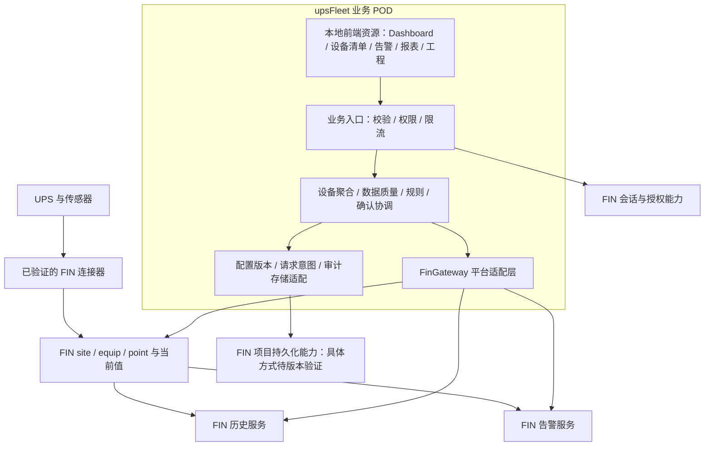
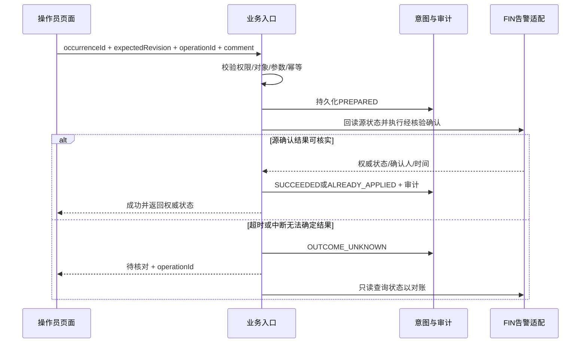
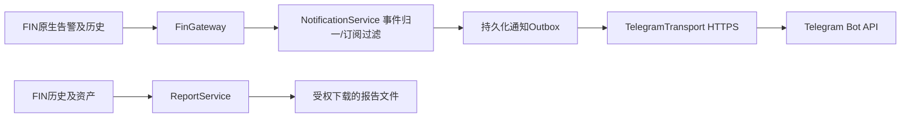

# UPS Fleet Monitor 功能规格说明书（FSD）

版本：v0.1 修订9｜日期：2026-09-15｜作者角色：产品规划与设计｜状态：用户确认本轮文档与DEMO评审通过；FIN生产及实屏验收边界见交付记录

本文定义功能、交互、数据契约、权限与验收要求；版本历史由Git追溯。

需求基线：[UPS-Fleet-FIN-POD-PRD-v0.1.md](UPS-Fleet-FIN-POD-PRD-v0.1.md)。本规格将其 FR-01～17 细化为可分工实现、可用固定输入测试的功能与系统契约；第18节定义FR-21～24，第19节定义FR-25。PRD 定义“为什么、做什么”，本文定义“如何表现、如何协作、如何判定完成”。

## 1. 使用约定与实施边界

**已确认**：用户要求基于 FIN Framework，以可安装 POD 插件交付；采集、历史、告警确认和健康评估通过受控平台接口实现。

**设计决定 D**：本文所有新增模块名、对象名、操作名、参数上限、周期、目录及算法细节均为拟定的项目设计，不是 FIN 官方 API。可据此开发领域逻辑、契约测试和前端；与 FIN 的具体绑定必须通过第 14 节版本门槛。

**待核验 T**：FIN 精确版本/构建号及 SDK、许可证、部署 OS、设备型号固件、协议、点表和容量未知；目标兼容性保持 `unverified`。不得把工作区样例依赖直接作为本产品支持矩阵。

MVP 在单个 FIN 项目内运行。交付一个业务 POD，复用平台已有连接器、对象、历史、告警和会话。本文只交付功能规格及其离线核验附件，不开发、连接现场或部署。无设备控制命令，无远程旁路/停机/放电测试，无批量确认，无未经验证寿命预测。

对 PRD 的细化约定：

|决定|本规格采用方式|原因|
|---|---|---|
|D-01 POD 组织|单业务 POD 暂名 `upsFleet`；前后端同包|减少部署组件，保持业务边界清晰|
|D-02 前端|原始AI-CES-IoT-UPS/index.html为dashboard视觉与组件基线；保留单机仪表盘、设备tabs、三列六卡、健康环/负载条/内嵌趋势；前端模块化和依赖本地化|功能框架或JS技术栈选择不授权重设计页面；详见5.2/5.8/第17节|
|D-03 平台适配|所有 FIN SDK 调用收敛至 FinGateway 逻辑边界|版本变化不扩散到页面和规则|
|D-04 实时传递|MVP 浏览器定时获取业务快照；后端共享采集缓存|无需预先承诺目标 FIN 的推送机制；不因用户数增加设备采集|
|D-05 告警权威|FIN 告警存储为权威；插件只保存关联、请求意图和审计|避免两套独立活动/确认状态|
|D-06 配置发布|影子准备、暂停副作用、持久化提交决定、统一epoch激活；第8节定义重启决策|提交前失败保持旧版，提交后按唯一决定恢复，禁止模块混版|
|D-07 健康呈现|恢复综合健康环位置；有已定义、可追溯的外部评分显示分值，无评分显示中性环“—/待评估”；risk/coverage另列|撤销“以风险文字代替健康环”的设计；不自行从风险、SOC或覆盖率造分数|
|D-08 无权对象|对象级读取统一“对象不存在或不可访问”；会话角色不足返回无权|细化 PRD 的错误页面要求，避免泄露对象存在性|

如实际 FIN 不具备某项接口能力，技术设计必须记录缺口与替代方案，并重新评审对应功能；不得静默降级告警确认、权限或审计。

## 2. POD 总体架构



数据流：设备 → FIN 连接器 → 当前点值/原生质量 → 业务映射与归一 → 快照 → 页面。历史直接经适配层查询平台历史，页面缓存不作为历史库。规则告警经验证的平台告警入口产生与恢复；不直接修改告警记录字段。

浏览器只接触本项目受控业务入口，不接触设备协议、FIN 管理凭据或任意 Axon 执行入口。FIN 内部服务访问方式优先使用目标版本支持的项目上下文能力；本文不预设 HTTP 回环或具体类/函数。

### 2.1 模块职责和边界

以下模块可以组织为 Fantom 类/包，不要求独立 POD。名称为项目逻辑名称。

|模块|输入→输出|负责|不得承担|
|---|---|---|---|
|M-01 UiShell/Views|业务响应→页面|默认Dashboard、设备tabs、六卡布局、健康环/容量条/内嵌趋势、设备清单、表单状态|把组件存在替换为深链/文字；阈值权威、直接确认、凭据存储|
|M-02 RequestFacade|会话+结构化请求→响应|身份、范围、参数、关联ID、超时、速率限制|接受任意查询表达式|
|M-03 InventoryService|授权范围+配置→设备目录|资产、能力、子对象和稳定ID关联|复制所有 FIN 设备资产成为第二主数据|
|M-04 TelemetryService|FIN点快照+映射→MetricValue/EquipmentSnapshot|转换、质量、新鲜度、缓存|修改设备值、生成随机替代值|
|M-05 HistoryService|点引用+时窗→曲线|权限、时区、分桶与缺口|把前端采样当作平台历史|
|M-06 RuleEngine|新鲜输入+规则版本→评估与告警意图|去抖、回差、规则状态、解释|自行向 UPS 下发控制|
|M-07 AlarmService|FIN事件→统一事件；确认请求→状态|去重关联、生命周期、确认协调与对账|独立重写 FIN 告警权威状态|
|M-08 ConfigurationService|草稿+版本→校验报告/发布版本|草稿、映射、版本冲突、激活/回退|无审计覆盖旧版本|
|M-09 AuditRepository|意图/结果→持久化记录|审计、请求幂等、待核对队列|普通用户可编辑的备注式日志|
|M-10 FinGateway|领域请求→目标FIN接口|点、历史、告警、授权、存储、生命周期适配|向领域泄露版本特定记录结构|
|M-11 Lifecycle/Diagnostics|启停/健康事件→运行状态|启动校验、任务释放、健康检查、版本和指标|在启动时创建示例生产设备|
|M-12 ReportService|授权历史/事件→报表作业与文件|第18.2节聚合、渲染、过期清理|截取当前页面冒充全量报告|
|M-13 NotificationService|FIN权威事件→通知outbox|订阅、游标、去重、顺序、审计|改变FIN告警生命周期|
|M-14 TelegramTransport|通知任务→外部投递结果|服务端HTTPS、限流、凭据与错误分类|接受Telegram写设备命令|

### 2.2 建议源码与包资源组织

```text
upsFleet/
  build.fan                  # 冻结 SDK 后编写；明确依赖、源码和资源清单
  fan/
    domain/                  # 值对象、规则、状态机
    services/                # 设备、历史、告警、配置协调
    fin/                     # 目标版本的平台适配
    web/                     # 受控业务入口
    persistence/             # 配置、意图、审计存储适配
    lifecycle/               # 初始化、停止、诊断
  ui/                        # 前端源代码、锁文件、构建配置
  res/web/upsFleet/           # 构建后的静态资源
  locale/                    # English (en-US) UI resources
  lib/                       # 目标版本要求的注册/模型定义
  test/                      # 领域、契约、目标平台集成测试源
  docs/                      # 兼容矩阵、安装升级回滚与测试报告
```

这是源目录建议；测试如何编入/执行、注册文件、资源路由、构建基类和依赖版本待 SDK 核验。E-01 中的混合 POD 只证明工作区存在这种组织实例，不证明本目录可直接编译。

## 3. 数据对象和持久化规格

### 3.1 对象所有权

|对象|主键/引用|所有者与存储|更改方式|
|---|---|---|---|
|FIN Site/Equip/Point|平台稳定 Ref|FIN；插件引用|标准工程流程；不由前端直接写|
|UpsEnrollment|projectId+equipRef|插件配置；注册监控范围|草稿发布；停用保留关联|
|PointMapping|configRevision+mappingId|插件不可变配置版本|发布生成新版本|
|CapabilityProfile|equipRef+configRevision|插件；每项 supported/unsupported/unverified|工程校验后发布|
|RuleDefinition|ruleId+ruleVersion|插件配置|结构化参数版本化|
|RuleState|equipRef+ruleId+ruleVersion|插件运行持久态|与输入水位、告警outbox意图同事务提交|
|RuleAlarmOutbox|projectId+occurrenceId+commandSeq|插件可靠发送队列|CREATE/SEVERITY/CLEAR按发生顺序发送，未知结果阻断后续|
|MaintenancePlan|planId+planRevision|插件不可变配置及计划事件|配置发布更新，事件区分完成、取消、替代|
|EquipmentSnapshot|projectId+equipRef+snapshotRevision|短期内存缓存|自动生成；不可用作恢复权威|
|AlarmAssociation|sourceSystem+sourceAlarmId+occurrenceId|插件关联记录|源事件幂等写入|
|OperationJournal|projectId+operationId|插件持久化意图/结果|追加状态转换；不删除未知结果|
|AuditEvent|auditId|插件/验证的平台审计设施|追加写，不原地编辑|
|ActiveConfigPointer|projectId→configRevision+activationEpoch|持久化提交决定|与发布COMMITTED及审计同事务写入；不是运行成功标志|
|LastSuccessfulActivation|projectId→configRevision+activationEpoch|插件持久化|全部模块统一激活后写入；用于诊断，不能覆盖已提交决定|

具体用目标 FIN 哪种记录或存储 API，由 FinGateway 映射；不引入独立外部数据库作为 MVP 默认依赖。若平台无法提供原子写入、必要索引或所需审计容量，G1 必须提出经评审的存储实现，未解决前不可上线变更功能。

### 3.2 设备注册与映射

UpsEnrollment 必填：equipRef、siteRef、displayName（默认平台名称）、commissioningStatus、capabilityProfile、sourceDocumentVersion、configRevision、acceptanceRevision（可空）。`enabled`改为服务端只读派生值，不允许客户端独立设置。位置使用明确资产字段；电池串/模块记录 parentEquipRef 和自身稳定引用，不用数组位置作身份。接入状态及必要数据集合见3.5节。

PointMapping 必填：mappingId、equipRef、targetObjectRef、logicalField、pointRef、rawKind、normalizedKind、origin、transform、qualityPolicy、historyPolicy、evidenceRef。数值另需 rawUnit、unit、precision；枚举另需 enumMap；相量另需 phase、measurementLocation；电流另需 signConvention。

转换只支持已注册的 scale/offset、单位换算、枚举映射及布尔正反逻辑。`normalized = raw × scale + offset` 使用有限数；不能同时重复应用源端和业务端的比例。缺失代码映射产生 `unknown + UNMAPPED_ENUM`，保留 rawValue；不能取首个枚举作默认。

逻辑字段、单位及来源沿用 PRD 第7节；本规格补充：环境传感器可属于其他设备，但必须有显式关联、同一授权范围和位置依据，不能强行修改其 equipRef 为 UPS；静态资产值以配置版本和变更时间表时效，不套用10秒遥测过期规则。

### 3.3 MetricValue 契约

|字段|类型/是否必填|规则|
|---|---|---|
|field/objectRef|字符串/Ref，必填|逻辑字段与具体整机/电池串/模块|
|value|数值/布尔/字符串/null，必填|当前有效归一值；非良好质量默认 null|
|lastGoodValue/lastGoodAt|同型/null、时间/null|仅供“最后有效值”展示；不得参与当前规则|
|observedValue/observedAt|同型/null、时间/null|可解码但量程异常的当前观测；普通查看者可见并标异常，不作为有效输入|
|unit/precision|字符串/null、整数/null|显示单位与源精度；布尔/枚举可空|
|quality/reason|枚举、代码/null|见第4节；reason给机器码，UI翻译|
|sourceRef/origin|Ref或配置ID可空、枚举|缺失规则见9.4；measured/configured/derived|
|sourceTs/receivedAt|时间/null、时间/null|真实采样与网关收到源结果；不能用浏览器读取时间代替|
|freshnessTs/freshnessBasis|时间/null、枚举|sample/connectorRead/heartbeat/config；来源可信策略明确|
|rawValue/rawStatus|原始值/状态，可空|仅有诊断权限者可查询；不能含设备凭据|
|mappingRevision|版本，必填|保证可追溯|
|derivation|对象/null|ruleVersion、inputRefs、inputTimes、calculatedAt|

rawValue仅作权限诊断；observedValue为已做单位归一的可展示异常值。类型无法解析时observedValue=null，不能显示误导数字。

传输层 D：应用 JSON 中 Ref 编码为不透明字符串、时间为带偏移的 ISO 8601、Number 为有限数并分离 unit；不是 Haystack JSON 编码。源 Haystack 类型仅在 FinGateway 转换。禁止 NaN/Infinity、空字符串冒充 null、false 被当作缺失。客户端无法推算或拼接 FIN Ref。

### 3.4 EquipmentSnapshot 与一致性

返回 identity、communication、powerMode（MetricValue）、metrics数组（以objectRef+field唯一）、assessment、alarmSummary、capabilities、batteryAssets、healthIndicator、outlook、configRevision、activationEpoch、snapshotRevision、generatedAt、partialErrors。assessment采用6.5及9.2的结构，包括risk、coverage、有效/不可用通道、风险原因和最后成功时间；已知critical与partial可共存。

一次快照只使用同一配置版本。各指标保持自身时间，generatedAt 只表示聚合时间，不表示所有设备值刚更新。旧请求响应只有在 equipRef、配置和页面请求序号仍一致时可呈现。列表成员/行序由listRevision冻结，行数值由snapshotRevision更新，实时统计由statsRevision标记；按5.7区分含义，不能用最新统计冒充冻结成员总数。

### 3.5 设备接入状态机与必要能力（评审7）

必要集合分三层，不能互相替代：

|集合|定义|用途|
|---|---|---|
|B 基础运行集合|主连接成功采集诊断、powerMode、至少一个已声明基准的负载指标（loadPct或outputPowerKw/outputApparentPowerKva）；资产ID/site/equip引用另作静态前提|通讯、接入验收及R-05监视集合；环境点默认不属于B|
|A 告警观测通道|真实FIN告警来源、发生身份、同步成功时间、确认/恢复能力|接入验收和健康覆盖；告警平台服务故障不算UPS物理断线|
|I(rule) 规则输入|每条启用规则声明的主输入、辅助遥测和配置；R-01为续航、模式及Q，R-02为负载及阈值|对应规则是否可评估，不影响其他规则输入定义|
|O 可选展示集合|SOC/SOH、阻抗、风扇、环境等能力支持但未选入B的点|字段展示；单点缺失不使B自动扩大|

R-05观测B中的必要遥测及主连接证据，A单独形成“告警同步异常”平台诊断。首批验收至少一种型号有真实续航；该型号启用R-01时续航加入其B集合，不能把不支持续航的型号当成R-01验收。所有集合写入版本化能力档案，不由前端缺省猜测。

|状态|enabled（只读）|进入/离开条件|生产行为|
|---|---|---|---|
|draft|false|工程注册草稿；校验与发布成功→ready|仅预览，不创建规则告警|
|ready|false|已发布未验收；commissioning.accept权限完成证据验收→accepted|只读工程数据，明确未验收；原生告警可读，不作已验收生产统计|
|accepted|true|完整验收报告关联acceptanceRevision；关键变更前须经过8.4限制|B质量监视与已发布规则运行|
|disabled|false|无阻断活动/未决操作后经config.publish停用；重新启用→ready|不创建新的规则告警；历史与源原生告警保留|
|retired|false|工程退役且全部活动规则发生按8.4处理完成；不可直接重新accepted|保留身份/证据/历史，无新监控；替换设备新建资产身份|

验收报告至少有：equipRef、映射/能力/规则revision、型号固件与点表版本、B逐点单位/枚举/时间和源对照、A生命周期/确认测试、断线恢复记录、历史策略结果、可选缺失豁免、验收人/时间及证据引用。后端校验报告指纹与当前配置一致；发布不能伪造accepted。权限 `commissioning.accept` 需明确授予工程角色，范围覆盖设备；验收作为审计变更使用operationId。

关键变更包括源pointRef、比例/单位/枚举、B集合、型号/固件身份、连接/告警来源。无活动/未决规则发生时发布关键变更→ready并撤销旧acceptanceRevision；仅显示名称或非关键计划日期变更保留accepted。已验收设备有活动/未决规则发生时关键变更阻断，先按8.4解决。不能为撤销验收而丢弃旧活动风险。

## 4. 当前值、通讯与质量判定

### 4.1 SF-01 遥测采集与新鲜度

输入：已发布映射、平台当前值/质量、可验证的源时间或连接器成功采集证据。输出：MetricValue 和快照；无任何值写回设备。

为满足PRD从FIN更新到页面p95≤3秒，D调整为：后端共享快照检查周期≤500ms，浏览器可见详情及总览快照刷新周期≤1秒。批量读取能力与开销须G1压测；这不等于500ms设备轮询。数值更新不重建列表成员。隐藏标签页暂停，恢复立即取快照。上次请求未结束不叠加，查询失败按2/5/10/30秒退避，上限30秒，成功恢复正常周期。若目标容量无法承受此策略，必须评审推送或指标变更，不能仍宣称达到3秒。

过期阈值 D：max(3×expectedInterval,30秒)。有效源时间优先；变化上报点可按经过验证的成功采集/心跳确认“值未变化但仍有效”。**单纯再次读取 FIN 缓存不能重置 freshnessTs**；没有采样或成功采集证明则保持 unknown/stale。浏览器可依据服务器时间差更新过期标签，但服务端判定为权威。

### 4.2 SF-02 质量决策顺序

1. 注册停用或点停用 → disabled；能力确认无此点 → unsupported；尚未映射 → unmapped。
2. 类型/单位/枚举转换失败 → fault 或 unknown（未知枚举），给明确 reason；有效范围违规 → fault/OUT_OF_RANGE，value=null，observedValue/At保留可解码的异常观测并对普通查看者显示“超量程，未参与评估”；不能用lastGoodValue替代该异常。
3. 原生 fault/down → 对应状态；无可靠当前采集依据 → unknown。
4. 时钟超未来容差60秒 → unknown/TIME_ANOMALY；采集时间超过阈值 → stale；其余 → good。
5. 非good时 value=null，保留独立 lastGoodValue/At；依赖该值的数值规则暂停并清候选，不自动恢复既有告警；R-05质量规则继续按服务端时间和bad状态评估，R-04日历规则不受遥测影响。

量程配置必须与设备精度/合法范围一致；负载>100%可能合法，不以100作为默认硬上限。good的0、false合法。源诊断和业务质量同时保留，不直接把平台状态枚举全部重命名而丢信息。

### 4.3 SF-03 通讯和供电模式

通讯判定仅来自已映射连接诊断：disabled优先；全部必要连接明确down为offline；部分连接或必要点失败为degraded；全部必要连接健康且必要点满足采集依据为online；证据不足为unknown。多源UPS列出各连接状态，环境传感器断线不能自动声明UPS主连接离线。

供电模式独立采用 utility/battery/staticBypass/maintenanceBypass/off/other/unknown；非good模式值当前为unknown并可附上次模式。不以通信online推断utility，不以模式battery推断连接正常。活动告警等级第三轴独立展示。

## 5. 页面功能规格

### 5.1 SF-04 设备总览（PRD FR-01/02/03）

设备总览定位为Dashboard的“设备清单”视图，保留本节筛选/分页/统计能力，不再作为插件默认首页。FIN中经验证的插件入口默认进入5.2的Dashboard；进入先获取会话能力，再取授权设备。无查看权限不加载设备数据。

顶部：站点过滤（默认全部授权站点）、关键词（名称/位置，最长100字符）、通讯/供电/严重度筛选、已配置/已验收设备数、通讯异常数、活动严重告警数、续航不足设备数及续航不可评估设备数。活动严重告警数以发生记录计，其他以去重设备计，文案不能混用。

列表：设备名、位置、通讯、供电模式、负载、续航/需求、活动告警数量、最新有效采集时间。50条分页，上限100；默认按活动最高严重度（critical>warning>info>无）、通讯异常、名称、稳定ID排序。列表成员与行序使用listRevision，遥测使用snapshotRevision。初次查询冻结授权范围内成员和顺序5分钟；翻页沿用同一listRevision，不主动重建。值每秒刷新，原成员不再匹配过滤时标“状态已变化，刷新列表后移除”，保持当前位置。新增匹配设备及风险升高均显示常驻“有更新”提示；新增critical需立即显示不受冻结排序影响的顶部风险提示及直接入口。重新过滤、手动刷新才重建成员。权限撤销立即从响应移除对象并使列表失效，不受冻结期限约束。

零设备：显示“尚未接入UPS”，仅工程角色显示配置入口；零过滤结果：显示“没有符合条件的设备”和清除筛选。局部失败展示成功行与统计不完整提示，不能把失败设备从总数悄悄删除。总览选择设备后进入详情，返回恢复筛选和页码。

验收：两个互斥站点角色获取的行、计数和搜索建议均无越权；设备值刷新不跳行；配置设备与已验收计数分别正确。

### 5.2 SF-05 默认UPS Dashboard与详情（FR-02/04～08/12）

**Dashboard是产品主页面，不是“设备表格上方几个统计数字”。** 插件默认进入Dashboard，直接呈现选中UPS的完整仪表盘；原设备详情路由复用同一Dashboard组件，不另做简化版数值页。主要导航为“Dashboard / Equipment / Alarms & Events / Reports / Engineering”；接入验收、运行诊断、审计归入工程二级，规格对照/评审场景只在原型辅助入口，不与监控同级抢占空间。

设备选择：顶部站点过滤及横向UPS tabs，默认选择当前范围内上次查看且仍授权的设备，否则选择按名称排序的首台accepted设备，再否则首台已注册设备；选择来源明确，不因新严重告警自动切走用户正在看的UPS。≤8台直接tabs；更多使用横向滚动及“全部设备”搜索，不用多行tabs挤走hero。空范围显示空态，不能保留无权设备。设备清单行点击、告警深链都进入同一Dashboard；返回恢复原上下文。

页面顺序固定：

1. 紧凑产品头部、四个主入口、站点与数据状态；舰队统计为一行紧凑摘要，不可取代单机KPI。
2. 原型风格设备tabs：设备名、位置、供电状态，通讯另加独立文字/图标。
3. **Hero三分区**：左为显著供电模式、UPS身份/位置、温度切换；中为大字号续航估算及同区次级“要求Q/余量R-Q/充裕或不足”；右为110px健康环及评分来源/质量。风险与覆盖说明为下方紧凑标识或展开抽屉，不以长段技术文案替代仪表，也不把Q做成与续航并列的一整块大指标。
4. **三列两行六卡**：第一行电池健康、负载与容量、电力电子；第二行环境、切换与旁路、维护与预测展望。
5. 全宽本机告警与事件区；显示活动数/未确认数各自含义，严重已确认仍保留严重状态。

|卡片|必须直接可见的信息与图形|交互|
|---|---|---|
|电池健康|串/节数/化学体系；串电压、阻抗及基准、温度、充电/电池电流；SOC与SOH分离；当前选择的SOC或SOH大百分比及卡内sparkline；电池更换/维护时间窗一行|多串选择；SOC/SOH趋势切换；点击展开历史/来源，不能先点进历史才见曲线|
|负载与容量|实测kW与对应额定kW、kVA基准说明；0/50/100刻度负载条、当前百分比、卡内负载趋势；要求续航与当前负载保留|超100保留数值并加超限标记，条形可封顶；历史点开加深分析|
|电力电子|输出电压/频率、THD类型与相别、整流器/充电器、风扇状态；底部电容健康mini-gauge+百分比或中性缺失状态|子模块可选择；每项质量/来源可展开|
|环境|环境温度、湿度、空气质量等级/依据、漏水检测|关联空间/传感器来源在次级信息；未知水不显示干燥|
|切换与旁路|切换开关状态；静态/维修旁路各自可用与激活；上次切换时长ms、上次切换事件日期时间|事件时间/来源可展开，不拿轮询间隔算毫秒|
|维护与预测展望|电池、充电/电容、风扇三个组件层面的风险点/建议行及可用时间窗；人工计划与预测来源分开；未提供的维度保留待评估行|点击查看依据；无算法不输出月份|

健康环、内嵌趋势与时间窗的可用/不可用规则见5.8及17.3；不得为展示“完整”而给生产补假值，也不得因缺少接入而删除组件。可用与缺失状态均须实现。

常态页面只显示业务标签、单位、更新时间及简短质量提示；fieldId、cfg、ruleVersion、原子事务、角色测试和“实测来源”等研发解释进入来源抽屉/工程页。温度按钮保留；主页面没有设备控制，

### 5.3 SF-06 历史趋势（FR-09）

入口：Dashboard卡内趋势/指标点击，进入展开趋势；卡内趋势常驻不以此入口替代。默认1小时，可选24小时/7天；自定义不超过7天 D，后续导出独立评审。最多同时4条兼容量纲曲线；不同单位分图，避免双轴误读。切换设备清空当前查询上下文。

Dashboard内嵌曲线默认最近1小时，卡内提示起止时间；首屏读取2条（SOC或SOH、负载率），复用OP-04但与OP-03快照独立加载。一次最多4条的限制沿用，不能因每张卡重复发起相同历史查询。主值先显示，历史加载/失败只影响曲线区域；每条卡内最多60个展示桶，完整展开仍≤1000。历史曲线必须使用源时间戳。

前端传逻辑字段/对象与绝对起止时间；后端按查询时间窗内映射有效区间解析pointRef及转换，并做当前权限校验，不接受任意点号。映射历史语义见5.6节。每曲线最多1000展示点；未降采样返回真实样本，降采样返回桶起止、min/max/avg、validCount、expectedCount（仅固定周期可算）、gap标记。页面默认线图加范围带，标聚合粒度；不以平均抹去尖峰。

缺失区间画断线或空区，不能插值补点。重复/乱序以平台历史读取策略为主，由适配器明确时间和序号处理；冲突不覆盖审计证据。显示站点时区、源单位、数据覆盖和历史服务错误。无历史、单样本、局部读取失败、历史权限不足分别有状态。

### 5.4 SF-07 告警事件页（FR-10/11）

默认活动告警；另有全部事件。过滤：站点、设备、严重度、活动状态、确认状态、发生时间。默认50条分页；活动页按严重度、发生时间降序、occurrenceId稳定排序；全部事件按发生时间降序。显示 occurredAt 与 receivedAt 差异时标“迟到事件”。

详情时间线包括发生、确认、恢复、来源未知、再同步；告警与纯事件区分 kind。纯事件的 ackRequired=false，按钮不出现。关闭详情后返回原过滤。源不支持确认时显示原因，不能把前端已读包装成确认。

### 5.5 SF-08 工程配置页（FR-13/16）

按“注册设备 → 声明能力 → 点位映射 → 历史/规则 → 校验 → 发布”六步组织，可保存草稿后继续。设备选择只列可访问且未重复注册的FIN设备。工程资产修改范围限插件登记，不同时修改设备协议地址和密码。

每个字段显示 logicalField、原始point名称/Ref、单位、枚举、当前值及质量、证据文件版本、支持状态。点预览明确“只读预览”，不得通过假数据使校验通过。设置“不支持”必须填能力依据；“未验证”不能当作已验收。

校验报告按阻断/警告/信息列出位置、原因、整改动作。硬错误：引用无效或越权、量纲冲突、重复目标字段、非法类型/枚举、正负约定缺失、必要点无映射、规则需求≤0、阈值或回差非法。可选字段缺失警告可保留，发布记录原因。

同一源点不得被意外映射为两个含义冲突的字段；合理复用需显式声明。映射UPS环境时可引用同站点其他传感器，必须记录关联，不使用“父设备不一致”一刀切误拒合法环境点。

发布细节见第8节。诊断视图显示配置版本、连接状态、点质量统计、历史错误、规则错误、确认待核对数量和请求ID，不显示凭据或完整内部堆栈。

### 5.6 历史映射版本语义（评审8）

采用“按当时有效映射解释”，不统一用当前源回查过去。PointMapping版本记录validFrom（提交激活决定时间）、validTo（下一生效边界，开区间）、sourceRef、transform、normalizedUnit、assetGeneration、changeReason。查询[from,to)切为互不重叠半开区间；每段使用该段源点和原转换。切换点的样本只属于新段；跨版本桶不得合并，图上显示垂直边界和映射版本。

换设备创建新的assetGeneration，即使名称相同也断开曲线；换点/单位/比例只在变更后生效。修正错误比例默认不追溯改写历史解释；旧段标“历史配置已知错误”并显示原因，数值不参与趋势规则。MVP无追溯修正入口，需另行受审计的重算方案。缺失旧版本/旧源/权限时返回该段gap及原因，不用新点补齐。查询所有段按用户当前对象权限过滤，历史权限不沿用当年的授权。有效区间与旧配置保留时间至少覆盖历史留存，不能提前清理。

### 5.7 列表返回与游标（评审12）

listRevision固定成员/排序和过滤，snapshotRevision只更新值。游标含listRevision与下一位置，不绑定每秒遥测版本；有效期5分钟。设备表和告警表都遵循此原则；topStats为最新权限范围及过滤条件下统计，单独标statsRevision/asOf，不声称与冻结成员数量相同；frozenTotal表示成员数。

从详情返回时游标有效恢复原位置；过期时用原过滤及anchorEquipRef重新查询并定位包含该设备的一页，提示“列表已刷新”；设备不再匹配则回第一页并解释。翻页遇CURSOR_EXPIRED按同一规则重建，不拼接旧页。后台新critical提示始终按当前数据与权限计算，与列表刷新独立。

### 5.8 Dashboard视觉保真规范（强制）

视觉一手基线是原始 `doc/UI prototype/AI-CES-IoT-UPS/index.html`。保真对象是信息组织、组件形态、层次和密度，不要求复制随机数、未验证阈值或前端确认逻辑；产品文案统一英文。

桌面布局示意（浏览器宽1366及以上，业务内容最大1240px）：

```text
[UPS Fleet 品牌/业务副标题]             [Dashboard  Equipment  Alarms & Events  Reports  Engineering] [Light/Dark]
[站点/范围 · 紧凑舰队统计]                  [数据状态/更新时间]
[UPS-1 · 位置 · 状态] [UPS-2 ...] [UPS-3 ...] ... [全部设备]
┌───────────────────────────── Hero ───────────────────────────┐
│ 供电模式 / UPS身份 / 位置  │  续航 R          │  健康环 分值 │
│ 通讯单独标识 / °C⇄°F      │  要求Q / 余量R−Q  │  数据来源标识  │
└─────────────────────────────────────────────────────────────┘
[电池健康 + SOC/SOH小趋势] [负载容量条 + 小趋势] [电力电子 + 电容条]
[环境四项]               [切换/旁路/上次事件]  [维护/预测展望列表]
[全宽：本机告警与事件；活动数/未确认数；严重已确认仍保持严重]
```

长名单、高级历史、配置和审计应增加深度，不应挤掉此主画面。

|维度|保留要求|允许调整|不接受的替代|
|---|---|---|---|
|内容壳层|Dashboard居中max-width1240px，外边距/留白参考原型28px/24px|英文标题、紧凑顶部导航；必要时≤64px图标栏|固定218px工程侧栏加大标题/场景条吞掉主画面|
|背景与面板|首次默认浅色，可自由切换并记忆；浅/深token见18.4，保留48px低对比网格|原DEMO深色作为深色模式基线，按对比度调整|只保留一种主题，或切换时改变仪表盘布局|
|色彩|按18.4浅/深主题语义token；文字+图标辅助|独立通讯图标，风险与供电模式分别编码|用电池供电颜色直接替代全部风险或健康|
|边角与间距|面板3px圆角、18px网格间距、1px细边框；卡内14～18px层次|移动端适当收缩|大圆角厚卡片、过大的卡片间距改变工业仪表密度|
|字体/数字|等宽数字用于KPI/时间，英文使用本地系统字体；hero续航约40px、健康分26px，正文12～15px|源精度与200%缩放|所有信息同一字号或每个次级值都放大到主KPI级别|
|Hero|左模式/身份，中续航，右110px环；约1.4fr/1fr/130px|风险与coverage一行短标识，详细依据可展开|三个大文字统计块；无环；用Q大数字代替模式主体|
|六卡|宽屏严格3列×2行，顺序不变，告警全宽|英文长文本换行、各卡高度随内容微调|桌面默认2列长表单，或只显示数字无图形|
|趋势与仪表|电池趋势、负载条/趋势、电容mini-gauge在本卡可见|补时间轴简注和质量缺口|“点击历史”链接充当曲线，纯文字充当量表|
|异常状态|组件框架/标题保留，缺数据标中性及原因|在异常区域展示最后有效值/观测值|删除组件，或无数据画满绿色环/条|

内容可用宽度>980px用三列；640～980px两列、hero可堆叠；<640px单列，卡片顺序电池→负载→电子→环境→旁路→维护不变。无横向整页滚动；设备tabs及第22节明确的宽表/图表容器允许局部滚动。1366×900和1440×1000作为桌面保真对照尺寸，100%缩放；完整多屏矩阵与交互按第22节。普通字号下第一个六卡行首屏可见仅约束上述桌面保真尺寸，手机、平板短屏及200%缩放允许自然纵向滚动，不能以硬塞内容为由缩到不可读。

### 5.9 健康环、预测展望与缺失数据的呈现

综合健康score与风险assessment独立。提供有效外部整体UPS评分（设备/厂家或单独批准的算法）时，环按0～100分呈现，显示来源/算法版本/评分时间；规则严重告警仍独立显著。无有效评分时保留中性空轨环、中心“—”、标签“健康待评估”；点击说明“未接入整体评分”，不把SOH、SOC、100减告警数或coverage百分比当整体评分。评分过期显示最后评分并标过期，环不按当前健康正常着色。MVP不新增自研评分算法。

电容条只有有效capacitorHealthPct及定义时填充；不支持时同位置中性空轨及“不支持”。电池趋势默认选择有历史且语义明确的SOH；否则选择SOC并明确标题“SOC荷电趋势”，不能继续模糊称“容量趋势”。两者均无历史时保留曲线区域和“无历史/未映射/不支持”原因；缺口断线规则保持。

电池更换窗口和组件预测列表保留可见位置，MVP可显示：已记录的厂家建议日期/人工计划、已有外部预测（已定义对象、方法、时点与适用范围）、或“预测暂不可用，待评估”。人工计划不得标为预测；无外部预测时不显示剩余月数。外部预测接入并非训练自研寿命模型，具体适用能力必须通过G1；模型开发仍P2。有有效外部预测才能显示“建议窗口”，不能借UI恢复放宽生产数据证据要求。

健康环、容量条、环境状态、切换时间与维护展望均按真实数据能力呈现，缺失时保留中性状态和原因。

## 6. 规则规格与状态机

### 6.1 SF-09 三类执行模型与输入推进（评审1、9）

每条规则都有ruleId/version、enabled、driver、inputs、parameters；driver决定执行时机，不能把“必须good”强加给质量或日历规则。

|类型|规则|驱动与前提|候选状态计数|
|---|---|---|---|
|数值规则|R-01/02/03|主输入新采集证据；主/辅助遥测均good，配置合法且同一运行epoch|仅主输入水位推进计数；重复读取/辅助输入更新不增计数|
|质量规则|R-05|服务器每1秒定时检查及质量变更事件；允许bad或完全无新样本|按持续时间判断，不等待good采样|
|日历规则|R-04|站点午夜及每60秒补偿检查、计划发布触发；不依赖遥测|按planRevision+阶段去重，不使用triggerCount|

数值主输入：R-01=runtimeEstimateMinutes，R-02=loadPct（或明确派生负载主采集批次），R-03=batteryImpedance。模式、其他辅助输入更新只影响下一主样本是否有效；模式更新可调整现有R-01告警严重度，但不得累计新的触发/恢复次数。静态配置不参与遥测时间差。遥测maxInputSkew为显式参数，D=2×最慢必要遥测周期。

主样本身份为sourceRef+sourceTs+sourceSeq（源有可靠序号时）；同时间不同递增seq算新样本；没有seq时同时间同值为重复，不同值为冲突诊断，不能多计。时间早于水位或seq倒退不推进，迟到值只可入历史。已验证的成功采集批次/心跳能证明主输入再次被读取时可作为新证据；只证明连接存活而未读该主点的心跳不可推进数值规则。

候选必须同时满足count≥N与elapsed≥durationMs（AND）；N≥1，durationMs≥0。新样本间隔>maxSampleGap重置候选，D=maxSampleGap等于主输入stale阈值；主或辅助数据bad立即重置候选，但保留已有活动风险。N=1且duration=0在第一个满足样本直接转换，不额外等待一次。水位、候选、风险状态及外发意图的原子持久化见7.4。

|状态|新有效主样本|结果|
|---|---|---|
|NORMAL|触发条件满足|达到N/时间则直接ACTIVE，否则PENDING_TRIGGER|
|PENDING_TRIGGER|继续满足|达标ACTIVE；不满足/无效/超间隔→NORMAL并清候选|
|ACTIVE|恢复条件满足|达标NORMAL并产生恢复意图，否则PENDING_CLEAR|
|PENDING_CLEAR|继续恢复|达标NORMAL；不满足/无效/超间隔→ACTIVE并清恢复候选|

ACTIVE/NORMAL是业务检测状态，不宣称平台已完成创建/恢复。平台同步状态另记，创建未确认时页面显示“已检测风险，待同步”，详见7.4。

### 6.2 SF-10 规则参数和转换（评审10）

|规则|条件/参数|级别与边界|
|---|---|---|
|R-01续航|Q>0、R≥0；R<Q触发；R≥Q+H恢复，D H=2min、N=2、duration=0|battery critical；其他已知模式warning；unknown暂停数值评估；参数需工程发布|
|R-02负载|W<C，0< Hw < W，0< Hc < C-W；触发/降级/恢复各自N和duration必填|转换表如下；维持同一活动发生身份|
|R-03阻抗|B>0、同对象/测法/条件，d=(I-B)/B×100；工程配置W、H>0，d≥W触发、d<W-H恢复|warning；无批准阈值只展示变化，不进入已启用评估集合；不据此生成整体健康百分比或剩余月数|
|R-04计划|站点Date≥dueDate-remindDays，D提前30天；Date≥dueDate为到期|纯计划事件，ackRequired=false，不当物理故障|
|R-05质量|accepted设备B任一必要项不可用，按6.3|warning及覆盖不足；不要求故障输入good|

R-02每个转换都有独立候选，满足次数和持续时间两项才发生；候选目标变更清旧候选并从当前样本计1。优先先判总体恢复，再判升级/降级。等于恢复阈值仍保持，不算恢复；严重边界等于C属于严重。

|当前风险|负载L|候选/目标|
|---|---|---|
|normal|L≥C|critical触发候选（可直接跨warning）|
|normal|W≤L<C|warning触发候选|
|normal|L<W|保持normal|
|warning|L≥C|critical升级候选|
|warning|L<W-Hw|normal恢复候选|
|warning|其余|保持warning，清不满足候选|
|critical|L<W-Hw|normal恢复候选；无需先降warning|
|critical|W-Hw≤L<C-Hc|warning降级候选|
|critical|L≥C-Hc|保持critical，清不满足候选|

数值规则生产默认disabled，验收所需规则须工程发布。R-05在设备accepted后按审核的B策略自动成为必需质量监视；不能通过禁用R-05让accepted设备无人监视。R-04随有效维护计划存在而评估。

### 6.3 R-05无新数据触发与恢复

每1秒用服务器单调计时检查B。值在now>freshnessTs+staleAfterMs时stale；原生down/fault即时成为异常。badSince起点为可证明的失效时间（stale截止时间、原生错误接收时间），不是下一次good时间。D持续bad达到5秒即生成一次设备级数据不可用风险，服务端检测最迟为截止+6秒；同一活动发生增加子点原因，不重复创建。

恢复必须B全部good且每个必要点取得badSince之后的新成功采集证据，然后持续good5秒；其中一个再次bad重置恢复计时。不要求每秒新样本，但持续good期间必须未过期。平台A告警通道不可用另报同步异常，不将R-05恢复条件循环绑定到自身告警服务。ready/draft/disabled/retired不新建R-05；允许进入停用的条件见8.4。

重启恢复badSince/活动发生；若截止时间已过立即按持久化时间判断，最迟启动质量监视后1秒重现检测。系统时钟回拨用单调时钟保持进程内持续时间；重启发现墙钟不可信标时间诊断并保留活动，不能伪造恢复。B无任何初始样本的ready设备不得accepted。

### 6.4 计划维护最小闭环（评审14）

MaintenancePlan字段：planId、planRevision、equipRef、targetObjectRef、source（manufacturer/manual）、title、dueDate（站点时区Date，YYYY-MM-DD）、remindDays整数0～365、status（scheduled/completed/cancelled）、completedDate可空、updatedAt、updatedBy、evidenceRefs、supersedesPlanRevision可空。计划在SF-08工程配置中通过草稿局部变更发布；不新增设备维护控制。

生成计划事件identity=planId+planRevision+stage，stage=upcoming/due/completed/cancelled/superseded；upcoming在到期日结束并接续due。日历检查重复不增事件，午夜错过由60秒补偿检查处理。完成必须填completedDate和证据；计划改期/修改生成新revision，旧提醒以superseded结束并保留旧日期，取消以cancelled结束，不伪称故障恢复。所有计划事件ackRequired=false；告警确认不会完成维护。MVP只支持计划及完成证据的配置更新，不扩充完整维护工单管理。

### 6.5 风险/覆盖决策表（评审11）

覆盖按“必需观测通道+应评估规则”计，不按屏幕字段数量。集合K包含B健康通道、A告警同步通道、R-05、每条已启用且适用的数值规则，以及存在scheduled计划时的R-04；静态不支持的O不入K。应启用而未启用的验收必需规则作为unavailable项，不能从分母删掉；其他disabled规则另列disabledRules。ready/disabled/retired无当前生产评估，risk=null、coverage=insufficient，保留历史及仍活动的源风险说明。

对accepted设备：validCount为有当前有效结果的K项数；validCount=|K|且|K|>0为complete，0<validCount<|K|为partial，validCount=0或K空为insufficient。质量规则有效地判断“异常”仍算有效评估；B失败本身使B通道unavailable，所以不会显示覆盖complete。源A过期为unavailable；其最后已知活动风险仍保留并标时间。

|输入|risk|
|---|---|
|任一已知活动critical原生告警/规则检测（包括待同步）|critical，优先级最高；质量差不掩盖它|
|无critical，有warning原生/规则风险、R-05异常或维护upcoming/due|attention；warning→attention显式映射|
|无已知风险，coverage=complete|normal|
|无已知风险，coverage非complete|null，显示“无法确认正常”|

info纯事件不参与风险；告警同步异常使覆盖不足，另有系统提示，不创造物理设备critical。输出expectedItems、validItems、unavailableItems（含原因）、disabledRules、lastSuccessfulEvaluationAt（可空）、riskReasons、riskLastVerifiedAt及sourceQuality。不得用刚聚合的generatedAt冒充最后成功评估时间。

## 7. 告警生命周期与可靠确认

### 7.1 SF-11 告警归一与发生身份

AlarmOccurrence采用9.2契约：activity允许active/cleared/administrativelyClosed/unknown；physicalClearedAt仅自然恢复，administrativeClosedAt及resolutionKind单独记录管理结束；acknowledgement和sourceQuality独立。没有平台证据时不能自行新增管理结束状态。

同一源身份重复采集幂等更新；恢复后再触发必须有新的 occurrenceId。FIN源提供批次ID时优先使用；没有时由适配器根据已核验的发生/恢复标识生成持久化批次，不能只用描述+分钟去重。恢复信息不全时activity=unknown并保留lastKnownActivity，不臆造恢复。

原生告警与本地规则同义时配置sourcePreference：native优先或rule优先；没有依据时仅相关联，不删除源记录。实际状态权威仍在FIN。断线只更新sourceQuality，不把活动告警恢复。

### 7.2 SF-12 单条确认流程

前提：已登录、具备 alarm.ack 及对象范围、ackRequired=true，源确认能力通过G1。按钮打开摘要：设备、描述、发生时间、当前状态、备注。备注 D：1～500字符，确认人从服务端身份取，不接受前端指定。



OperationJournal状态：PREPARED → EXECUTING → SUCCEEDED / ALREADY_APPLIED / REJECTED / FAILED_NOT_APPLIED / OUTCOME_UNKNOWN；未知可经源证据转最终状态，证据不足保持未知并呈运维待办。请求意图落库失败不执行确认；源成功但结果落库失败仍为待核对，不能向页面宣称审计完成。

确认请求有效revision与幂等键均通过后再执行；SUCCEEDED意味着源结果已经核实且完成审计，不要求页面投影立刻可读。源成功但审计未完成仍保持OUTCOME_UNKNOWN/待核对，不返回SUCCEEDED+pending。

同operationId同请求体重复提交返回已有操作；同ID不同请求体返回 IDEMPOTENCY_CONFLICT。作用域为项目+操作ID并绑定操作者，不能借ID读取他人越权对象。记录保留与审计同期限（建议365天）；未决操作不因期限自动删除。

两个操作员竞争：先回读；已确认则返回ALREADY_APPLIED及原确认者，不覆盖备注。revision不同且仍可操作则返回REVISION_CONFLICT要求刷新。业务端同一发生串行处理，但不能只依赖进程锁；需持久化去重/原子条件更新保障重启一致性。

浏览器等待超3秒可显示“处理中”，收到待核对后每2秒查询操作状态，30秒后停止自动查询并保留“状态待核对”入口；后端继续受限对账。页面离开不取消已经提交的操作。断网禁用新确认，不保存离线待发队列。

确认不会修改activity或clear时间，不会发送UPS控制命令。目标平台若不支持恢复后确认，显示“平台不支持此确认”，该能力偏差需G1评审；不能临时创建伪装为FIN确认的前端已读状态。

### 7.3 SF-13 审计规格

AuditEvent含 auditId、projectId、serverTs、actorId、action、targetRefs、operationId、outcome、beforeRevision/afterRevision、redactedDiff、reasonCode、sourceResultRef。记录确认、配置发布/回退、规则变更、拒绝与失败。普通角色不可编辑或删除；查询强制授权范围。备注文本进行长度和输出转义，不接受HTML执行。

源确认由其他FIN界面执行时，在本插件回读更新权威状态；显示“源系统确认”，保留可获取的身份与时间；不可把当前读取者记为确认人。本插件审计不声称覆盖所有平台外部操作，外部变更需要通过平台审计关联。

### 7.4 规则告警可靠发送协议（评审4）

业务检测状态与FIN确认状态分离。对每个新主样本/质量或日历时钟事件，在同一事务提交：RuleState（候选、检测级别、输入水位）、新发生identity或既有发生更新、RuleAlarmOutbox命令。事务失败三者均不前移，重新处理同一事件；不得先保存ACTIVE后再单独保存发送意图。

occurrenceId由持久化发生计数分配；correlationKey=projectId+equipRef+ruleId+occurrenceId。每发生持久化occurrenceOrdinal、detectedStartedAt/detectedEndedAt、previousOccurrenceId；commandSeq单调递增，幂等键=correlationKey+commandSeq，命令kind为CREATE/SEVERITY/CLEAR，保存原发生/恢复时间和前置seq。CREATE总为seq1；升级及恢复顺序跟随；不能以当前时间重写过去发生时间。

发送状态为PENDING→DISPATCHING→APPLIED / DEFINITELY_NOT_APPLIED / OUTCOME_UNKNOWN。对同一发生最多一个在途命令；FIN已执行后，把sourceAlarmId/回读结果、outbox APPLIED及关联写入同一事务。发送前退出仍PENDING可发送；DISPATCHING后崩溃一律先只读按correlationKey核对。只有目标FIN支持可验证的幂等键或唯一关联查询，才允许自动创建规则告警；能力不足阻止该功能上线，不能靠“看起来同一描述”查重。

CREATE结果未知时，后续SEVERITY/CLEAR可落队列但禁止外发。业务风险已恢复而CREATE仍未核实时，页面同时保留“已检测历史风险/源同步待核对”和原发生时间；不宣称平台已恢复。待CREATE确认后按seq补发，保持先产生后恢复的历史。源长期不可用时展示本地已检测风险、syncState和首次失败时间，FIN活动数量另列为过期，不能伪造源活动计数。

本地恢复判定达标并原子写入CLEAR时，立即结束该检测发生并写detectedEndedAt；不等待FIN确认。再次达标触发即分配新的occurrenceId和occurrenceOrdinal，不继承旧确认；每个发生保留独立CREATE/CLEAR及检测起止时间。即使前一CREATE或CLEAR未知，新发生仍可持久化。发送依赖为同规则/设备occurrenceOrdinal顺序：后一CREATE等待前一CLEAR被源确认，旧发生的CLEAR只引用旧sourceAlarmId，不能结束新发生。前一命令未知只阻断这条发生链的外发，不阻断本地检测；多个快速发生/恢复均按序持久化，受原有outbox事务及容量约束。当命令明确未执行可按2/5/10/30秒退避；未知只读对账，D每30秒、连续20次无结论转RECONCILIATION_REQUIRED并停止自动写，保留运维待办。只读对账恢复可继续；无法核实需源系统证据，普通用户无“强制成功”按钮。队列限额D=10,000待发命令，满时停止接受新副作用，显著显示监控降级并保留错误日志；RuleState不能在outbox落库失败时前移。

## 8. 工程发布、并发和恢复

### 8.1 SF-14 范围安全草稿与校验（评审6）

客户端只提交局部patch列表：add/update/remove + entityType + entityId + expectedEntityRevision + payload；省略对象表示不变，不表示删除。不接受项目全量替换。服务端取得完整活动版本，在内存合并patch；A站点用户只能读/改A投影，B对象由服务端原样保留。

新增校验所属site/equip及所有引用；修改校验对象旧归属和新归属双边权限；删除检查被引用对象和其范围权限；跨站搬移无双边授权拒绝。影响无权对象的共享规则模板变更拒绝SCOPE_CONFLICT，不提供对方对象名称或数量。MVP采用设备专属规则配置；全项目公共配置仅project.config权限可改。

草稿含draftId、baseConfigRevision（不透明令牌）、draftRevision、scopeDigest、patches、contentHash、author、updatedAt。每次保存/验证/发布重新取当前权限。差异、校验影响清单、版本历史、回退内容只展示授权范围。回退也是把该用户可见范围生成patch；绝不恢复整个项目旧版本覆盖其他站点。

validate返回validationId、draftRevision/hash、platformBindingFingerprint、blockingIssues、warnings、affectedEquip/ActiveAlarms（范围内）、expiresAt。D有效期10分钟；引用、权限或元数据变化使报告失效。所有发布基于项目baseConfigRevision做CAS；别的站点先发布也返回不含细节的REVISION_CONFLICT。服务端以原patch在最新版本上重新合并供用户复核；不自动发布。未变更的无权对象逐字段保持不变并在服务端测试中验证。

### 8.2 SF-15 统一激活状态机（评审3）

选定“影子准备 + 持久化提交决定 + 统一epoch闸门”方案，替换旧版存储指针先改而模块各自加载的语义。持久化Publication含operationId、candidateRevision、previousRevision、previousEpoch、targetEpoch、state、moduleReadySet、decisionAt、lastError。所有模块必须在内存按同一epoch运行，规则和发送器持久化写入使用epoch条件检查。

|状态|动作|中断/失败后的唯一恢复|
|---|---|---|
|PREPARING|写候选不可变配置；各模块构建影子只读对象，不读写生产规则状态或发送命令|未COMMITTED重启丢弃候选运行态，加载旧ActiveConfigPointer；操作ABORTED|
|PREPARED|所有必需模块返回候选hash和READY，预检通过|仍无提交决定；重启ABORTED用旧版|
|QUIESCING|关闭变更/规则发送闸门，排空旧epoch在途本地事务；持久化未知外部操作，禁止新旧混发|未提交仍用旧版；重启先对账旧未知操作|
|COMMITTED|同事务写ActiveConfigPointer=候选+targetEpoch、Mapping有效边界、Publication提交决定、审计；规则状态迁移决定同边界登记|重启必须准备并激活该候选；不自行选择旧版|
|ACTIVATING|闸门关闭，全部模块切同一epoch并确认；模块不齐时不运行新副作用|超时D30秒或任一失败→RECOVERY_REQUIRED；保留新提交决定，禁止静默退旧版|
|ACTIVE|全模块一致后持久化LastSuccessfulActivation及操作成功，打开闸门|重启加载ActiveConfigPointer并重建；按未决操作协议恢复|
|ABORTED|提交前失败，记录原因，旧epoch恢复运行|旧版唯一有效|
|RECOVERY_REQUIRED|提交后失败，只读诊断；旧快照标“配置切换未完成”，禁规则新评估/外发及普通新变更，OP-31紧急暂停除外|每次启动尝试重建已提交候选；失败保持此态；管理员可发经校验的显式恢复发布|

启动选择只看持久化COMMITTED决定/ActiveConfigPointer，不以LastSuccessfulActivation代替提交决定。没有COMMITTED的孤立候选作废；有COMMITTED必须全部加载同版后再开闸。外部已发送但未知命令不因epoch变更重发，保留7.4身份；发布前的在途回调仅允许完成其已登记操作，不允许再生成旧epoch新命令。

提交后恢复旧内容也作为新的恢复发布：复制previousRevision为新候选/新epoch，做同样PREPARE→COMMIT→ACTIVATE及审计；不倒写旧指针。恢复发布若改变相关映射，继续受8.4活动发生限制。恢复失败保持RECOVERY_REQUIRED，由运维处理；不能一边cfg8遥测一边cfg7规则。未激活时间段标历史解释边界但不声称插件曾运行规则。

激活期间读请求返回CONFIG_ACTIVATING或带旧epoch/过期标识的最后快照；不得返回混合模块快照。变更请求返回PUBLICATION_BUSY；已提交operationId状态读取及OP-31紧急暂停独立保持可用，OP-31不依赖候选配置激活。

### 8.3 历史策略、回退与外部服务

历史设置为工程预检：页面声明归档/留存期望，实际平台设置通过工程流程并回读核验；插件发布不冒充外部历史事务。必需历史不符合则阻断或显式能力豁免。回退生成新局部patch版本，不重写过去映射区间、告警或审计；仅未来解释采用新激活边界。

### 8.4 SF-16 活动规则、禁用和退役（评审5）

MVP选定可执行的保守策略：**有相关活动检测、未完成CREATE/SEVERITY/CLEAR或OUTCOME_UNKNOWN时，阻止破坏恢复链路的变更**。范围包括规则禁用/删除/阈值版本更改、输入删除或重映射、B变更、设备停用/退役。返回ACTIVE_OCCURRENCE_BLOCKS_CHANGE及有权范围内的发生ID和动作建议；确认已知悉不解除阻断。仅名称、文案、无关计划修改可以继续。

处理路径一（自然恢复）：旧配置持续运行，按旧规则取得恢复证据并使CLEAR确认；之后可发布禁用/新版本/停用。对尚未触发但有候选的规则可变更，提交时清候选并记录旧水位，不迁移计数。原生源告警由平台继续管理，停用插件不能把它恢复；有原生活动时可在无插件活动/未决命令的前提下停用监视，但停用记录必须列出这些源活动并持续在告警事件页可查。

处理路径二（设备永久移除/不可能自然恢复）：需要验证的平台管理结束流程，并提供管理操作者、原因、源记录、时间及可回读证据。该行为记为engineeringRetired/administrativelyClosed，与physicalCleared区分；不得填入physicalClearedAt。插件在读取确认管理结束证据且无未决写后，关联记录标resolutionKind=administrative，并允许退役。MVP不提供该外部管理写入口；若目标平台不能区分管理结束或无法提供证据，退役变更保持阻断，列明确运维待办，不能伪造恢复。

停止评估是配置状态，不是发生状态；自然恢复需要条件证据；工程退役是审计管理结论，三者分别记录。恢复后新规则用新version/新occurrenceId，不继承旧确认。重新启用disabled设备回ready重新验收，不直接accepted。

## 9. 业务操作与传输契约

下列 `OP-*` 为项目拟定的逻辑操作，**不是可直接调用的 FIN API/Axon 函数**。MVP建议以同源受认证Web入口传JSON，实际资源路径、CSRF机制和SDK绑定在G1冻结。只读可映射GET或受控查询；确认/发布只允许显式变更请求，GET无副作用。

公共响应采用9.2的Response判别联合；列表游标绑定用户范围、filterHash和listRevision，有效期5分钟，不随遥测更新失效；过期按5.7恢复，不混合新旧成员。所有时间带时区；纯日期只用于维护计划。未声明字段拒绝，null与缺省含义不可互换。

|操作|主要输入|输出|权限/限制|
|---|---|---|---|
|OP-01 SessionCapabilities|会话|允许动作、范围摘要、语言/时区|登录；不泄露无权站点|
|OP-02 EquipmentList|site/filter/query/cursor/pageSize|设备摘要与同范围统计|fleet.view；pageSize≤100|
|OP-03 EquipmentSnapshot|equipRef、已知revision可选|EquipmentSnapshot或未变化|fleet.view+设备范围|
|OP-04 MetricHistory|equipRef/objectRef/fields/from/to|各曲线桶、质量、单位、缺口|history.view；≤4条/7天/每曲线1000点|
|OP-05 AlarmList/Detail|过滤或occurrenceId|事件列表/时间线|alarm.view+范围|
|OP-06 AlarmAcknowledge|occurrenceId/expectedRevision/operationId/comment|操作状态与权威确认结果|alarm.ack；无批量/设备写|
|OP-07 OperationStatus|operationId|状态、可公开结果|原动作权限及对象范围|
|OP-08 ConfigGet/SaveDraft|action、draftId、base/draftRevision、局部patches|范围投影或草稿版本|config.edit；禁止全量替换；大小上限D=2MB|
|OP-09 ConfigValidate|draftId/draftRevision|校验报告|config.edit；只读平台核验|
|OP-10 ConfigPublish|validationId/hash/baseRevision/operationId|Publication和Operation状态|config.publish；报告未过期；统一epoch激活|
|OP-11 ConfigRollback|目标历史版本/理由/baseConfigRevision|授权范围回退草稿；随后OP-09/10|config.publish；不直接执行回退|
|OP-12 Diagnostics|设备/项目范围|错误、版本、计数、运行健康|diagnostics.view|
|OP-13 AuditList|设备/时间/动作/cursor|只读审计事件|audit.view；默认7天查询，上限31天/次|
|OP-14 CommissioningAccept|equipRef/configRevision/report/operationId|设备状态与验收记录|commissioning.accept+设备范围；证据指纹必须匹配|

错误约定：UNAUTHENTICATED（重新登录）、FORBIDDEN（动作权限不足）、OBJECT_UNAVAILABLE（无对象或无范围）、VALIDATION_FAILED（字段列表）、REVISION_CONFLICT、IDEMPOTENCY_CONFLICT、CURSOR_EXPIRED、SOURCE_UNAVAILABLE、HISTORY_UNAVAILABLE、RATE_LIMITED（retryAfterMs）、PERSISTENCE_UNAVAILABLE、OUTCOME_UNKNOWN、CAPABILITY_UNSUPPORTED、SCOPE_CONFLICT、ACTIVE_OCCURRENCE_BLOCKS_CHANGE、PUBLICATION_BUSY、CONFIG_ACTIVATING、RECOVERY_REQUIRED。只读临时错误可退避重试；变更错误以OperationStatus为准。

默认查询每会话并发≤2个历史请求、≤4个一般请求；项目历史并发≤8，超限返回可重试错误。数值、时间、枚举、引用长度和查询窗口服务端验证。不会将前端filter字符串拼成任意执行脚本。

### 9.1 联调字段规则（评审13）

9.2为独立于FIN的业务类型契约，以TypeScript式类型记法表达数据schema，不是产品代码或SDK声明。未标?的字段必填，?为允许省略；可空必须显式null。所有ID/Ref/版本为非空不透明字符串（≤128字符），文本≤500字符，数组按操作上限限制；未知枚举/额外字段拒绝。所有操作统一使用9.2与9.4契约；目录只作索引，不允许另加未声明字段。

请求默认：列表pageSize=50；filter为空表示全部授权对象；alarm list默认activity=active，纯事件只在all视图；history缺省时窗serverNow前1小时至serverNow；audit缺省7天。排序不可由客户端注入表达式，枚举限文中列举。数据更新响应（ok/partial）与notModified以kind区分；notModified仍给serverTime和snapshotRevision，客户端只在本地缓存同设备/权限/configRevision且存在时使用，否则重新取全量。质量时间变化或权限/配置变化必须产生新snapshotRevision。

operation.state与结果可读取分开：SUCCEEDED且resultAvailability=pending表示执行已完成、结果投影尚未可读，只能查询OP-07，禁止重发；unknown表示执行结果尚未确定，两者不能混用。列表单项失败为partial并列partialErrors；未授权对象不进入错误详情，以免泄露。

### 9.2 业务schema（请求、响应、枚举）

```typescript
type Id = string; type Ts = string; type DateOnly = string;
type Scalar = number | boolean | string;
type Severity = "critical" | "warning" | "info"; // 排序权重3/2/1
type Quality = "good" | "stale" | "fault" | "down" | "unknown" |
  "disabled" | "unmapped" | "unsupported";
type Comm = "online" | "offline" | "degraded" | "disabled" | "unknown";
type PowerMode = "utility" | "battery" | "staticBypass" |
  "maintenanceBypass" | "off" | "other" | "unknown";
type Commissioning = "draft" | "ready" | "accepted" | "disabled" | "retired";
type ErrorCode = "UNAUTHENTICATED" | "FORBIDDEN" | "OBJECT_UNAVAILABLE" |
  "VALIDATION_FAILED" | "REVISION_CONFLICT" | "IDEMPOTENCY_CONFLICT" |
  "CURSOR_EXPIRED" | "SOURCE_UNAVAILABLE" | "HISTORY_UNAVAILABLE" |
  "RATE_LIMITED" | "PERSISTENCE_UNAVAILABLE" | "OUTCOME_UNKNOWN" |
  "CAPABILITY_UNSUPPORTED" | "SCOPE_CONFLICT" |
  "ACTIVE_OCCURRENCE_BLOCKS_CHANGE" | "PUBLICATION_BUSY" |
  "CONFIG_ACTIVATING" | "RECOVERY_REQUIRED" | "SOURCE_MODE_MISMATCH" |
  "GENERATION_MISMATCH" | "SESSION_BUSY" | "SESSION_DELETED" | "INVALID_STATE" |
  "LIMIT_EXCEEDED" | "REPORT_EXPIRED" | "REPORT_NOT_READY" |
  "SCHEMA_VERSION_UNSUPPORTED" | "CHANNEL_PAUSED";
type Issue = { path: string; code: string; message: string };
type PartialError = { targetRef: Id | null; component: "telemetry" |
  "history" | "alarm" | "rule" | "configuration" | "report" | "notification" | "simulation";
  code: ErrorCode; message: string; retryable: boolean; lastGoodAt: Ts | null };
type Meta = { requestId: Id; serverTime: Ts; schemaVersion: "2.0"; context: SourceContext };
type Response<T> = Meta & (
  { kind: "ok"; data: T; warnings: Issue[] } |
  { kind: "partial"; data: T; warnings: Issue[]; partialErrors: PartialError[] } |
  { kind: "notModified"; snapshotRevision: Id; configRevision: Id } |
  { kind: "error"; error: { code: ErrorCode; message: string;
    retryable: boolean; retryAfterMs: number | null;
    operationId: Id | null; issues: Issue[] } }
);
type Metric = {
  field: string; objectRef: Id; value: Scalar | null;
  lastGoodValue: Scalar | null; lastGoodAt: Ts | null;
  observedValue: Scalar | null; observedAt: Ts | null;
  unit: string | null; precision: number | null; quality: Quality; reason: string | null;
  sourceRef: Id | null; origin: "measured" | "configured" | "derived";
  sourceTs: Ts | null; receivedAt: Ts | null; freshnessTs: Ts | null;
  freshnessBasis: "sample" | "connectorRead" | "heartbeat" | "config";
  mappingRevision: Id; rawValue?: Scalar | null; rawStatus?: string | null;
  derivation: { ruleVersion: Id; inputRefs: Id[]; inputTimes: (Ts | null)[];
    calculatedAt: Ts } | null;
};
type Identity = { equipRef: Id; siteRef: Id; name: string; location: string | null;
  model: string | null; commissioningStatus: Commissioning; enabled: boolean;
  acceptanceRevision: Id | null };
type Assessment = { risk: "normal" | "attention" | "critical" | null;
  coverage: "complete" | "partial" | "insufficient"; expectedItems: Id[];
  validItems: Id[]; unavailableItems: { id: Id; reason: string }[];
  disabledRules: Id[]; riskReasons: { sourceId: Id; severity: Severity;
    message: string; syncState: "synced" | "pending" | "unknown" }[];
  lastSuccessfulEvaluationAt: Ts | null; riskLastVerifiedAt: Ts | null;
  sourceQuality: Quality };
type AlarmSummary = { activeCritical: number | null; activeWarning: number | null;
  activeInfo: number | null; asOf: Ts | null; sourceQuality: Quality;
  lastKnownCounts: { critical: number; warning: number; info: number } | null;
  pendingDetectedRisks: number };
type Capability = { field: string; objectRef: Id;
  status: "supported" | "unsupported" | "unverified"; evidenceRef: Id | null };
//整体评分只引用外部定义，不从assessment/SOC/SOH生成。
type BatteryAsset = { objectRef: Id; parentEquipRef: Id;
  chemistry: string | null; cellCount: number | null; evidenceRef: Id | null };
type HealthIndicator = { metric: Metric | null;
  availability: "available" | "unsupported" | "unmapped" | "stale" | "unknown";
  basis: "device" | "vendor" | "approvedExternalModel" | null;
  methodologyRef: Id | null; algorithmVersion: Id | null; reason: string | null };
type OutlookItem = { itemId: Id; equipRef: Id; targetObjectRef: Id;
  component: "battery" | "capacitor" | "charger" | "fan";
  kind: "planned" | "vendorRecommendation" | "externalPrediction" | "unavailable";
  title: string; severity: Severity | null; dueDate: DateOnly | null;
  windowStart: DateOnly | null; windowEnd: DateOnly | null;
  assessedAt: Ts | null; quality: Quality; evidenceRefs: Id[];
  methodologyRef: Id | null; algorithmVersion: Id | null; reason: string | null };
type Snapshot = { identity: Identity; communication: Comm; powerMode: Metric;
  metrics: Metric[]; assessment: Assessment; alarmSummary: AlarmSummary;
  capabilities: Capability[]; batteryAssets: BatteryAsset[];
  healthIndicator: HealthIndicator; outlook: OutlookItem[];
  configRevision: Id; activationEpoch: Id;
  snapshotRevision: Id; generatedAt: Ts; partialErrors: PartialError[] };
type EquipmentRow = { identity: Identity; communication: Comm; powerMode: PowerMode;
  load: Metric | null; runtime: Metric | null; requiredRuntimeMinutes: number | null;
  alarmSummary: AlarmSummary; assessment: Assessment; lastGoodAt: Ts | null;
  matchesCurrentFilter: boolean; snapshotRevision: Id };
type Filter = { siteRefs?: Id[]; equipRefs?: Id[]; query?: string;
  communication?: Comm[]; powerModes?: PowerMode[]; severity?: Severity[] };
type Page<T> = { items: T[]; listRevision: Id; expiresAt: Ts; nextCursor: Id | null;
  frozenTotal: number; partialErrors: PartialError[] };
type FleetPage = Page<EquipmentRow> & {
  stats: { statsRevision: Id; asOf: Ts; configured: number; accepted: number;
    communicationAbnormal: number; activeCritical: number | null;
    lowRuntime: number; unknownRuntime: number; sourceQuality: Quality };
  hasMembershipUpdates: boolean; urgentCriticalRefs: Id[] };
type Alarm = { occurrenceId: Id; sourceSystem: string; sourceAlarmId: Id | null;
  equipRef: Id; kind: "alarm" | "event"; ackRequired: boolean;
  activity: "active" | "cleared" | "administrativelyClosed" | "unknown" | "notApplicable";
  acknowledgement: "unacknowledged" | "acknowledged" | "unknown" | "notRequired";
  sourceQuality: Quality; severity: Severity; severityRaw: string | null;
  message: string; occurredAt: Ts; receivedAt: Ts; physicalClearedAt: Ts | null;
  administrativeClosedAt: Ts | null;
  resolutionKind: "physical" | "administrative" | null;
  ackAt: Ts | null; ackBy: Id | null; ackComment: string | null;
  revision: Id; ruleVersion: Id | null; correlationKey: Id | null;
  eventDetails?: { planId: Id; planRevision: Id; stage: "upcoming" | "due" |
    "completed" | "cancelled" | "superseded"; endedAt: Ts | null;
    endReason: "due" | "completed" | "cancelled" | "superseded" | null } };
type TimelineItem = { id: Id; at: Ts; type: "occurred" | "acknowledged" |
  "physicalCleared" | "administrativeClosed" | "sourceUnknown" | "resynced" |
  "planUpcoming" | "planDue" | "planCompleted" | "planCancelled" | "planSuperseded";
  actor: Id | null; message: string; evidenceRefs: Id[] };
type Operation = { operationId: Id; state: "PREPARED" | "EXECUTING" |
  "SUCCEEDED" | "ALREADY_APPLIED" | "REJECTED" | "FAILED_NOT_APPLIED" |
  "OUTCOME_UNKNOWN" | "RECONCILIATION_REQUIRED";
  resultAvailability: "ready" | "pending" | "none";
  resultRef: Id | null; updatedAt: Ts; errorCode: ErrorCode | null };
type Publication = { operationId: Id; candidateRevision: Id; previousRevision: Id;
  previousEpoch: Id; targetEpoch: Id; state: "PREPARING" | "PREPARED" | "QUIESCING" | "COMMITTED" |
  "ACTIVATING" | "ACTIVE" | "ABORTED" | "RECOVERY_REQUIRED";
  committedRevision: Id; lastSuccessfulRevision: Id; moduleReadySet: string[];
  decisionAt: Ts | null; lastError: string | null };
type Plan = { planId: Id; planRevision: Id; equipRef: Id; targetObjectRef: Id;
  source: "manufacturer" | "manual"; title: string; dueDate: DateOnly;
  remindDays: number; status: "scheduled" | "completed" | "cancelled";
  completedDate: DateOnly | null; updatedAt: Ts; updatedBy: Id;
  evidenceRefs: Id[]; supersedesPlanRevision: Id | null };
type Mapping = { mappingId: Id; equipRef: Id; targetObjectRef: Id; logicalField: string;
  pointRef: Id; rawKind: "Number" | "Bool" | "Str"; normalizedKind: "Number" | "Bool" | "Str";
  origin: "measured"; rawUnit: string | null; unit: string | null;
  precision: number | null; phase: string | null; measurementLocation: string | null;
  signConvention: string | null; evidenceRef: Id;
  transform: { scale: number; offset: number; enumMap: { raw: Scalar; mapped: Scalar }[];
    invertBoolean: boolean };
  qualityPolicy: { expectedIntervalMs: number; staleAfterMs: number;
    min: number | null; max: number | null; freshnessBasis: Metric["freshnessBasis"] };
  historyPolicy: { required: boolean; periodMs: number | null; retentionDays: number | null } };
type RuleBase = { ruleId: Id; ruleVersion: Id; equipRef: Id; enabled: boolean };
type CountGate = { count: number; durationMs: number };
type NumericBase = RuleBase & { driver: "sample"; primaryMappingId: Id;
  auxiliaryMappingIds: Id[]; maxInputSkewMs: number; maxSampleGapMs: number };
type Rule = (NumericBase & { type: "R-01"; requiredMinutes: number; hysteresisMinutes: number;
  trigger: CountGate; clear: CountGate }) |
  (NumericBase & { type: "R-02"; warningPct: number; criticalPct: number;
    warningHysteresis: number; criticalHysteresis: number;
    triggerWarning: CountGate; triggerCritical: CountGate;
    upgrade: CountGate; downgrade: CountGate; clear: CountGate }) |
  (NumericBase & { type: "R-03"; baseline: number; warningChangePct: number;
    hysteresisPct: number; comparableEvidenceRef: Id; trigger: CountGate; clear: CountGate }) |
  (RuleBase & { type: "R-04"; driver: "calendar"; planId: Id }) |
  (RuleBase & { type: "R-05"; driver: "quality"; requiredMappingIds: Id[];
    triggerDelayMs: number; clearDelayMs: number });
type Enrollment = { equipRef: Id; siteRef: Id; displayName: string;
  commissioningStatus: Commissioning; capabilityProfile: Capability[];
  sourceDocumentVersion: Id; baseRequiredMappingIds: Id[]; alarmSourceRef: Id;
  acceptanceRevision: Id | null }; // accepted只能由OP-14赋值
type AssessmentBinding = { bindingId: Id; equipRef: Id;
  healthScorePointRef: Id | null; healthBasis: HealthIndicator["basis"];
  methodologyRef: Id | null; algorithmVersion: Id | null;
  outlookRecordRefs: Id[]; evidenceRefs: Id[] }; //仅允许已登记的FIN项目对象，无任意URL/脚本
type Entity = { entityType: "enrollment"; payload: Enrollment } |
  { entityType: "mapping"; payload: Mapping } |
  { entityType: "rule"; payload: Rule } |
  { entityType: "plan"; payload: Plan } |
  { entityType: "assessmentBinding"; payload: AssessmentBinding } |
  { entityType: "notificationChannel"; payload: NotificationChannel } |
  { entityType: "notificationSubscription"; payload: NotificationSubscription };
type EntityRecord = Entity & { entityId: Id; entityRevision: Id };
type Patch = ({ op: "add"; entityId: Id; expectedEntityRevision: null } & Entity) |
  ({ op: "update"; entityId: Id; expectedEntityRevision: Id } & Entity) |
  { op: "remove"; entityId: Id; entityType: Entity["entityType"]; expectedEntityRevision: Id };
type Draft = { draftId: Id; baseConfigRevision: Id; draftRevision: Id;
  scopeDigest: Id; contentHash: Id; patches: Patch[]; author: Id; updatedAt: Ts };
type ValidationReport = { validationId: Id; draftRevision: Id; contentHash: Id;
  platformBindingFingerprint: Id; blockingIssues: Issue[]; warnings: Issue[];
  affectedEquip: Id[]; affectedActiveAlarms: Id[]; expiresAt: Ts };
type Audit = { auditId: Id; projectId: Id; serverTs: Ts; actorId: Id;
  action: string; targetRefs: Id[]; operationId: Id; outcome: string;
  beforeRevision: Id | null; afterRevision: Id | null; redactedDiff: Issue[];
  reasonCode: string | null; sourceResultRef: Id | null };
type AcceptanceReport = { reportId: Id; equipRef: Id; configRevision: Id;
  mappingFingerprint: Id; modelFirmware: string; pointListVersion: Id;
  baseChecks: { mappingId: Id; passed: boolean; evidenceRefs: Id[] }[];
  alarmEvidenceRefs: Id[]; disconnectEvidenceRefs: Id[]; historyEvidenceRefs: Id[];
  waivers: Issue[]; acceptedBy: Id; acceptedAt: Ts }; //身份/时间由服务器最终填写
type HistorySegment = { mappingRevision: Id; sourceRef: Id; assetGeneration: Id;
  from: Ts; to: Ts; unit: string; knownMappingError: boolean; changeReason: string;
  buckets: { from: Ts; to: Ts; min: number | null; max: number | null; avg: number | null;
    validCount: number; expectedCount: number | null; gap: boolean; reason: string | null }[] };
type Diagnostics = { committedRevision: Id; lastSuccessfulRevision: Id;
  publication: Publication | null; lifecycle: "STOPPED" | "STARTING" | "RUNNING" |
    "DEGRADED" | "FAILED" | "STOPPING"; lastSourceSync: Ts | null;
  qualityCounts: { quality: Quality; count: number }[];
  pendingOperations: number; ruleOutboxDepth: number; alarmSyncQuality: Quality;
  errors: PartialError[] };
//每个OP返回Response<下面指定的响应类型>；只有OP-03允许notModified。
type CoreContracts = {
  "OP-01": { request: {}; response: { actorId: Id; permissions: string[];
    authorizedSiteRefs: Id[]; language: "en-US"; timezone: string; scopeVersion: Id } };
  "OP-02": { request: { filter?: Filter; pageSize?: number; cursor?: Id;
    anchorEquipRef?: Id; listRevision?: Id }; response: FleetPage };
  "OP-03": { request: { equipRef: Id; knownSnapshotRevision?: Id };
    response: Snapshot };
  "OP-04": { request: { equipRef: Id; objectRef: Id; fields: string[];
    from?: Ts; to?: Ts }; response: { timezone: string; series: {
      field: string; objectRef: Id; segments: HistorySegment[] }[]; partialErrors: PartialError[] } };
  "OP-05": { request:
    { action: "list"; view?: "active" | "all"; filter?: Filter;
      activity?: Alarm["activity"][]; acknowledgement?: Alarm["acknowledgement"][];
      from?: Ts; to?: Ts; pageSize?: number; cursor?: Id } |
    { action: "detail"; occurrenceId: Id };
    response: Page<Alarm> | { alarm: Alarm; timeline: TimelineItem[] } };
  "OP-06": { request: { occurrenceId: Id; expectedRevision: Id;
    operationId: Id; comment: string }; response: { operation: Operation; alarm: Alarm | null } };
  "OP-07": { request: { operationId: Id }; response: { operation: Operation;
    alarm: Alarm | null; publication: Publication | null } };
  "OP-08": { request: { action: "get"; draftId?: Id } |
    { action: "save"; draftId: Id | null; baseConfigRevision: Id;
      expectedDraftRevision: Id | null; patches: Patch[] };
    response: { visibleEntities: EntityRecord[]; configRevision: Id; draft: Draft | null } };
  "OP-09": { request: { draftId: Id; draftRevision: Id }; response: ValidationReport };
  "OP-10": { request: { validationId: Id; contentHash: Id; baseConfigRevision: Id;
    operationId: Id }; response: { operation: Operation; publication: Publication } };
  "OP-11": { request: { targetConfigRevision: Id; baseConfigRevision: Id; reason: string };
    response: Draft }; //只生成授权范围回退草稿，随后OP-09/10
  "OP-12": { request: { equipRef?: Id }; response: Diagnostics };
  "OP-13": { request: { equipRef?: Id; from?: Ts; to?: Ts; action?: string;
    pageSize?: number; cursor?: Id }; response: Page<Audit> };
  "OP-14": { request: { equipRef: Id; configRevision: Id;
    report: AcceptanceReport; operationId: Id }; response: { operation: Operation;
      identity: Identity; acceptanceRevision: Id | null } };
};
```

数值gate count默认建议2但发布schema必须显式填；durationMs≥0，所有毫秒整数；时窗from/to须同时提供或同时省略。历史当前只支持数值字段，非数值返回CAPABILITY_UNSUPPORTED。未降采样时每个实际样本用单样本桶表示，from为源时间，to为from+1ms，min=max=avg=样本值且validCount=1；不由桶宽推断采集周期。计划纯事件必须有eventDetails，activity=notApplicable、acknowledgement=notRequired；提醒结束只改eventDetails，不填物理恢复时间。

OP-11只建立幂等性不要求的编辑草稿，重复调用可以得到多个草稿但绝无发布副作用。OP-14由后端把验收结论作为局部配置变更，复用8.2提交/激活流程；它不是绕过配置版本的直接修改。accepted及acceptanceRevision仅此操作可赋值，客户端patch对此字段的非法提升必须拒绝。

Patch update是单个有权实体完整替换，不是项目完整替换；delete必须显式remove。客户端不可设置Plan.updatedBy/At及Acceptance.acceptedBy/At任意身份，提交时须与会话一致，服务端覆盖生成审计时间。configRevision为原子版本令牌，不暴露无权范围变更详情。

### 9.3 响应处理语义

这是OP-06已确认、权威结果投影暂不可读取；页面显示“Acknowledged. Syncing details.”，仅OP-07查询，不能再次确认。

这是OP-09校验报告；发布仍需对应hash和base版本，不以无阻断报告自动授权。

这是OP-12部分诊断可用；不能把不可用的告警通道解释为无告警。

schemaVersion为2.0，Snapshot含batteryAssets/healthIndicator/outlook；所有业务操作还须使用9.4上下文。字段缺失不能被2.0客户端默认成有效评分；需按unknown渲染。AssessmentBinding沿用OP-08局部patch、校验/发布与权限范围；仅引用已有且可读FIN对象，不新建预测引擎。未配置绑定也必须返回unknown健康环及unavailable展望；batteryAssets按所选对象返回真实资产描述，未知值为null。配置源失效不可用时禁止沿用上个设备分值。评分availability=available要求metric.quality=good、0～100范围、methodologyRef和非空来源；否则拒绝配置或标unknown。outlook按targetObjectRef+component+kind去重并允许计划/预测并存，显示来源标签。externalPrediction须有有效时间窗、方法证据与质量；unavailable各日期为空，不能输出占位月份。仪表历史仍由OP-04独立提供，未并入快照刷新事务。

OP-03未变化不含空data；本地缺少对应快照时重取完整快照。源过期、量程异常或权限改变必须返回更新或错误，不能继续notModified。


### 9.4 统一扩展契约与版本

以下类型与9.2组成同一schema2.0。每个JSON请求必须有schemaVersion与context，不把context塞入额外业务字段。服务器先验证版本、会话身份、运行模式及代次，再按10.1检查动作；客户端不可指定他人项目或owner。模拟根上下文只允许OP-01、OP-23及OP-30 list，此时sessionId/generationId均为null。其他模拟操作两者必须非空；live不得携带模拟ID。模拟root响应的场景和时间为空，已绑定会话响应必须完整。

2.0是有破坏性变更的接口版本：1.2客户端返回SCHEMA_VERSION_UNSUPPORTED并提示升级，不静默丢弃新字段或回填live。OP-01允许无版本的首次GET只返回支持版本与升级提示，不返回业务数据。新版本响应的notModified同样包含context，缓存必须匹配用户、权限版本、模式、sessionId、generationId、设备和配置版本。

```typescript
type RequestContext = { mode: "live" } |
  { mode: "simulation"; sessionId: Id | null; generationId: Id | null };
type SourceContext = { sourceMode: "live" } |
  { sourceMode: "simulation"; simulationSessionId: Id | null; generationId: Id | null;
    scenarioId: Id | null; scenarioVersion: Id | null; seed: number | null;
    virtualTime: Ts | null };
type NotificationChannel = { channelId: Id; name: string; enabled: boolean;
  secretRef: Id; chatId: string; messageThreadId: number | null;
  timezone: string; resumePauseRevision: Id | null };
type NotificationSubscription = { subscriptionId: Id; channelId: Id;
  enabled: boolean; equipRefs: Id[]; severities: Severity[];
  eventTypes: ("occurred" | "physicalCleared" | "acknowledged")[];
  quietHours: { start: string; end: string } | null }; // HH:mm，按channel.timezone
type ChannelGate = { channelId: Id; paused: boolean; pauseRevision: Id;
  pausedAt: Ts | null; pausedBy: Id | null; reason: string | null };

type ReportParams = { templateId: "REP-01" | "REP-02" | "REP-03" | "REP-04";
  templateVersion: Id; equipRefs: Id[]; start: Ts; end: Ts; timezone: string;
  metricIds: string[]; aggregation: "raw" | "bucketed" | "summary";
  bucketSeconds: number | null; format: "pdf" | "xlsx" | "csv"; allowEmpty: boolean };
type ReportJob = { jobId: Id; ownerId: Id; context: SourceContext; params: ReportParams;
  state: "queued" | "running" | "succeeded" | "failed" | "cancelled" | "expired";
  progressPct: number; createdAt: Ts; expiresAt: Ts | null;
  dataCutoffAt: Ts; collectedFrom: Ts | null; collectedTo: Ts | null;
  rows: number; bytes: number; qualitySummary: Issue[];
  checksum: string | null; errorCode: ErrorCode | null; reason: string | null };
type ReportFile = { fileName: string; mime: string; bytes: number; checksum: string };
type NotifyJob = { notificationId: Id; context: SourceContext; channelId: Id | null;
  alarmRef: Id | null; eventKey: Id; eventAt: Ts; createdAt: Ts;
  state: "queued" | "sending" | "accepted" | "retry_wait" | "unknown" | "failed" | "cancelled";
  attempt: number; nextAttemptAt: Ts | null; channelRevision: Id | null;
  transport: "telegram" | "simulated"; messageId: string | null;
  simulatedOutcome: "accepted" | "rateLimited" | "rejected" | "unknown" | null;
  lastError: string | null };
type MetricDefinition = { metricId: string; name: string; meaning: string;
  unit: string | null; formula: string | null; measurementLocation: string | null;
  sourceRef: Id | null; qualityMeaning: string;
  basis: { kind: "standard" | "vendor" | "project"; title: string;
    version: string | null; locator: string | null; status: "verified" | "pending" }[] };
type SimState = "ready" | "running" | "paused" | "stopped" | "failed" |
  "resetting" | "deleting" | "deleted";
type SimSession = { sessionId: Id; ownerId: Id; generationId: Id;
  controlRevision: Id; dataRevision: Id; state: SimState; initialized: boolean;
  scenarioId: Id; scenarioVersion: Id; seed: number; deviceCount: number;
  startAt: Ts; timezone: string; virtualTime: Ts; speed: 1 | 5 | 10;
  historyHours: number; sampleIntervalSeconds: number; historyRows: number;
  lastActivityAt: Ts; cleanupOperationId: Id | null; reason: string | null };
type SimMutation = { sessionId: Id; generationId: Id;
  expectedControlRevision: Id; operationId: Id };
type ScenarioChange = { scenarioId: Id; scenarioVersion: Id; targetSimEquipIds: Id[];
  simulatedOutcome: "accepted" | "rateLimited" | "rejected" | "unknown" | null };
type ExtendedContracts = {
  "OP-15": { request: ReportParams & { operationId: Id }; response: { job: ReportJob } };
  "OP-16": { request: { action: "get"; jobId: Id } |
    { action: "list"; cursor?: Id; pageSize?: number };
    response: { job: ReportJob } | Page<ReportJob> };
  "OP-17": { request: { jobId: Id }; response: ReportFile };
  "OP-18": { request: { jobId: Id; operationId: Id }; response: { job: ReportJob } };
  "OP-19": { request: { channelDraftId: Id; draftRevision: Id; operationId: Id };
    response: { job: NotifyJob } };
  "OP-20": { request: { channelId?: Id; states?: NotifyJob["state"][];
    from?: Ts; to?: Ts; cursor?: Id; pageSize?: number }; response: Page<NotifyJob> };
  "OP-21": { request: { notificationId: Id; operationId: Id; acceptDuplicateRisk: boolean };
    response: { job: NotifyJob } };
  "OP-22": { request: { metricIds: string[]; equipRef: Id };
    response: { items: MetricDefinition[] } };
  "OP-23": { request: { operationId: Id; scenarioId: Id; scenarioVersion: Id;
    seed: number; deviceCount?: number; startAt?: Ts; timezone: string };
    response: { session: SimSession } };
  "OP-24": { request: SimMutation & { historyHours?: number; sampleIntervalSeconds?: number };
    response: { session: SimSession } };
  "OP-25": { request: SimMutation & { action: "start" | "pause" | "resume" | "stop";
    speed?: 1 | 5 | 10 }; response: { session: SimSession } };
  "OP-26": { request: SimMutation & { seconds: number }; response: { session: SimSession } };
  "OP-27": { request: SimMutation & ScenarioChange; response: { session: SimSession } };
  "OP-28": { request: SimMutation; response: { operation: Operation; session: SimSession } };
  "OP-29": { request: SimMutation; response: { operation: Operation; session: SimSession } };
  "OP-30": { request: { action: "get"; sessionId: Id } |
    { action: "list"; cursor?: Id; pageSize?: number }; response: { session: SimSession } | Page<SimSession> };
  "OP-31": { request: { channelId: Id; operationId: Id; reason: string };
    response: { gate: ChannelGate; operation: Operation } };
};
type Contracts = CoreContracts & ExtendedContracts;
type WireRequest<K extends keyof Contracts> = Contracts[K]["request"] &
  { schemaVersion: "2.0"; context: RequestContext };
type WireResponse<K extends keyof Contracts> = Response<Contracts[K]["response"]>;
```

OP-17为唯一二进制成功响应例外：成功返回文件流，Content-Type、Content-Disposition、Content-Length与校验和分别对应ReportFile；响应头包含requestId/schemaVersion及不透明上下文指纹，失败返回JSON Response<never>，下载发出前重新授权。不得将文件base64塞入ReportFile未声明字段。

新增类型的必填、null、未知字段规则与9.1相同。列表默认50、上限100；OP-16/20/30沿用Page的范围游标；OP-20时间默认7天、上限31天、from/to同时出现。seed为0～2147483647整数；场景ID/版本由受控注册表校验，未知返回VALIDATION_FAILED；OP-27数组非空、全部同会话同代次且≤deviceCount。OP-25 speed只允许start/resume时填写，省略使用当前speed，其他action带speed拒绝。新增错误含义：模式不匹配SOURCE_MODE_MISMATCH，代次过期GENERATION_MISMATCH，屏障中SESSION_BUSY，删除SESSION_DELETED，状态不允许INVALID_STATE，资源超限LIMIT_EXCEEDED，文件过期REPORT_EXPIRED/未完成REPORT_NOT_READY。

REP-01/04仅pdf/xlsx且aggregation=summary、bucketSeconds=null；REP-02仅xlsx/csv且raw或bucketed；raw时bucketSeconds=null，bucketed时60～86400整数且必填；REP-03 pdf使用summary，xlsx/csv使用raw，bucketSeconds=null。metricIds在REP-02非空且≤32，其他模板为空数组并用模板字典。start<end且满足18.2限额。ReportJob的progressPct为0～100，完成文件才为100。NotifyJob在transport=simulated时messageId必须null，真实transport时simulatedOutcome必须null；模拟场景参数不能控制真实传输适配器。

Metric.sourceRef的缺失规则：quality=unmapped/unsupported时sourceRef允许null且value=null，sourceTs/receivedAt/freshnessTs=null，reason非空，不生成占位引用。已绑定但离线/stale/fault保留已知sourceRef与历史时间；unknown可空但当前value必须null。good必须有非空sourceRef；derived指向已登记计算定义，输入来源在derivation中列出；configured指向配置对象。不存在映射时mappingRevision用已发布配置的版本令牌，不编造pointRef。缺失状态仍返回Metric以保留界面组件。


## 10. 角色、会话与访问控制矩阵

逻辑权限名是应用契约，具体映射到FIN能力/角色待验证。默认最小权限，工程师不天然获得告警确认。commissioning.accept必须明确授予负责验收的工程师；project.config仅项目全范围管理员获得；站点工程师按8.1局部patch发布，不能读取或覆盖其他站点配置。

|角色|fleet/history/alarm.view|alarm.ack|config.edit|config.publish|diagnostics.view|audit.view|
|---|---|---|---|---|---|---|
|查看者|是|否|否|否|否|否|
|值班员|是|是|否|否|否|本人的动作结果；完整审计需另授权|
|工程师|是|否|是|是（项目授权范围内）|是|配置相关审计按授权|
|管理员|按FIN及项目授权|需明确授予|按授权|按授权|是|按授权|
|审计查看者|按授权|否|否|否|否|是|

缓存内可共享原始设备快照，但出参组装每次重做授权；任何用户可见列表/聚合缓存必须含范围版本，不能跨用户复用已过滤结果。权限撤销在下一请求生效，不以缓存TTL延迟执行。会话过期清除页面敏感数据，保留非敏感显示偏好；不使用localStorage存设备快照或令牌。

所有变更防跨站请求伪造，身份取自验证过的FIN会话；权限校验覆盖直接调用业务入口。所有数据访问限定在授权项目与设备范围。接口日志脱敏，厂商资料引用不能包含连接密码。


### 10.1 运行模式与权限贯通

服务端先根据登录项目和RequestContext定位live对象或模拟会话ACL，再查动作；模式不能从ID字符串猜测。simulation.manage包含simulation.read/ack/export，仅作用拥有或显式授予manage的会话；simulation.read不含ack/export。共享会话ACL分别授read、ack、export、manage，账号权限与ACL须同时满足，live的fleet/alarm/report权限不替代模拟权限。管理员身份也须显式持有模拟权限；创建仅需simulation.manage，owner由服务器填写。

|操作|live|simulation|
|---|---|---|
|OP-01|登录后返回真实范围/动作|返回模拟会话授权动作，不返回真实站点列表|
|OP-02/03/04/05/22|原fleet/history/alarm.view及设备范围|simulation.read＋会话read；历史无需history.view|
|OP-06|alarm.ack＋真实告警范围，经FinGateway|simulation.ack＋会话ack，仅模拟存储；manage可执行|
|OP-07|原动作权限与范围|原模拟动作权限、会话与journal所有权；不得路由真实确认|
|OP-15/17/18|report.export＋全部真实设备范围，取消需所有者|simulation.export＋会话export，取消需所有者；只读用户不能生成/下载/取消|
|OP-16|report.read及任务/设备范围|simulation.read＋会话read；可读授权共享作业元信息，不能因此下载|
|OP-20|notification.read＋渠道/设备范围|simulation.read＋会话read，仅模拟投递记录|
|OP-21|notification.manage＋渠道范围|simulation.manage＋会话manage，仅本地重试|
|OP-23|不允许|simulation.manage；创建本人会话|
|OP-24～29|不允许|simulation.manage＋会话manage|
|OP-30|不允许|simulation.read＋会话read，root列表只列有权会话|
|OP-08～14、19、31|原配置/验收/审计/通知管理权限|不允许；模拟场景由OP-27管理，模拟确认由OP-06完成|

OP-02～22表中既有权限列均为live分支；simulation按本矩阵替换而非叠加。模拟报表下载重新检查会话/代次与export，真实报表继续重新检查真实设备范围。授权变更触发scopeVersion变化并清缓存，不因已有文件或operationId继续放行数据读取。OP-31要求notification.manage及整个渠道订阅范围，暂停审计不暴露无权订阅。


## 11. 生命周期、运行限制与运维

### 11.1 SF-17 生命周期

状态：STOPPED → STARTING → RUNNING / DEGRADED / FAILED；停止为STOPPING → STOPPED。

STARTING：核验依赖/版本、读取配置schema、检查持久化可写，先按8.2持久化提交决定选择唯一配置/epoch，恢复未完成操作，全部模块一致后建立受限任务。配置不存在则运行空配置引导，不自动创建真实业务设备；模拟会话按第19节显式创建。不可兼容schema为FAILED并提供诊断；点源不可达可DEGRADED，只读诊断仍可用。

RUNNING：共享点读取、历史查询、规则评估、告警同步独立有界任务；一个设备异常不阻塞其他设备。读取设备数据不依赖前端是否打开。告警查询来源失败时显示同步时间和未知覆盖，不能将告警计数变0。

STOPPING：拒绝新的变更，等待/持久化在途操作状态，取消任务、订阅和计时器，释放插件拥有资源。启停必须幂等；重启扫描PREPARED/EXECUTING/UNKNOWN请求，先核实源状态再决定后续，不能重放可能已执行的确认。具体生命周期覆写名称在G1按SDK确定。

### 11.2 SF-18 容量、缓存与压力保护

沿用PRD建议：100 UPS、5,000实时点、20会话、典型设备10秒采集；1,000关键历史点每60秒归档、90天留存；告警/审计365天。均为测试假设，非FIN保证或选型结论。不得因20个会话开启20组设备轮询。

内存仅保留最新快照、有限游标与正在处理结果，历史不全量载入。规则不扫描全项目未注册点，避免紧循环逐点查询。历史和查询超限可拒绝，不能拖垮平台采集/告警；意图日志不可用时停止确认/发布，继续可用的只读功能。

指标：committedRevision、lastSuccessfulRevision、当前运行epoch及publication状态、最后源同步、各质量点数、告警同步延迟、规则错误、历史队列深度、请求p95、未核对操作数量、审计失败数。未知错误以requestId关联后台日志，前台给可操作简明说明。

### 11.3 SF-19 打包升级回滚

交付 `.pod`、校验和、组件/许可清单、冻结版本矩阵、schema版本、离线资源、安装升级回滚手册和测试报告。安装前验证目标构建、授权库与备份；安装路径/库启用/重启要求按冻结版本手册，不使用未经验证的通用命令。

升级先备份配置/状态/意图/审计并验证可恢复；迁移重复执行不重复创建对象。版本包与schema不兼容时拒绝运行，不能“尽量启动”后丢字段。发布失败保留上一包与配置。回滚需相容schema或经演练恢复快照，并保全升级期间新增审计/确认结果；不可仅换旧POD造成请求重放。

卸载释放自有资源并移除入口，默认保留审计/配置备份，禁止删除共享连接器、原生点/历史/告警。POD升级与FIN平台升级分开验证。72小时浸泡、断网恢复和失败回滚是发布门槛。

## 12. 研发拆分与测试追踪

工作顺序：先固定领域契约与验收条件 → 确定目标版本适配 → 完成真实读取闭环 → 确认/发布持久化 → UI联合验收 → 打包恢复演练。未冻结目标版本不阻止前两类文档/领域测试准备，但禁止宣称平台适配已完成。

|研发包|包含规格|PRD追踪|交付验收|
|---|---|---|---|
|WP-01 平台骨架|M-02/10/11、SF-17/19|FR-14/16/17|可编译POD、入口、会话、启动停止、冻结版本报告|
|WP-02 设备/质量|SF-01～05、对象契约|FR-01～08|固定输入快照、质量测试、权限总览、真实设备对照|
|WP-03 历史|SF-06、OP-04|FR-09|1h/24h/7d、缺口/尖峰/时区、压力限制|
|WP-04 告警闭环|SF-07、11～13|FR-10/11/14|原生状态机、并发确认、未知结果对账、持久化审计|
|WP-05 规则|SF-09/10|FR-04/12|新样本去抖、回差、输入不足、重启水位和规则版本|
|WP-06 工程配置|SF-08、14～16|FR-13/16|草稿冲突、阻断校验、原子发布、加载失败恢复|
|WP-07 交互与发布|全页面、SF-18/19及5.8/第17节|FR-02/15/17|原DEMO保真对照、32项KPI追踪、UI-01～12、离线资源、英文适配、压力/72h/升级回滚报告|

### 12.1 固定测试向量

|编号|输入/动作|必须观察到的结果|关联PRD|
|---|---|---|---|
|FT-01|point值未变，每2秒重复读取缓存，源采样保持t0；超过30秒|stale，不因页面读缓存刷新时效|AC-02|
|FT-02|同一源采样R=14,Q=15重复评估3次；随后一个新采样R=14|首次仅计1；第二个源采样才触发critical|AC-03|
|FT-03|SOC70、SOH90、water=null、load110|独立显示70/90；水未知；负载110保留且不伪造量程故障|AC-04|
|FT-04|R=14触发；R=17一次后输入down|告警保持活动，恢复计数中断；不因断线恢复|AC-03/06|
|FT-05|两个用户同告警不同操作ID并发确认；一个响应丢失|一个权威确认、不覆盖确认人；丢失响应只查询对账|AC-07|
|FT-06|FIN确认成功后进程在结果落库前退出|重启先核查源，补记审计；不再次盲确认|AC-07/12|
|FT-07|同operationId更换comment或目标|IDEMPOTENCY_CONFLICT，无第二动作|AC-07|
|FT-08|两个草稿基于cfg7；A发布cfg8，B再发布|B冲突；cfg8及审计不被覆盖|AC-09|
|FT-09|cfg8已COMMITTED，规则模块激活失败|所有副作用闸门保持关闭，RECOVERY_REQUIRED；重启只尝试cfg8，不静默运行cfg7|AC-09/12|
|FT-10|字段无good数据，但已有严重活动告警|risk=critical，coverage不足；不显示normal|AC-08|
|FT-11|历史10分钟缺口及短尖峰，经1000点分桶|缺口仍空、max包络保留尖峰，说明粒度|AC-05|
|FT-12|越权equipRef/operationId/历史/计数请求|无数据泄漏；对象级统一不可用|AC-10|
|FT-13|源告警服务down、上次活动数3|当前计数null、lastKnownCounts为3并标来源未知；无其他风险时risk=null，不变成0/normal|AC-02/06|
|FT-14|离线网络加载所有页面、检查生产路由|无CDN请求；没有设备控制路由|AC-11|
|FT-15|升级、schema不兼容及回滚演练|不以旧schema启动；恢复引用/审计、不重放确认|AC-12|
|FT-16|B点t0最后成功，周期10s，之后完全无数据|t0+30s后stale，持续5s后最迟t0+36s检测到一次R-05；不等待源样本；源不可用则单条outbox待发|AC-02/06|
|FT-17|R-05活动；所有B点在t40取得新证据，t43一项又bad|t45不得恢复；全部B再次新证据good并连续5s后才产生一次CLEAR|AC-02/06|
|FT-18|R-01续航seq1=14、模式每秒更新5次、Q=15|只计主输入1次，不触发；续航seq2=14才触发，重复seq2不增次数|AC-03|
|FT-19|同时间递增主seq1/2；重复seq2；迟到seq0；N=1,duration=0独立条件|seq1/2各计一次，重复/迟到不计；N=1第一个合格样本即转换|AC-03|
|FT-20|R-02 W75,C90,Hw5,Hc3；所有gate N2,duration0；输入76/76→91/91→86/86→69/69|依次warning→critical→warning→normal；同一活动ID；输入87保持critical，70不清除|AC-03/08|
|FT-21|cfg8分别在PREPARING/PREPARED/QUIESCING退出，无COMMITTED|重启运行cfg7，候选ABORTED；无cfg8规则或外发命令|AC-09/12|
|FT-22|cfg8 COMMITTED后、模块部分切换后、ACTIVE写入前分别退出|重启都读取cfg8决定，全模块cfg8齐备前零新副作用；模块加载失败保持RECOVERY_REQUIRED|AC-09/12|
|FT-23|已COMMITTED cfg8失败；显式恢复发布cfg9（内容来自cfg7）在提交前/后退出|提交前仍恢复cfg8或阻断；cfg9提交后唯一目标cfg9；从不倒写旧epoch|AC-09/12|
|FT-24|规则状态与outbox事务提交前退出，再提交成功但发送前退出|前者水位未移，可重评一次；后者恰有一条PENDING，恢复发送一次|AC-06/12|
|FT-25|CREATE在FIN成功、关联落库前退出|DISPATCHING恢复先按correlationKey读源；匹配后补关联，绝不重复CREATE|AC-06/12|
|FT-26|CREATE结果未知期间条件恢复产生CLEAR|CLEAR已持久化但不外发；查明CREATE后按seq顺序发送；保留原发生/恢复时间|AC-06|
|FT-27|活动规则修改阈值/删除映射/禁用/停用；只执行告警确认|均阻断ACTIVE_OCCURRENCE_BLOCKS_CHANGE；确认不解除；旧配置继续自然恢复监视|AC-09|
|FT-28|设备永不回线，提交退役且无平台管理结束证据|退役阻断，明确运维待办；提供可回读管理结束证据后行政结束，不填physicalClearedAt|AC-06/09|
|FT-29|A工程师patch改A并省略B；再显式改/删B|第一次B逐字段不变；第二次拒绝，报告不泄露B身份/计数；回退也只改A|AC-09/10|
|FT-30|accepted设备无活动发生，关键mapping改变并发布|状态ready、enabled=false、acceptanceRevision=null；新规则不生产报警；OP-14新证据通过后accepted|AC-09|
|FT-31|12:00从P1比例1切P2比例2，查[11:00,13:00)|返回两个半开段；12:00只属P2，分桶不过界；旧段缺源画gap，不用P2补；修正比例不追改旧段|AC-05|
|FT-32|冻结列表60秒后翻页，180秒从详情返回；超过5分钟再返回|有效期内无重复漏行，原成员/顺序保留；过期重建并定位anchor或第一页，给提示；新critical即时顶部提示|AC-01|
|FT-33|计划due9/20提前30天；9/19改期到10/20；到9/20再检查；之后完成并提供证据|旧revision提醒superseded结束；新计划9/19无提前提醒、9/20产生一次upcoming；完成事件ackRequired=false，不产生物理故障恢复|AC-08|
|FT-34|无已知风险，A告警通道down；其他规则有效；然后本地检测critical而CREATE待同步|先risk=null且coverage=partial；后risk=critical并显示待同步，FIN源计数仍未知|AC-02/08|
|FT-35|OP-06成功但结果投影暂缺，OP-07稍后可读|SUCCEEDED+pending，页面不重发；OP-07转ready并显示原确认者|AC-07|
|FT-36|20会话下注入均匀和最不利轮询偏移的100次更新/页|分别记录各段延迟与tPaint-tFin；总览/详情端到端p95≤3s；转处理中不计为确认3s完成|AC-12|

### 12.2 联合验收基线

功能：PRD AC-01～12、FT-01～36、UI-01～12、NEW-01～12、SIM-01～08、R7-01～10及LANG-01～04全部通过；P1/P2不以空接口假装完成。首页首次可用p95≤3s、详情首次可用≤2s、24h历史≤5s；确认完成目标p95≤3s，转“处理中”属于正确异常交互，但不能计作在3秒完成确认。

刷新链路以同一个源更新关联ID记录时间：

- tDevice：源采样；tFin：FIN接收并可读；tSnapshot：业务快照发布；tPaint：浏览器绘制该更新。
- 设备→FIN单独实测并记录采集周期，不计入插件3秒预算，不假设任意型号都能快速采样。
- FIN→快照预算p95≤0.75s（共享检查周期≤0.5s）；快照→可见总览/详情预算p95≤1.75s（页面周期≤1s）；tPaint-tFin整体仍须实测p95≤3s，不能相加两个p95代替端到端统计。
- 验收20会话、100设备/5000点假设下，每页面至少100次更新，均匀覆盖相对后端500ms和前端1s轮询的时间偏移；包括刚轮询完立即更新的最不利相位。记录tDevice/tFin/tSnapshot/tPaint、网络延迟、吞吐和丢更新。
- 隐藏页、断网、退避和配置闸门关闭单列异常指标，不混入正常p95，也不让这些状态显示当前正常；可见恢复1次成功取快照后才退出异常标识。


稳定：72小时无崩溃和持续内存增长，最终24h稳态内存漂移建议<10%；断网30分钟恢复不重复告警，已确认状态持久。界面：1920×1080、1366×768、768/390宽及200%缩放、键盘焦点、减少动态、英文长文本换行和错误状态检查。验收需以实际运行结果记录。

## 13. 异常处理矩阵

|故障|当前页面|后台动作|恢复条件|
|---|---|---|---|
|浏览器断网|离线条、最后快照时间、禁确认发布|不排队客户端写入|重新登录/取快照并核对未决操作|
|设备连接down|通讯异常、指标非good|停止相关规则新结论，保留活动告警|新的成功采集证据|
|部分传感器故障|局部卡片错误、覆盖不足|隔离点错误|单点恢复|
|历史失败|实时仍可显示、历史重试|有界重试/并发限制|平台历史可用|
|源告警失败|计数/列表标过期|不生成虚假零告警|回读恢复并去重|
|审计/意图不可写|操作不可用|不执行新变更；已执行的进入对账|存储恢复且未决对账完成|
|身份过期|清除敏感内容、登录提示|每请求拒绝|重新认证|
|配置加载失败|显示提交版本/最后成功版本及错误|提交前保持旧版；提交后闸门关闭进入RECOVERY_REQUIRED|同一提交版本重建或显式恢复发布成功|
|磁盘/队列满|诊断异常和功能限制|拒绝新持久化变更，不无声丢意图|容量恢复与完整性检查|

## 14. FIN版本绑定门槛与未决项

|门槛|研发必须提交的证据|未满足时|
|---|---|---|
|VG-01 版本/许可|FIN精确构建、SDK/依赖、OS、连接器授权与分发许可|不生成支持声明|
|VG-02 POD注册|目标SDK编译、菜单/资源/语言加载、启停释放测试|仅领域/页面设计可推进|
|VG-03 身份/权限|会话解析、对象范围、越权和撤销测试|不开放真实数据入口|
|VG-04 当前值/历史|源质量/时间证明、批读、时区、历史策略对照|不宣称实时/历史验收|
|VG-05 告警|发生ID、恢复/确认、并发/重启、规则告警产生及恢复路径|阻止MVP发布，不用前端确认替代|
|VG-06 持久化|原子配置切换、幂等条件写、意图恢复、审计容量|阻止确认/发布功能上线|
|VG-07 型号能力|点表、单位、枚举、设备面板对照、断线恢复|设备保持待验收|
|VG-08 规模/恢复|容量压测、留存、72h、安装升级回滚记录|不作生产容量承诺|

待确认问题沿用PRD T-01～10，新增绑定问题：源成功采集时间如何取得；恢复后告警是否能确认；规则告警创建/恢复是否可幂等关联；业务存储能否保障指针与审计事务；多源环境点如何匹配项目权限。这些为G1技术验证任务，不要求用户在本版文档编写前给出答案。

## 15. 证据、校验和交付状态


|证据编号|FIN Expert记录与位置|用途/适用边界|
|---|---|---|
|E-01|`8e042e31366acc8caf4f5785`，`fin-dev-docs/trainDemo/build.fan`，`line:21#chunk:1`|已完整读取；工作区混合前端/Fantom POD例子，不是目标版本认证|
|E-02|`7814ae4f98287bd98410aa8c`，`.agents/skills/fin-haystack-modeling/references/modeling-checklist.md`，`line:2#chunk:1`|已完整读取；site/equip/point基础关联；未声明UPS自定义字段为标准|
|E-03|`dfb0b7422d59d1ba53279d2c`，`.agents/skills/fin-fantom-connectors/references/extension-checklist.md`，`line:2#chunk:1`|已完整读取；分离传输/转换/协调、释放资源、有界重试的工程清单|
|E-04|`bbe094b98e5e53a2b495dae7`，同清单，`line:16#chunk:1`|已完整读取；依赖、错误处理、许可与运行验证边界|
|E-05|`a0a35cafa3650ea84387ce97`，`evals/domain_contracts.py`，`line:186#chunk:1`|已完整读取；solution结构校验契约，解释前次字符串requirements触发解析问题；不是FIN SDK|
|E-06|`fin://version-rules`，catalog 2026-08-29|已读取；5.1.9 evidence_scoped、5.2.x workspace_observed，未知/其他目标仍unverified|

E-03/E-04搜索曾附`record-version-vs-product-version`冲突标识，完整记录未提供产品版本；本文将其仅作为无版本工程清单，不据记录修订推断FIN版本。以上工作区材料为internal，不直接复制示例源码发行；本稿仅引用标识、位置和设计推论。

本文件的离线结构校验结果见同目录UPS-Fleet-FIN-POD-FSD-v0.1-validation.json。结构校验不代表SDK编译、运行兼容、视觉或功能验收通过。

## 16. 功能规格适用约定

本文件只规定产品行为及接口契约；历史批准状态不自动适用于后续功能变更。

## 17. Dashboard监控信息与验收要求

### 17.1 Dashboard范围

默认显示所选UPS的完整仪表盘，保持设备切换、Hero、三列六卡和全宽告警区域。

### 17.2 监控信息项与呈现要求

KPI-ID为视觉/信息追踪ID，不新增FIN标准标签；术语纠正为“监控信息项”，具体含义与依据见18.1。以下均是P0“位置与有效/缺失状态可展示”的要求；并不意味着每台生产设备都必须具备这些测量或预测能力。

|ID|监控信息项|功能要求及字段/位置|
|---|---|---|
|KPI-01|供电模式主标识|Hero左主标识；powerMode；通信独立|
|KPI-02|设备tabs、名称/类型/位置|恢复tabs与Hero身份，保留型号差异|
|KPI-03|当前负载下续航估算|保留中心大数值runtimeEstimateMinutes及估算来源|
|KPI-04|要求时长、续航充裕/不足|Q及R-Q回到续航区次级；规则依据可展开|
|KPI-05|整体健康分及环|恢复环；healthIndicator.metric；无有效分数中性待评估|
|KPI-06|电池节数、VRLA串标签|展示实际/逐样例batteryChemistry、cellCount，不跨设备写死|
|KPI-07|电池串电压|保留stringVoltage，绑定选中串|
|KPI-08|阻抗及基准异常强调|保留impedance/baseline与可比变化，不自定告警阈值|
|KPI-09|电池温度及°C/°F|保留源精度、显示换算|
|KPI-10|充电电流|明确batteryChargeCurrent或双向batteryCurrent；显示“充电/放电电流”与符号，不冒称同一测量|
|KPI-11|容量百分比|保留SOC/SOH并在图形标题明确，禁止模糊capacityPct|
|KPI-12|电池capacity sparkline|电池卡内常驻SOC或SOH时序；无历史保留图框原因|
|KPI-13|电池预测更换窗口|电池卡尾部outlook battery窗口或“Prediction Unavailable”；计划/预测标签分开|
|KPI-14|当前kW/额定kW|负载卡头突出实际/额定相同基准；kVA次级注明|
|KPI-15|负载百分比和0/50/100条|详情恢复完整负载条/刻度；>100标记|
|KPI-16|负载sparkline|负载卡内常驻趋势，与KPI-15同屏|
|KPI-17|逆变器输出V/Hz|保留测量位置；仅厂家确认逆变器内部值时称逆变器|
|KPI-18|输出THD|保留且注明电压/电流类型|
|KPI-19|整流器/充电器状态|保留两者实际能力与状态说明|
|KPI-20|冷却风扇状态|保留图标+文字及有效时间|
|KPI-21|电容健康mini-gauge/百分比|恢复条与capacitorHealthPct；有效值填充，缺失值空轨|
|KPI-22|环境温度|保留空间来源|
|KPI-23|相对湿度|保留observedValue异常显示|
|KPI-24|空气质量|显示等级和依据；生产无源保留位置标缺失|
|KPI-25|漏水检测|区分有效干燥/检测到水；另测null≠false|
|KPI-26|切换开关状态|transferStatus需有效枚举来源，不统一硬写稳定|
|KPI-27|维护旁路可用|保留改进，不能将offline未知显示当前可用|
|KPI-28|上次切换时长ms|恢复字段lastTransferDuration；有效值显示ms；生产无设备事件证据不估算|
|KPI-29|上次切换事件日期|补回lastTransferAt含完整日期/时区，禁止只显示“稳定”|
|KPI-30|电池/电容/风扇预测建议行及风险点|维护/预测展望组件列表；来源/有效性分开，无外部算法用明确待评估行|
|KPI-31|全宽告警：级别/描述/时间|保留全宽同机事件与告警，事件类型独立|
|KPI-32|未确认计数与确认操作|活动数与未确认数分别标注，确认不恢复；不恢复原demo的open歧义|

资产和测点必须按设备/子对象独立绑定，不从站点推定额定容量，也不从单个指标质量推定全部子系统质量。

### 17.3 数据契约与POD落地增量

架构仍为同一个upsFleet POD：UI组件→业务入口→FinGateway→FIN实时/历史/告警；不增加第二套设备数据库或独立dashboard服务。仪表和图形是呈现层变化，不削弱修订2权限、质量、outbox和发布epoch。

|增量|规范|
|---|---|
|整体评分|由可选AssessmentBinding关联受控FIN评分/展望对象；无绑定不阻断基本监控。逻辑field=healthScore，0～100无量纲分值；Metric附质量/时间，HealthIndicator附方法与来源；生产未接入为null，不能从SOH或risk折算|
|电容健康|逻辑field=capacitorHealthPct，%，通过普通PointMapping映射，未支持只影响该指标|
|串资产|cellCount、batteryChemistry、stringId随资产/子对象返回；新设备不能继承上一台默认值|
|充/放电流|batteryChargeCurrent和batteryCurrent分开注册；展示标签由映射测量语义决定，方向必须明示|
|切换事件|lastTransferDuration为ms数值，lastTransferAt为带时区事件时间；可由同一可信事件给出，各自缺失不能相互推断|
|维护展望|Snapshot.outlook由已发布MaintenancePlan与经验证的外部建议/预测聚合；保留Unavailable项是UI需求，不创建虚假FIN点|
|内嵌趋势|复用OP-04按映射版本查询；客户端由完整返回桶进一步保峰下采样≤60点，不篡改质量，和主值独立加载|
|组件能力|完整/缺失能力属于设备档案，不以“这版MVP暂未实现图形”伪装设备不支持|
|版本|业务schemaVersion=2.0，统一9.2/9.4上下文、实体和操作；1.2请求明确拒绝并提示升级，不静默填补字段|

lastTransferAt是事件时间（独立带时区字符串），不能借Number历史通道制造数值时序。评分/预测外部适配来源、许可证与产品版本仍需核验；工作区混合POD证据E-01支持组织候选，不证明任何评分API存在。设备数据与FIN版本均需独立核验。

### 17.4 信息呈现

工程诊断在二级入口，主页面聚焦状态、指标与告警。数据可用、异常和缺失均保留对应组件及原因。

### 17.5 新增视觉与KPI验收门槛

本表规定视觉验收要求。需要实际页面检查与截图或人工验收记录；源码和离线结构校验不能替代视觉验收。

|编号|操作/对照|判定条件|
|---|---|---|
|UI-01|首次打开有授权设备的插件|默认Dashboard，同屏tabs+Hero+六卡；设备清单是次入口，不以表格充当dashboard|
|UI-02|1366×900、1440×1000下与原DEMO对照|顺序/三列六卡/全宽告警一致；首行在首屏可见；无固定宽工程侧栏挤压|
|UI-03|有效健康评分|健康环可见且比例对应来源分值，有来源说明；Q为续航区次级，模式为hero主体|
|UI-04|评分缺失或stale，risk critical|环仍存在且中性/过期，不拿SOH/coverage造分；critical另显著提示|
|UI-05|电池SOC/SOH选择及历史成功/空/失败|电池卡自带趋势和明确标题；无数据保留曲线区；无须跳历史才看到图|
|UI-06|额定范围内及超额定负载|详情完整负载条/0、50、100刻度和趋势可见；超额定数值不裁剪且明确超载|
|UI-07|有效电容健康值及unsupported|同位置mini-gauge有效填充/中性空轨，不能两种都只写不支持|
|UI-08|切换4ms、指定日期时区及缺失场景|时长/上次事件时间均在旁路卡可见；不把轮询时间当切换时长|
|UI-09|三组件维护展望、人工计划、无预测|列表行和风险点可见，计划/外部预测明确，未知不写剩余月份|
|UI-10|逐项核对KPI-01～32|每项有对应组件/可用或缺失状态；不能用路由存在或标题存在判通过；每项记录截图区域/验收人|
|UI-11|切换设备/串、风险、权限及390px/200%|无跨设备假字段；卡片顺序不乱、图形不溢出、权限撤销无残留；最后切换日期和告警仍可读|
|UI-12|正常Dashboard|主页面无常驻工程调试/角色测试控件；来源清楚；截图对照与未验事项齐全|

KPI台账完成条件：32项全部标“可用/缺失均实现并验证”或有明确设计批准的偏差；不能以设备不支持免除组件存在和降级分支验收。允许有意差异：英文文案统一、SOC/SOH纠义、权限与新鲜度、分离旁路类型、健康未知中性、不提供设备控制。其余布局/关键图形差异必须记录并评审。

## 18. 指标释义、报表、Telegram与双主题

本节定义FR-21～24：指标释义、报表导出、Telegram通知和双主题；与前述仪表盘、权限及告警生命周期要求共同实施。

### 18.1 KPI是什么：术语、定义与判断依据（FR-21）

KPI = Key Performance Indicator（关键绩效/性能指标）。本项目真正的核心性能指标包括续航余量、负载率、电池SOC/SOH等；型号、设备tabs、风扇状态、趋势组件不全是KPI。第17节KPI-01～32只是既有追踪编号，今后统一称“监控信息项”，保留编号以免开发引用失效，不代表32个行业标准指标或FIN标准标签。

每个信息项的“说明”入口及报表指标字典必须提供：英文名称、业务意义、单位、测量位置/资产、来源point或事件、厂家定义/算法版本、采样与有效时间、计算式（有计算时）、阈值及阈值出处、质量/缺失原因。数量单位、来源不明确时不能靠标题推断含义。

|追踪ID|具体含义、单位与计算口径|数据/判断依据|
|---|---|---|
|KPI-01/02|供电模式是设备当前工作模式；身份是名称、型号、位置和所选设备，不是性能评分|设备协议枚举、资产台账；不以通信断线推断旁路模式|
|KPI-03|续航R：设备/获准外部模型估计在当前负载条件下还能供电的分钟数，不是承诺保障时间|优先设备运行时间估计；记录算法/负载/温度条件；无来源为未知，不以电压线性估算|
|KPI-04|要求时长Q（min）是项目业务需求；余量M=R−Q（min）；R/Q倍数仅在Q>0且R有效时可选显示|Q由业务连续性要求、合同/项目设计批准；R-01触发、回差、去抖仍按第6节，不能把项目要求当行业统一强制值|
|KPI-05|综合健康分0～100，是设备/厂家或获准外部模型的综合评估|方法、适用范围、版本、有效时点可追溯；本项目未采用统一标准评分公式，不能由SOC/风险等级拼分|
|KPI-06|化学体系及电池节数：实际串/组的资产配置|厂家及工程台账；VRLA与磷酸铁锂不能共享默认阈值|
|KPI-07|电池串电压V：所选串端电压；单体与整串不混用|协议地址、倍率、测量位置和厂家允许范围|
|KPI-08|内阻/阻抗mΩ：指定方法下的测量结果；相对基准变化=(当前−基准)/基准×100%，基准须>0|相同仪器/方法/温度与充电状态下才可比；内阻不自动等于交流阻抗；厂家/经批准基线决定阈值|
|KPI-09/10|电池温度°C（可换°F）；充电或双向电流A，符号定义必须明确|厂家传感器位置、方向及温度限制；不得把放电负值错称充电故障|
|KPI-11|SOC为荷电状态，表示相对于设备所定义满充基准的剩余电量%；SOH为健康状态，可能基于容量或厂家综合算法|容量型SOH可定义为相同试验条件下实测可用容量/参考额定容量×100%；只有厂家确认容量型时才采用此式。SOC高不表示SOH高，SOH阈值不跨化学体系硬套|
|KPI-12/13|电池趋势须标明SOC或SOH；更换窗口是计划、厂家建议或外部预测的日期范围|FIN历史及有来源的outlook；计划网格不当剩余寿命算法，无模型时不造月份|
|KPI-14/15/16|有功kW与视在kVA分别显示；同基准负载率P/P额定×100%或S/S额定×100%；趋势沿用该口径|设备额定/降额能力与厂家load%定义。若原生load%定义不同则分别命名，不替换原值；不能用kW/kVA直接算百分比。>100%保留数值并提示超额定|
|KPI-17|输出电压V、频率Hz；明确输出/逆变器内部、相别及线电压/相电压|厂家性能声明及实际测点；IEC 62040-3适合作为UPS性能与试验方法的标准背景，具体容差查设备及项目设计|
|KPI-18|THD%区分电压THDv和电流THDi。采用基波作分母的THD-F时为√Σ(n=2..N)Xn²/X1×100%|优先厂家仪表值并保留分母、谐波阶次/窗口定义；普通慢速点历史不足以重算谐波，THD-R等不同定义不得混算|
|KPI-19/20/21|整流/充电器与风扇是状态；电容健康%是厂家/外部评估，不是通用量测百分比|协议枚举或获准评估源；无源保留未知轨道，不认定健康100%|
|KPI-22/23|环境温度°C、相对湿度%RH，注明机房/机柜位置|部署地点、设备工作条件与厂家范围；20～25°C等值不自动升级为本项目强制标准|
|KPI-24/25|空气质量须标污染物/量纲或所用等级体系；漏水是干燥/检测到水/未知|不能把任意传感器指数叫统一AQI；地区标准及传感器定义须另行登记，漏水null不等于false|
|KPI-26/27|切换状态、静态/维护旁路可用及激活是不同状态维度|厂家开关/UPS枚举；可用不等于已投入|
|KPI-28/29|上次切换持续时间ms及发生时间（含时区）|设备事件记录；不能用页面轮询间隔推断毫秒切换时长|
|KPI-30|维护展望是电池/电容/风扇等计划或有来源预测列表|计划负责人/日期、厂家建议或外部模型分别标注；没有统一“剩余月数标准”|
|KPI-31/32|告警级别、发生/恢复/确认时间；活动数=当前活动实例数，未确认数=当前筛选范围内未确认实例数|FIN原生生命周期与第7节；确认不代表恢复，非报警事件不计入告警数|

**标准引用分层，不混为“所有KPI符合某标准”：**

- STD-01：[IEC 62040-3:2021 官方目录](https://webstore.iec.ch/en/publication/60140)，UPS性能规定与试验要求的参考背景。本轮只核验公开范围，没有逐条审核付费标准正文，未作产品符合性认证，也未从其推导统一健康分、SOH报废线或要求续航。
- STD-02：具体设备厂家手册、型号/固件点表、电池维护手册、原生测量算法。这些是字段解释、额定值与适用阈值的直接依据；目前未提供，工程阶段逐设备登记。
- STD-03：项目需求/合同及经批准运维策略，是Q、告警分级与阈值的业务依据；本文既有设计阈值若无批准证据，仍是项目设计提案。
- STD-04：界面可读性参考[W3C WCAG 2.2 对比度说明](https://www.w3.org/WAI/WCAG22/Understanding/contrast-minimum.html)，不是UPS电气标准。
- 每条ThresholdBasis保存basisId、kind（standard/vendor/project）、文档名/版次、条款/页码（未知不得编造）、适用型号/条件、数值/单位、批准人/日期。第6节规则配置必须引用可核验依据；没有依据显示“项目拟定，待批准”，不能标“行业标准”。本节不自动更改已批准规则数值。

### 18.2 SF-20 报表中心与导出（FR-22，首期P0）

入口：主导航“报表”；Dashboard提供“导出本机报告”，继承所选设备与时间范围，进入同一报表流程。流程为选择模板 → 站点/设备/周期/时区/格式 → 预览范围及预计量 → 生成 → 任务状态 → 下载。默认最近完整自然日、FIN项目时区；项目未配置时区则要求选择后生成，不能默默按浏览器时区。

|模板|内容|导出|
|---|---|---|
|REP-01 运行概览|设备清单与身份、期间负载统计/趋势、续航最小值/不足记录、SOC/SOH、数据完整性、期末最后有效状态及其时点、活动/未确认快照|PDF管理报告、XLSX明细|
|REP-02 指标历史|选择信息项、源时点/值/单位/质量/映射版本，按设备及测点分组；支持原始或显式分桶|XLSX或CSV；原始数据不导PDF|
|REP-03 告警事件|期内发生及跨期持续的告警、发生/恢复/确认、级别、设备、规则来源、持续时间/未结束标记；普通事件分表|PDF摘要＋有限明细、XLSX/CSV完整明细|
|REP-04 维护与健康|当前资产、SOC/SOH/健康评估时点与依据、替换计划/建议/预测、缺失清单|PDF或XLSX；不宣称任意历史时刻的评分可重建|

**统计与一致性：**
- 时间范围统一[start,end)，内部UTC、呈现指定IANA时区；自然日允许23/25小时。报告标reportId、模板/指标字典版本、生成时点、asOf数据截止时间、筛选条件、设备范围、单位、质量和数据来源。
- 概览平均负载采用有效时间加权：每样本仅向后保持到下一样本或其freshness上限（取更早）；对有效区间求Σ(value×duration)/Σduration。缺口不按0填充；最小/最大取有效源样本，不以显示图分桶平均替代峰值。每测点覆盖率=有效秒数/查询秒数，0有效秒平均值为空；同时给有效/总样本数。运行时间估计取有效最小值，不相加成供电小时。
- 告警发生数按原生实例唯一ID在区间内的发生时间计数；跨期活动另列，不重复算新发生。持续时长按与区间相交部分计算，未恢复以end/asOf较早者截断，历史不可得则标不可计算。确认耗时=首次权威确认时间−发生时间，仅对两者已知且非负者统计，样本数/未确认数另列。无完整电源状态历史不输出可用率/SLA、MTBF或MTTR估值。
- live报表使用服务端FIN历史/告警数据，simulation报表使用第19节隔离数据源；不抓页面DOM。锁定请求、设备范围及配置映射版本，结果生成后不可变；目标平台不支持一致性快照时标注实际采集起止和“跨源非原子快照”，不得伪装同一事务。重生成是新报告。
- 历史不足、部分测点失败可以生成标“数据不完整”的报告，列明缺口；越权设备、非法范围、完全无可读数据必须明确报错或显示空报告预览，由用户选择导出带“无数据”标记的空报告，禁止只导当前页却称完整导出。


**历史边界与时点状态（统一口径）：**
- requestedEnd为用户查询的end；dataCutoffAt=min(requestedEnd,提交作业时该模式的当前时间)，live用服务器时间，simulation用virtualTime。createdAt、collectedFrom/To是真实服务时间；数据查询采用[start,dataCutoffAt)，期末状态指截止点之前的瞬时状态（end左极限）。范围全在未来拒绝；包含未来时段的请求截断并提示。
- 每个有效映射段额外读取段内查询起点之前最后一个样本作为carry-in候选。只有该样本与起点同mappingRevision/assetGeneration、质量good、且freshness尚未过期才可向区间内延续；到下一样本、freshness截止、映射validTo或dataCutoffAt的最早者停止。样本本身不计入区间新样本数，延续时长参与时间加权/覆盖率；没有前置样本或证据则该段开头为缺口。
- 映射切换处不把旧源值延续进新段；若起点等于新映射validFrom且该段暂无值，即为缺口。明细保留源时间及carry-in标记，不制造start时点的采样。原始采样峰值仅按区间内有效源样本计算，承接值如需列出单独标“起点承接值”。
- REP-01期末设备状态、活动与未确认计数均按dataCutoffAt之前的权威历史重建；REP-03确认耗时也只使用截止前已发生的确认事件。截止之后才确认的告警在过去报告中仍未确认。设备状态缺历史、生命周期有缺段或身份不完整时返回“期末状态不可得”，不回填生成时的当前状态。
- REP-04仍是生成时最新健康/维护资料，标题明确“当前评估（评估时点）”，不作为历史快照。当前值与历史区间指标必须分区显示，来源无法重建的字段不计入期末分母。


**作业与限制（项目设计默认，非平台能力声明）：**
- 异步ReportJob：queued → running → succeeded/failed/cancelled，succeeded在文件过期后为expired；失败可创建新作业。取消不影响FIN采集。重启中断任务标failed(reason=interrupted)，不把部分文件当成功。
- 单次≤100设备、≤31天、≤100,000明细行、≤50MB；每用户最多2个排队/执行任务、项目最多2个执行worker。预估超限返回建议缩小范围；读取中超限则失败不静默截断。PDF最多200页；超过时要求选摘要或XLSX/CSV。摘要明确省略明细及省略数量。
- 文件保存24小时后清理，审计元数据默认90天（可配置并据容量评审）；磁盘配额不足拒绝新任务并保留既有成功文件至其到期，临时失败文件清除。
- XLSX含“Readme / Metric Dictionary / Data Quality / Details”等工作表；CSV为UTF-8带BOM、标准引号转义，包含质量及单位列。外部文本导出按文字类型处理，防止以=、+、-、@等开头的标签变公式；真实数值负数保留数值类型。PDF用本地嵌入字体，覆盖英文及°C/Ω等必要符号、重复表头、页码、图例、无裁切，统一浅色打印，不继承深色页面背景。
- 创建、预览、查询、下载均检查report.read/report.export与设备范围；默认操作员可导出自己可读设备，审计员需显式赋予导出能力。下载前重新检查全报告设备权限，任一撤销则拒绝原文件并提示缩小范围重新生成；禁止公共永久URL。记录创建/下载/取消及结果，日志不保存完整敏感报表。
- 首期手动导出必须实现；每日/每周/月定时生成及自动分发列P1，不拿定时计划页面代替首期可下载文件。

### 18.3 SF-21 FIN告警 → Telegram通知（FR-23，首期P0）

业务目的：当FIN中UPS范围的原生告警发生、恢复或确认时，向指定Telegram私聊/群/频道发送通知；点击链接返回FIN登录后的告警详情。首期“连接”定义为告警外发＋详情跳转，不接收Telegram内确认、旁路、停机等写命令。双向确认作为P1独立设计，须有Telegram用户到FIN身份绑定、逐对象授权及确认审计，不以群成员身份当FIN权限。

**同一业务POD内的逻辑结构：**



复用平台会话、告警ID、历史与持久化适配；新增M-12 ReportService、M-13 NotificationService、M-14 TelegramTransport。通知outbox与第7节规则/确认outbox分开，Telegram失败不得阻塞FIN告警产生、恢复、确认或Dashboard。这里的模块名为项目设计，不是FIN SDK符号。

**配置与启用：**
- 工程 → 通知渠道：Bot显示名、服务端secretRef、chatId（字符串）、可选messageThreadId、站点/设备范围、级别/事件类型、时区、静默时间、发送状态。Bot token只经受保护配置提交到服务端秘密存储，不写前端、本地存储、导出配置、URL日志或审计正文；接口只回脱敏状态。发送仅到官方HTTPS端点，不能让普通用户填任意转发URL。
- 管理员配置渠道，具有notification.manage且授权覆盖订阅设备才可发布；收件群是显式批准的数据接收范围，FIN权限不会自动同步到群成员，渠道配置页须展示其外发设备范围及允许的消息字段。
- 首次创建disabled；管理员在产品中主动“发送测试消息”，页面提示目标聊天及预览内容，实际得到Telegram成功响应后可启用；仅验证token或getMe不等于可向目标chat发消息。私聊用户需先与Bot建立会话，群/频道需Bot具备发消息权限。chatId/token由部署方配置。
- 渠道/订阅使用OP-08～10的草稿、范围、CAS及epoch发布流程；秘密独立保管，配置版本只引用secretRef。紧急暂停通过OP-31持久化发送闸门立即阻止尚未领取发送许可的项；常规enabled/范围变更按发布生效；修改设备范围后发送前再校验，新版本不把旧积压自动发往新chat。删除或换chat取消旧目标未发记录并留审计。密钥轮换保留渠道身份且重新测试，队列使用当前有效secret。


**独立发送暂停闸门（OP-31）：**
ChannelGate是独立持久化运行记录，优先级高于配置enabled与epoch。OP-31只允许pause、不允许resume，不等待OP-09/10，也不受PUBLICATION_BUSY/RECOVERY_REQUIRED阻断；需正常身份、渠道管理范围、幂等operationId和非空原因。暂停原子写paused=true、新pauseRevision及审计，存储不可写时返回PERSISTENCE_UNAVAILABLE，发送器同时fail-closed停止获取新许可。

每次HTTP外发前，发送worker与OP-31共享同一渠道的原子许可边界：只有未暂停、配置启用、订阅/权限仍有效才将任务登记sending并获取许可。暂停完成后没有新许可；之前已获许可的请求视为在途，可能已发出，不能承诺撤回。其响应照常落库为accepted/unknown/failed，不冒充取消；页面显示在途数量。

恢复须在OP-08草稿的NotificationChannel.resumePauseRevision填写当前暂停版本，经OP-09/10验证后在ACTIVE激活边界CAS释放闸门；若期间再次紧急暂停，版本变化使释放失败，配置可激活但仍paused，返回警告。旧配置重启或一般发布不得自动解除暂停。范围或chat变化继续按发布流程，未发队列重新校验，不把紧急暂停当成配置回退。


**事件与内容：**
- 默认订阅critical/warning的发生、恢复；确认事件可勾选。原生severity到产品级别的映射须配置核验，不能假定FIN数字优先级越大越严重。
- 消息固定字段：项目/站点/设备、事件类型、严重级别、标题、发生及本次事件时间/时区、活动/确认状态、短notificationId、FIN详情链接；仅白名单字段可外发。采用纯文本正文，超长描述截短并提示查看详情，内部正文上限3500字符（项目保守上限）；不携带token、会话或一键确认链接。
- 恢复/确认消息明确标事件类别，不能显示为新的故障；没有相应发生通知（如首次启用、过滤、历史补偿）须标“未在本渠道发送发生通知”。启用时建立游标基线，默认不重发全部历史活动；提供管理员主动“发送当前活动摘要”，标记快照而非新告警。
- 静默时间按配置时区计算，默认关闭；启用后warning延后，critical绕过静默。延后记录到发送时若已恢复仍按时间顺序呈现发生/恢复并标“延迟通知”，不篡改原始时间。
- 优先使用经目标版本验证的变更源/持久化事件历史。若采用轮询，设计间隔5s并有重叠回看和持久化游标；事件去重与入队成功后才推进游标，必须能恢复短暂发生/恢复及重启间隙。只读“当前活动列表”不能满足此要求。平台不能提供稳定实例ID/生命周期序列或可追补历史时，本功能不能标验收通过，需明确缺口评审。

**可靠性与外部API边界：**
- 本地事件键=项目＋原生alarm实例ID＋生命周期事件唯一ID（或经核验稳定版本）＋渠道ID；不能以标题或时间秒粒度去重。相同实例再次发生必须区分新的生命周期。数据库唯一约束保证重复读不重复入队。
- NotifyJob状态：queued → sending → accepted/retry_wait/unknown/failed/cancelled；accepted仅指Telegram接口接受并返回message_id，不代表收件人已读。保存eventKey、alarmRef、eventAt、channelRevision、attempt、nextAttemptAt、messageId、lastError及审计。
- 同一实例/渠道按生命周期顺序发送；429按retry_after等待，不抢先发后续恢复。有明确未接受证据的临时错误（含可确认失败的5xx）以5s、30s、2min、10min、30min退避（加抖动），最多6次调用且最长24h；超过进入failed。401/403及无效chat停止并提示修复，不无限重试。
- 请求已经发出但超时/断连，或进程在响应落盘前崩溃，置unknown。Bot API没有此项目可依赖的业务幂等键；不承诺跨网络严格一次。含代理5xx等无法确认是否接受的响应也按unknown处理。默认不自动重发unknown，管理员可明确“可能重复，重新发送”并保留关联attempt；后续事件可继续并标先前发送结果未知，避免永久阻塞。
- 免费模式保守限流：每Bot≤20条/s、每chat≤1条/s，群≤15条/min，仍动态遵守429；不自动启用付费广播。洪峰按严重程度排队，同实例保持顺序。持久化队列默认10,000条，容量将满进入degraded并暂停游标推进，告警留在FIN；恢复后追补，历史保留不足时标明不可补偿区间，禁止声称零丢失。
- 提供投递记录筛选、队列数/最老年龄、accepted/failed/unknown、渠道暂停原因及单条重试。FIN详情页可显示通知结果，但不得把投递状态当告警确认状态。
- 部署门槛：FIN服务器到Telegram的DNS/HTTPS/TLS及可选组织代理、秘密存储、后台任务生命周期、持久化和原生历史适配必须现场验证。不需要为了单向发送暴露FIN入站webhook。目标FIN构建未知，本轮未验证上述运行条件。

Telegram技术依据：[Bot API sendMessage](https://core.telegram.org/bots/api#sendmessage)、[ResponseParameters](https://core.telegram.org/bots/api#responseparameters)及[官方限流FAQ](https://core.telegram.org/bots/faq#my-bot-is-hitting-limits-how-do-i-avoid-this)，查阅日期2026-09-14。官方定义消息发送与限流响应；本项目队列、重试次数、权限、顺序和unknown策略是设计决定，不是Telegram提供的端到端保证。

### 18.4 SF-22 浅色/深色自由切换（FR-24，首期P0）

用户明确要求优先于原始DEMO深色配色。默认浅色，不跟随操作系统首次自动变深；右上角常驻“Light / Dark”切换，所有业务页面、表单、弹窗、表格、图表及空/异常状态一致生效，不重载、不清空筛选、不改变选中设备。

|token|浅色默认|深色|
|---|---|---|
|页面背景/面板/抬升面板|#f3f6fa / #ffffff / #eaf0f7|#0e1218 / #171d26 / #1c232e|
|边线/主文字/次文字|#cbd5e1 / #172033 / #526176|#354153 / #edf2f7 / #aebbc9|
|正常/警告/严重/信息前景|#08745b / #8a4b00 / #b42332 / #245bb2|#35c4a1 / #e6a23c / #ff7b86 / #80adff|

颜色为项目候选token，开发必须实测组合；正常文字对比≥4.5:1、大字≥3:1，告警含文字与图标，不能只靠红绿。保持第5.8节Hero、健康环、三列六卡、趋势和密度；深色仍保留原DEMO工业风格，浅色不是改成另一套布局。网格背景随主题低对比，不干扰文字。图表网格、坐标、tooltip和量表轨道不得残留旧主题硬编码。

偏好保存为localStorage中的light/dark枚举，key包含项目＋当前用户的非敏感不透明标识，仅作用本浏览器；跨设备同步列P1。页面首屏绘制前读取有效偏好以避免闪屏；不存在/损坏/存储不可用一律浅色，存储不可用时当次仍可切换。退出后不把前一用户选择套到另一用户。切换按钮支持键盘、可访问名称和当前状态。用户重置偏好回浅色；系统颜色变化不覆盖手动选择。PDF/打印固定浅色，Excel/CSV不随主题变更数据或单位。

### 18.5 业务操作目录与实施分工

沿用第9节结构化响应/错误及会话、权限约定；以下是拟定业务操作，不是实际FIN路由。公共schema统一升级2.0，所有请求/响应及对象按9.2/9.4声明；不再使用额外未声明的contractVersion字段。

|操作|请求/响应的必需内容|权限及异常|
|---|---|---|
|OP-15 ReportCreate|operationId、templateId/version、equipRefs、start/end、timezone、metricIds、aggregation、format、allowEmpty → jobId/state|report.export＋全设备范围；同用户同operationId/同请求复用作业，异请求冲突；范围/限额错误不建作业|
|OP-16 ReportGet/List|jobId或分页条件 → 范围内任务及进度、统计、过期时间、错误|report.read；任务所有者默认可见，管理查看需独立授权；返回不泄露无权范围|
|OP-17 ReportDownload|jobId → 受保护文件流、mime、文件名、校验和|report.export＋重新核验全设备范围；未完成/过期/撤权明确拒绝|
|OP-18 ReportCancel|jobId、operationId → 状态|所有者＋report.export，重复取消幂等；成功文件走过期清理不伪装取消|
|OP-19 NotificationTest|channelDraftId/revision、operationId → 测试NotifyJob|notification.manage＋范围；必须用户点测试，同ID不重复发送，unknown走既定人工策略|
|OP-20 NotificationDeliveryList|channelId、state、时间、cursor → 脱敏投递记录|notification.read＋设备/渠道范围；记录不含token|
|OP-21 NotificationRetry|notificationId、operationId、acceptDuplicateRisk → 新attempt状态|notification.manage＋当前授权；unknown必须acceptDuplicateRisk=true且用户主动动作；重复请求不再建attempt|
|OP-22 MetricDictionary|metricIds/equipRef → 定义、单位、basis、质量口径|设备读取范围；无授权不返回其厂家资料|

ReportJob保存owner、授权设备列表、请求hash、数据截止/采集起止、配置版本、行数/大小、qualitySummary、文件引用/校验和、createdAt/expiresAt和错误码；不存前端任意文件路径。NotificationChannel/Subscription沿用第8节Entity扩展与配置发布，包含enabled、secretRef、chatId、范围、事件筛选、静默策略、revision；后端禁止普通配置导出secret。渠道权限增加notification.manage/read，服务端worker用已批准渠道范围执行且每次发送重验enabled/范围；人员角色撤销不得绕过发布/重试权限。主题偏好仅本地展示，不进入配置epoch或FIN点表。

WP-08：M-12/OP-15～18，报表聚合、作业持久化、英文文件渲染、权限和下载。
WP-09：M-13/14/OP-19～21，FIN变更适配、通知outbox、Telegram传输及诊断。
WP-10：M-01/OP-22，信息项说明、浅深主题、报表/渠道页面及完整/缺失/失败状态。
这些模块随同一upsFleet POD交付，不要求另立微服务；运行库/许可证/资源配额需纳入第14节目标版本门槛。

### 18.6 新增验收（与FT-01～36、UI-01～12并行，尚未执行）

|ID|固定输入/操作|通过条件|
|---|---|---|
|NEW-01|SOC=95%、容量型SOH=70%、无综合健康源|三者分别解释；健康环待评估，不能显示95分；来源和阈值依据可展开|
|NEW-02|P=45kW、额定60kW；R=12min、Q=15min|负载75%、余量−3min；不称统一标准违规；Q/额定/规则依据可追溯|
|NEW-03|导出含英文、多设备、质量缺口的数据|PDF/XLSX/CSV实际可打开；单位/时间/条件一致；PDF不裁切，不能只返回空链接|
|NEW-04|半开区间端点、跨日时区、2分钟50%+1分钟100%有效负载、另1分钟缺口|有效平均66.67%、覆盖75%；缺口不补0，边界不重复，原始峰值100%|
|NEW-05|报告生成后撤销其中一个设备权限；超行数、取消、服务重启、到期下载|分别拒绝原文件、显式超限、取消/中断标识、过期；不暴露越权数据|
|NEW-06|文本字段含公式前缀与正常负数；跨期未恢复报警|文本不执行公式、负数仍可分析；跨期计数及截断持续时间符合18.2|
|NEW-07|同一FIN事件重复读取、插件重启、短时发生又恢复|持久化仅一条/事件/渠道，生命周期顺序正确；短事件可从历史追补|
|NEW-08|Telegram 429、401/403、明确5xx、请求发出后超时|分别按等待、停发诊断、有限重试、unknown处理；不影响FIN告警；accepted不标已读|
|NEW-09|渠道暂停/换chat/范围撤销后仍有排队项|不向旧/新未授权收件范围误发；测试与人工重试有审计且不泄露token|
|NEW-10|静默中warning随后恢复、critical发生、队列满|延迟顺序/critical例外正确；队列降级可见、游标不跳过丢失事件|
|NEW-11|首次打开且操作系统深色；切换、刷新、用户切换、存储失败|首次浅色、本人偏好记忆、账户隔离；无重载/筛选丢失/首屏闪黑，失败可当次切换|
|NEW-12|两主题下1440/1366/移动端、空值/严重/图表tooltip、键盘与PDF导出|仪表盘组件齐全、文字对比达标、按钮可用、PDF始终浅色且布局正常|

### 18.7 适用依据

IEC、W3C及Telegram来源见本节链接；FIN具体接口仍需目标构建验证。报告、通知、权限和主题的功能验收按18.6执行。

## 19. SF-23 模拟数据服务与静态DEMO（FR-25，P0）

### 19.1 功能范围与两种运行方式

用户要求静态DEMO包含模拟数据，产品提供模拟数据函数。本节替代修订5的无预置数据静态交付口径。FSD只规定功能、参数、场景及验收；具体设备数组、生成脚本输出、批量执行记录不嵌入本文，也不恢复旧operations目录。

- 静态DEMO：首次打开自动加载完整场景，默认浅色；无需FIN即可查看设备、32项监控信息、历史曲线、告警、维护展望，并操作模拟场景与导出有实际内容的PDF/XLSX/CSV。页面、来源抽屉和导出文件标明“Simulated Data”。不得恢复仅空态的交付。
- 产品运行：同一业务POD增加M-15 SimulationService与SimulationRepository；工程页提供“Simulated Data”入口，默认未启用，具备simulation.manage权限的人员可创建会话、生成设备、启停、步进、切换场景、重置和清理。具备simulation.read的用户可查看范围内会话；确认/导出依10.1矩阵，不继承真实操作权限。真实监控仍由FinGateway提供。
- 运行模式为live/simulation。产品切换到simulation必须由用户明确选择已有模拟会话；真实接口断开不能自动降级成模拟值。顶部常驻模式与会话标识；切回live清除模拟视图缓存并重新读取真实源。
- 静态DEMO是模拟功能的前端实现与体验载体，不能替代POD后台模拟服务的交付。首轮开发完成静态版；产品版须按第14节目标FIN版本门槛实现与验收。

### 19.2 架构、来源和数据隔离

UI → 业务入口 → DataProvider；live路由到FinGateway，simulation路由到SimulationService。模拟域提供与当前值、历史、告警、评估、报表所需相同的领域契约；领域组件和业务规则共用，不能维护一套省略字段的模拟页面。

每个模拟响应在Meta.context中携带sourceMode、simulationSessionId、generationId、scenarioId/scenarioVersion、seed、virtualTime；根级列表字段按9.4允许为空；业务对象使用sim:<sessionId>:<generationId>:<localId>命名空间，模拟ID不作为FIN真实引用。DataContext由服务端权限与会话解析，不能仅凭客户端传入mode绕过授权。

模拟设备、当前值、历史、告警、操作记录、报告文件和通知记录在独立会话存储中维护，不写入真实设备点、FIN原生告警或生产历史。真实业务对象拒绝sim引用，模拟会话拒绝真实equipRef；查询、统计、导出和缓存键必须包含mode/sessionId/generationId。跨模式请求返回SOURCE_MODE_MISMATCH。

第7节FIN权威生命周期适用于live；simulation在独立存储实现相同发生/确认/恢复语义，模拟确认仅改模拟记录，不能调用真实确认入口。第18.2节报表在模拟模式读取模拟历史/事件，标注来源并保持相同统计和缺口规则；第18.3节模拟通知默认使用本地传输适配器，只产生明确标注的模拟结果，不调用Telegram。真实Telegram渠道测试仍由真实渠道页的独立测试动作触发，不与模拟场景联动。

POD模拟服务不是设备协议写入工具，也不将虚拟设备注册成生产FIN对象。若后续需要向专用FIN测试项目注入对象/历史，另行定义受控导入功能及目标验证，当前范围不包含此操作。

### 19.3 模拟函数与契约

以下名称为项目逻辑函数及业务操作，不是FIN内置函数或已核验Axon符号。后端以固定类型参数提供，禁止任意脚本文本、任意Axon和任意对象写入。

|操作/函数|输入与输出|行为|
|---|---|---|
|OP-23 simulationCreate|operationId、scenarioId/version、seed、deviceCount、startAt、timezone → session|建立ready会话；设备数默认3、范围1～100；startAt为空取创建时服务器时点并固定保存，重放使用原时点|
|OP-24 simulationGenerate|sessionId/generationId、expectedControlRevision、historyHours、sampleIntervalSeconds、operationId → revision/统计|生成逐设备资产、能力、当前值与初始历史；默认24h、300s；允许0～168h、60～3600s，预计超过100万条则拒绝，不静默截断；只在ready且initialized=false时执行一次|
|OP-25 simulationControl|sessionId/generationId、expectedControlRevision、action、speed、operationId → state/virtualTime|action=start/pause/resume/stop；speed为1/5/10倍；状态转移见下节|
|OP-26 simulationStep|sessionId/generationId、expectedControlRevision、seconds、operationId → virtualTime/revision|仅initialized=true的ready或paused下按1～60秒推进一次，统一更新当前值、历史与规则，不依赖浏览器刷新|
|OP-27 simulationScenario|sessionId/generationId、expectedControlRevision、scenarioId、targetSimEquipIds、operationId → revision|仅initialized=true的ready/running/paused可用，对会话内目标应用预定义场景；生成状态及规则输入变化，保留已有历史；配置参数受量纲/范围校验|
|OP-28 simulationReset|sessionId/generationId、expectedControlRevision、operationId → ready/newRevision|按19.7屏障清理旧代次，返回ready且initialized=false；保留seed、起始场景及生成参数供再次generate，界面先列清理范围|
|OP-29 simulationDelete|sessionId/generationId、expectedControlRevision、operationId → deleted|仅ready/paused/stopped/failed可删；仅删除该会话及派生文件，产品保留脱敏管理审计|
|OP-30 simulationGet/List|sessionId或范围/分页 → 会话状态及统计|simulation.read与会话范围过滤；不泄露其他项目/用户会话|

纯生成逻辑函数：generateAssets(config)、generateCurrent(seed,scenario,simTime)、generateHistory(config,range)、evaluateScenarioTransition(previous,current)。相同seed、场景版本、起始时间和步进序列必须可重放；用带seed的生成器或确定性函数，不由页面每次渲染调用无种子随机数。

所有模拟变更采用operationId幂等、expectedControlRevision冲突检查和会话内串行执行；相同ID相同请求复用结果，不同请求拒绝。simulation.manage显式包含模拟read/ack/export，工程师只有被授予该权限才可管理自己的会话；共享会话由管理员显式授权，普通真实设备读取权限不自动授予模拟管理权限。静态版在本地呈现相同操作语义，不宣称实现了服务端安全边界。

### 19.4 状态、时间与资源

状态：创建后ready；initialized=true才可start → running；pause → paused；resume → running；stop → stopped。stopped禁止继续写入，需reset后重新开始。重置/删除依次经过resetting/deleting屏障，完成删除后deleted。错误为failed，停止调度并保留原因；恢复先人工reset。产品进程重启将原running会话恢复为paused，不自动继续产生事件。

产品由后台调度器推进虚拟时间，默认每真实1秒推进speed秒；最多每会话一个任务。暂停冻结virtualTime，规则持续时长、历史及模拟数据freshness都使用虚拟时钟；界面另显示真实服务连接状态，避免暂停误判业务通信故障。停止后数据只读。浏览器隐藏/关闭不产生多实例计时器；产品后台按会话状态继续，静态版离开页面暂停并提示，不假装跨页面后台运行。

初始资产包括合理且逐设备一致的额定kW/kVA、电池体系/节数、测量位置及能力；生成参数保证负载百分比与额定口径一致、SOC/SOH不混同、充放电符号明确。断线场景停止源采样而不是把值写0；无历史/不支持与数值0分开。健康分、剩余窗口均标为模拟评估，不能称经过厂家或行业标准验证。历史时间有实际时点/单位/质量，最新历史与当前值的时间顺序一致。

产品默认最多5个并存会话、2个running，每会话24小时无管理/查看活动后自动stop，停止后保留7天再清理。单会话≤100万历史条；达到限制进入paused并提示清理/缩小参数，不无限增长。模拟任务资源限额独立，不能挤占真实告警处理；具体容量在目标FIN环境压测，数值是项目默认而非已验证平台能力。

### 19.5 必需场景与交互

|场景|需要覆盖的行为|
|---|---|
|完整正常|设备tabs、Hero健康环、六卡、SOC/SOH与负载曲线、电容条、环境、切换日期和三类维护展望都有模拟值及来源|
|市电中断与恢复|供电模式转换、负载关联的续航变化、规则触发/恢复；模拟确认不恢复故障|
|低续航/高负载|风险显著，超过额定不裁剪；整体健康分不能遮蔽严重风险|
|电池劣化/维护|SOH或阻抗相对基准变化，阈值依据标模拟场景；计划与模拟预测分开|
|通信与数据缺失|采样停止→过期、恢复；部分指标不支持、未映射、无历史，组件保留|
|环境与旁路|高温/漏水/旁路状态变化，维度分离，不触发真实设备控制|
|通知异常|本地可选择接受、429、拒绝、超时unknown等结果，显示“Simulated Delivery”；不生成真实message_id或调用外部网络|

场景选择位于模拟工具面板，监控主界面仍聚焦设备。首次静态打开默认完整正常场景；异常和缺失场景可切换，不能用所有字段均空替代DEMO。场景说明可显示模拟参数，但不将样例数值回写正式阈值。

模拟报表下载必须为有效PDF/XLSX/CSV，含选定时间范围的数据、质量、来源与“Simulated Data”标记；能够打开并核对统计，不能只下载空文件。模拟通知记录的状态字段与真实投递字段分开（transport=simulated、simulatedOutcome），页面不可显示“Delivered via Telegram”。

### 19.6 验收与开发交付

|ID|操作|通过条件|
|---|---|---|
|SIM-01|首次打开静态DEMO|默认浅色、完整模拟数据、32项组件与解释、曲线和告警区域可见，顶部来源明确|
|SIM-02|同seed/起始时间/场景生成后reset重放|资产、初始历史及按相同步骤产生的值/事件一致，无重复设备|
|SIM-03|start/pause/step/resume/stop与页面刷新|状态约束正确、无重复计时器、暂停不造过期业务告警、停止不再追加|
|SIM-04|live断线、跨模式ID/报表请求|不自动展示模拟值，跨模式拒绝；真实点/历史/告警/渠道保持不变|
|SIM-05|切换异常→确认→恢复|发生、确认与恢复独立；历史有时间和质量，规则去抖/回差与正式逻辑一致|
|SIM-06|选择范围导出三种格式|文件实际可打开、有模拟内容、统计一致且标来源；不混入真实数据|
|SIM-07|通知异常场景|仅本地模拟结果，零外部发送；unknown不显示成功、不伪造message_id|
|SIM-08|越权、重复请求、revision冲突、删除/重置及资源超限|权限和幂等有效、清理仅当前会话、超限有明确状态；产品后台重启恢复paused|

静态实现应将生成器、场景定义、内存数据适配与视图分离；保留可接入真实DataProvider的边界。开发可新建受控模拟功能源码/测试文件，不恢复旧现场执行记录和备份。POD实现M-15及OP-23～30列为产品功能交付，FIN SDK绑定、持久化及权限须另有实际验收；静态版通过不等于产品后台已实现。

### 19.7 控制版本、代次与异步清理屏障

controlRevision只因成功的管理命令（生成、控制、步进、场景、重置/删除屏障）改变；后台tick仅增加dataRevision，不修改controlRevision，因此暂停请求不因每秒采样冲突。后台限额/超时自动暂停或stop、故障、进程恢复等控制状态改变必须增加controlRevision。generationId只在reset屏障建立时切换；新会话初始化首个代次，普通tick/场景不改代次。SimMutation同时检查context与body的sessionId/generationId一致；幂等查找先于版本冲突检查，重复请求返回原操作状态。

|操作|ready未生成|ready已生成|running|paused|stopped|failed|resetting/deleting/deleted|
|---|---|---|---|---|---|---|---|
|generate|允许|拒绝|拒绝|拒绝|拒绝|拒绝|拒绝|
|start|拒绝|允许|拒绝|拒绝|拒绝|拒绝|拒绝|
|pause/resume|拒绝|拒绝|仅pause|仅resume|拒绝|拒绝|拒绝|
|stop|允许|允许|允许|允许|同ID幂等，否则已停止|拒绝|拒绝|
|step/scenario|拒绝|允许|仅scenario|允许|拒绝|拒绝|拒绝|
|reset|允许|允许|拒绝，先stop|允许|允许|允许|仅原operationId查状态|
|delete|允许|允许|拒绝，先stop|允许|允许|允许|仅原operationId查状态|
|get/list|允许|允许|允许|允许|允许|允许|返回管理状态；不返回旧代次数据|

所有管理动作与虚拟时间事件按会话串行化。reset/delete不是先删文件的同步操作：在同一持久化事务记录cleanupOperationId、旧代次、目标代次（delete为墓碑）、管理审计与屏障状态，并关闭新数据任务受理。reset立刻换generationId、进入resetting；delete进入deleting且墓碑从屏障时对数据接口生效。之后取消调度/报告/通知worker，停止新查询，分批清理旧代次文件与索引。只有清理完成才能将reset置ready(initialized=false、virtualTime=startAt)，重新generate使用保存的seed及生成配置；delete完成为deleted。失败保持屏障及原因，重启优先续做清理，不回滚至可读旧数据状态。

报表/通知worker提交及文件发布前，在同一受控提交边界重新检查state、generationId和权限；屏障已建立则取消结果、清除临时文件，不注册下载地址。所有临时与正式文件路径以sessionId/generationId分区，禁止后台绕过报告文件登记写入可下载目录。删除与已获准文件流的边界：屏障关闭新下载，尝试中断已有流；已传给浏览器的数据无法收回，不承诺撤销本地已下载副本。

请求游标、缓存、文件引用、报告/通知job、操作结果和前端DataContext均包含generationId。旧查询晚回即丢弃；旧代次业务请求返回GENERATION_MISMATCH（删除返回SESSION_DELETED）。只有原cleanup operationId的OP-07允许在旧上下文下查询脱敏清理状态，不返回旧代次业务内容；墓碑/幂等管理日志保留90天，重复reset/delete不能误作用新代次。自动到期清理复用同一屏障，不能另写直接删除路径。

### 19.8 虚拟时钟的事件推进协议

advanceTo(targetTime)必须按虚拟到期时间处理区间(currentTime,targetTime]内全部事件，不只算终点。事件来源包含已安排的场景变化、源采样/断线、质量过期及持续门槛、维护日期边界；同时间依次为：场景变更 → 源采样 → 质量计时 → 日历计时 → 规则评估与outbox落库 → 历史/快照提交。相同类型再按稳定设备/规则ID及事件序号排序。规则新样本去重仍按第6节，不能因一次advance触发多次相同主样本。

场景变更记录scenarioId/version、targetSimEquipIds、virtualEffectiveAt、eventSeq、参数及controlRevision；OP-27在当前virtualTime形成一次已排序事件，新旧生成器切换不能追改过去历史。seed按设备ID、字段及虚拟采样序号派生，不按外层tick调用次数消耗随机数。初始历史也按相同事件调度规则生成。

一次60秒步进、60次1秒步进以及1/5/10倍实时推进，在相同seed、起点、场景有效时间安排下，必须产生相同业务值与告警发生/恢复序列（忽略真实receivedAt与管理调用次数）。批量推进允许按事务分片，但只能把virtualTime提交到已经完整处理的最后事件时点；崩溃后从持久化水位续行，幂等防重，不能先跳到targetTime再漏处理途中事件。性能不足时减慢真实推进并显示“追赶中”，不得丢弃事件。


## 20. 需求追踪与新增边界验收

### 20.1 需求编号与分期

PRD原FR-18（模块拓扑/冗余P1）、FR-19（增强功能P1）、FR-20（自研寿命预测/跨项目P2）保留原身份，不再用于新增功能。两文档统一新增编号如下，旧引用须按“文档修订号＋旧编号”迁移，不能仅按数字替换PRD原编号。

|当前编号|功能/优先级|修订6 FSD旧编号|实现与验收|
|---|---|---|---|
|FR-21|指标释义P0|FR-18|18.1、OP-22、NEW-01/02|
|FR-22|首期报表导出P0|FR-19|18.2、OP-15～18、NEW-03～06|
|FR-23|Telegram通知P0|FR-20|18.3、OP-19～21/31、NEW-07～10|
|FR-24|浅/深主题P0|FR-21|18.4、NEW-11/12|
|FR-25|模拟服务及有数据静态DEMO P0|FR-22|19节、OP-23～30、SIM-01～08|

FR-22将PRD原FR-19中的告警/趋势导出明确提升为P0，以18.2四模板为边界；原FR-19其余审计导出、维护记录增强、模板复用和批量导入仍P1。FR-18模块拓扑和FR-20自研预测不因模拟数据功能提前承诺。

### 20.2 边界验收（待实际执行）

|ID|输入/操作|唯一预期|
|---|---|---|
|R7-01|按2.0校验通知Entity、live/simulation响应及OP-15～31；提交1.2请求|合法字段通过；未知字段拒绝；旧版明确提示升级，通知配置可通过OP-08～10，不需私加schema字段|
|R7-02|仅simulation.read的共享用户读历史、确认、导出；再分别授ack/export|先仅可读，后各动作按独立授权放行；live权限不能代替模拟权限，模拟确认无FinGateway写调用|
|R7-03|CREATE-A未知时A恢复，再发生B并恢复；CLEAR-A未知时又发生C|本地A/B/C身份独立、起止完整；外发按A创建/恢复→B创建/恢复→C顺序，旧CLEAR不清新发生，重启不重复|
|R7-04|报表运行中reset/delete，旧请求延迟返回；清理中重启|屏障及generation阻断旧结果/文件发布，旧UI响应丢弃；重启续清理，已删除数据不复活|
|R7-05|核对PRD/FSD/任务与验收的FR-18～25|同一编号含义及分期一致，旧引用有修订号及迁移记录|
|R7-06|running连续tick后以未变controlRevision pause；stopped scenario；未generate step|pause成功；另两项INVALID_STATE；tick仅dataRevision变化，管理变更才改变controlRevision|
|R7-07|同场景有效时点安排，用60秒单步、1秒分步及1/5/10倍推进|源值、质量触发、日历及告警序列相同；中途过期/恢复不丢失，不以终点代替全事件|
|R7-08|start前有效样本跨入、区间内换映射；昨天未确认今天确认|承接只到freshness/映射边界；昨日期末仍未确认；缺权威历史标不可得，不用当前状态覆盖|
|R7-09|配置ACTIVATING或RECOVERY_REQUIRED时pause，发送许可前后竞态；旧恢复发布遭遇新暂停|暂停持久生效，新许可为零；在途不可撤回如实记录；旧pauseRevision不能释放新闸门|
|R7-10|unmapped/unsupported无来源、unknown未绑定、stale已有来源、good无来源|前三者按9.4表示；stale保留来源；good无来源拒绝；不伪造pointRef，缺失组件仍返回|

## 21. 产品英文交付要求

### 21.1 交付语言与适用范围

交付产品统一使用英文，locale固定为en-US，包括真实模式和静态DEMO。首次加载不读取浏览器语言切换中文；本期不提供语言切换。FSD、PRD、评审和项目沟通可继续用中文，正文中的中文业务描述用于解释功能，不能直接作为产品字符串。用户可见文案由集中英文资源提供。

范围包括：导航、按钮、字段、指标解释、tooltip、帮助、无数据/异常/权限/确认提示、规则告警及审计操作描述；Demo设备名、站点、位置、场景、维护计划/建议、事件和模拟来源标识；PDF正文/图例/页眉页脚、XLSX工作表/列名、CSV列名与导出文件名；Telegram标题、事件类型、状态与正文。首次加载、异步刷新、切换场景、错误回退及下载输出全部使用英文。

来源ID、品牌型号、协议名及单位符号保留准确原值；不能把语言转换误作数据转换。默认显示时间为英文、使用已选择的IANA时区并包含时区/UTC偏移；ISO时间字段、数值类型及计算口径不变，不能因en-US擅自将项目时区换为美国时区。深浅主题与语言独立。

对接入的非英文资产名称/源告警正文：原始证据保留在服务端，不原样泄露到英文展示、报表或通知。工程接入需提供经核对的英文显示名称/描述映射；未配置时显示英文回退，如“Untranslated source description”并附稳定ID，另给英文工程诊断待办。不能静默机译安全相关告警，也不能因缺翻译隐藏告警级别、生命周期或记录本身。Demo生成器直接生成英文内容，不依赖事后逐字符串替换。

### 21.2 统一文案基线

|内容|产品英文|
|---|---|
|导航|Dashboard / Equipment / Alarms & Events / Reports / Engineering|
|主题|Light / Dark|
|模式与来源|Live Data / Simulated Data / Simulation Session|
|缺失状态|Not Connected / No Data / No History Available / Unsupported / Unmapped / Stale / Read Failed / Disabled|
|告警|Critical / Warning / Info / Active / Cleared / Acknowledged / Unacknowledged / Acknowledge|
|六卡|Battery Health / Load / Power Electronics / Environment / Transfer & Bypass / Maintenance Outlook|
|模拟操作|Create / Generate / Start / Pause / Resume / Step / Stop / Reset / Delete|
|报表模板|Operating Summary / Metric History / Alarm & Event Report / Maintenance & Health|
|报表动作|Preview / Generate Report / Download / Cancel|
|通知|Notification Channels / Send Test Message / Pause Sending / Delivery Unknown / Simulated Delivery|
|场景|Normal Operation / Utility Failure & Recovery / Low Runtime & High Load / Battery Degradation / Communication & Missing Data / Environment & Bypass / Notification Failures|
|安全提示|Simulation only. No real equipment commands or external messages will be sent.|

“Simulated Data”必须随数据进入文件与通知模拟记录；将模拟结果称为真实成功仍禁止。产品英文文案修改不改变错误码、权限、schema2.0结构或原有状态机；OP-01的language枚举本期统一为en-US，旧zh-CN能力声明需更新，不能继续作为本期合法响应。

### 21.3 英文验收与发布门槛

|ID|范围与操作|通过条件|
|---|---|---|
|LANG-01|首次打开、所有导航/弹窗/tooltip、浅深主题、移动端与200%缩放|全部产品文案英文；无中文回退、截断或重叠；lang=en-US；文案、aria-label及title一致|
|LANG-02|遍历7类模拟场景并运行/暂停/重置/恢复，触发缺失与权限错误|设备/位置/场景/计划/事件/告警均为英文；动态生成及异常路径无中文|
|LANG-03|四模板及各允许格式导出，逐页/逐表查看并重新解析|标题、表头、工作表、文件名、质量说明及模拟标识全英文；数值、符号和时区正确，文件可打开|
|LANG-04|真实通知模板和本地模拟通知各事件类型；非英文源描述、locale声明|英文正文/英文回退，原始来源不直接外发；OP-01返回en-US；本地验证不等于真实Telegram投递|

验收需扫描实际交付资源/动态DOM/导出内容并人工核对英文质量；不能仅以源码无中文字符判通过。静态文件和语言资源的注释不作为用户文案，但不得进入最终DOM/报表/通知。本轮只更新文档，上述产品验收尚未执行。

## 22. SF-24 多屏响应式与触控适配（FR-26，P0）

本节落实PRD修订9的FR-26、5.6、NFR-05及AC-14，适用于真实产品与静态DEMO的全部页面、弹窗及模拟工具。产品文案和Demo数据继续全部英文。第5.8节保持桌面视觉基线，小屏按本节重排，不删掉健康环、六卡、趋势、告警或功能入口。此变更不修改业务schema、权限或模拟隔离规则。

### 22.1 布局与组件

断点按业务内容可用CSS宽度：<640px一列，640～980px两列，>980px三列；在639/640及980/981边界均测试。页面宽度流式适配320px至1920px及以上，宽屏保留既有最大内容宽度。使用正确viewport，允许浏览器缩放；不得用固定桌面宽度加整体缩放实现移动版。

|区域|手机/窄屏|iPad/平板及宽屏|
|---|---|---|
|导航与状态|导航折叠为英文Menu按钮；模式/模拟标识、所选设备和严重风险仍可辨；设备tabs局部滚动且当前项可见|空间不足时同样折叠，不根据user-agent强制桌面导航；iPad分屏按实际宽度重排|
|Hero与六卡|Hero纵向排列，保留身份、通讯/供电、续航/要求/余量、健康环及覆盖；六卡顺序不变，允许纵向滚动|Hero按空间换行；六卡按断点两列/三列，不强制在短横屏首屏塞全|
|设备/告警表|优先卡片化显示身份、级别、状态和动作；必要宽表置独立滚动区，提示可横向滚动并提供可达详情|列按空间调整；禁止靠隐藏告警状态、质量或确认操作适配|
|历史与图表|图表宽度随容器更新；坐标/单位可读，刻度可减少但不改变数据/聚合；点击或点选查看tooltip，不依赖hover|旋转和分屏后重新测量图表；必要长图可在有说明的局部容器滚动|
|报表/工程/模拟工具|多列表单变单列，步骤、校验错误和所有原有动作保留；工具可折叠但入口可见|根据可用宽度分栏；共享同一业务状态，不创建第二套省略功能的移动页|
|弹窗与抽屉|窄屏可用全屏面板，头部关闭和底部操作可达，正文独立滚动|宽高不超过可视区域；长内容滚动，不溢出屏幕|

整页不得横向溢出；不能用全局overflow隐藏被裁切内容。长英文设备名、ID、错误及单位合理换行，单行省略必须有触控/键盘可达完整内容。除上述允许局部滚动区外，不依赖左右拖动查看主要操作。

### 22.2 交互与状态保持

按钮、图标操作和表单交互命中区至少44×44 CSS px，避免相邻误触；不能只靠hover展示说明或动作。菜单/弹窗具有英文可访问名称，键盘焦点进入后可见，关闭回到触发处；Escape可关闭非阻断弹窗。200%缩放保留浏览器能力并按有效视口重排，不锁定横屏。

适配手机安全区和动态浏览器工具栏；软键盘打开时当前输入、错误和提交/关闭按钮可通过滚动到达。旋转、尺寸改变和主题切换不清空设备选择、筛选、时间范围、未提交草稿、报告任务或模拟会话，不重发确认/发布/生成操作，不产生重复模拟定时器。仅重新布局和按现有查询规则更新显示。

移动端报表仍生成相同有效PDF/XLSX/CSV；iOS/iPadOS可通过系统预览/保存/分享入口取得文件，不强制与桌面下载提示一致。取消系统对话框不得伪报保存成功。PDF保持固定浅色打印排版，不把窄屏DOM截图当报告。

### 22.3 验收与DEMO交付

|编号|场景|通过条件|
|---|---|---|
|RESP-01|320×568、360×800、390×844、430×932；遍历全部业务页、模拟工具和弹窗|全英文、核心数据/操作完整，无整页横向溢出/重叠/裁切；卡片和局部滚动符合22.1|
|RESP-02|768×1024、820×1180、834×1194、1024×1366及各自横屏；iPad分屏和断点边界|正确重排，图表重新测量；旋转不丢设备/筛选/草稿/会话，不重复操作|
|RESP-03|1366×768、1440×900、1920×1080及第5.8桌面对照尺寸；200%缩放|桌面保真不退化，缩放可重排和纵向滚动，全部状态/按钮可达|
|RESP-04|触控、键盘、长表单、软键盘、安全区和长英文/异常数据|44px命中区、无需hover、焦点和关闭可达，键盘/工具栏不遮挡操作；真实设备验证|
|RESP-05|小屏选择设备/时间并导出PDF/XLSX/CSV；横竖屏切换中执行模拟暂停与确认|文件可取得并打开、英文及Simulated Data标识正确；操作只执行一次，模式不串用|
|RESP-06|浅/深两主题，正常/严重/缺失/断线状态，真实模式失联|颜色与文字均可辨，组件保留；失联不自动切模拟；手机Safari、iPadOS Safari、Android Chrome、桌面Chrome/Edge记录结果|

新增WP-12（M-01/全部页面）负责响应式布局、触控、状态保持与多屏DEMO。开发在现有UPS-FSD-R4实现并更新静态交付入口；提交各代表尺寸截图、浏览器/OS版本、CSS视口、缩放、操作结果和缺陷清单。首轮视口模拟不代表触控/软键盘/真机下载已通过；无真机时明确待验收。产品后台与现场FIN验收仍独立。现有离线校验附件不作为本次新增条款的完成证据；本次仅更新需求与规格，RESP测试尚未执行。
