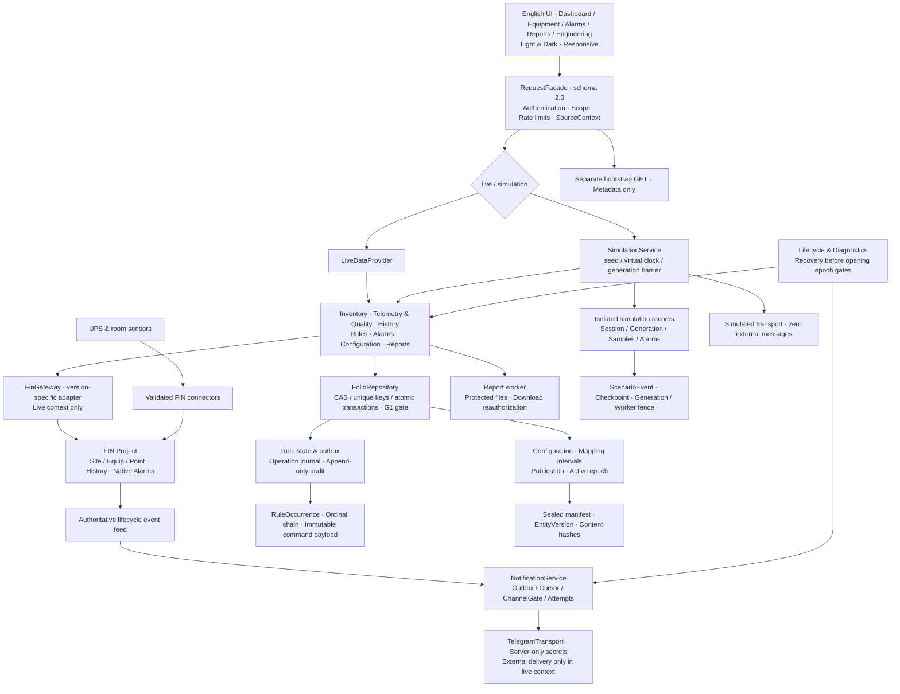

# UPS Fleet POD 整体架构

基线FSD修订9；单业务POD upsFleet，所有模块名为项目逻辑边界。

共享领域逻辑通过数据提供器选择来源；模拟上下文无法获得Live FinGateway写端口。图中领域到FinGateway路径仅对live开放。模拟确认、通知和报表分别落模拟域，真实断线不自动切换模式。

配置发布使用持久化提交决定及统一epoch；事务能力是G1门槛。规则、确认、通知的未决状态分别持久化，Telegram失败不能阻塞FIN告警。文件从ReportService的受权接口取得，浏览器不执行任意Axon。

配套：[模型目录](model-catalog.md) · [接口清单](interface-implementation-list.md)。

A2新增：跨发生链、场景日志/检查点、全量配置清单、独立bootstrap。AR-03公开编辑差异仍待确认；详见处置结果。
